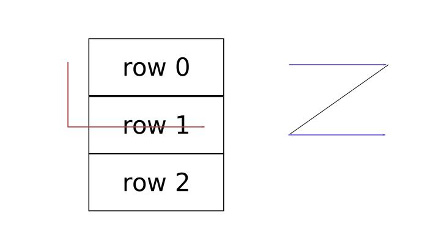
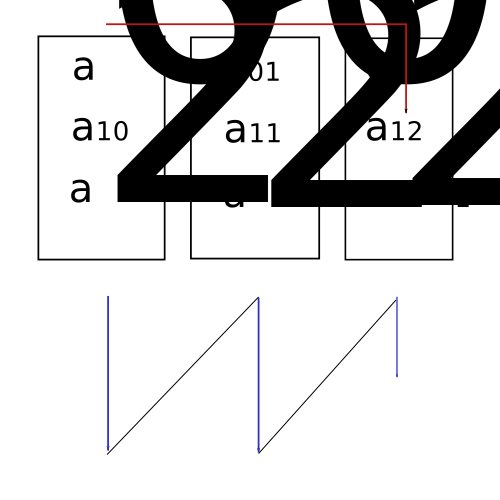

# Arrays in C++

Integers and characters are simple variables or scalar variables.

Arrays are collections, described as vector variables.

Array initialisation need not assign all elements. All non-assigned elements are padded with zeros.

```cpp
int A[5] = {2,4};   //this would give {2,4,0,0,0}
```

Array size is allocated explicitly (`A[5]`) or by passing values (`A[] = {2,3,4,5,6,7,8}`).

Arrays can be accessed using `A[i]` or `i[A]` or with a pointer `*(A+2)`. The first two calls access the i-th element, the third call access the third element.

The address of a given element is achieved with `&A[2]`. The difference in the address given by, for example, `&A[2]` and `&A[3]` indicates the size of each element (compiler dependent).

## Static and dynamic arrays

Static arrays are fixed in size, dynamic arrays are allocated memory on run-time. Both arrays would reside in the stack.

To declare an array on the heap, one would use pointers:

```cpp
int *p;
p = new int[5];
...
delete []p;
```

Above, the array is in the heap whereas the pointer is in the stack. To simulate a truly dynamic array one would need to declare and copy an array to another array of greater capacity.

```cpp
int *p = new int[5];
int *q = new int[10];

for(int i = 0; i < 5; i++){
    q[i] = p[i];
}
delete []p;
p = q;
q = NULL;
```

Arrays are contiguous structures and therefore the last element will likely neighbour some other unrelated variable in the heap, temporarily limiting the present array length.

## Multi-dimensional arrays

Declare as `int A[m][n]`, where m is the number of rows and n is the number of columns, very much like conventional matrices.

In memory, multidimensional arrays are stored linearly:

```cpp
A = { row1, row2, row3, ..., rowN };
```

We can declare 2D arrays with pointers, this time the pointer is of type array[no_of_arrays]. For example, `int *A[3]` is a pointer to the first of three arrays `A`. __The address of the first array is given by `&A[1]`, where the index starts at one.__ The pointer *A[1] resides in the stack.

When one initialises the elements in each array, one uses __zero-based indices__:

```cpp
A[0] = new int[4];
A[1] = new int[4];
A[2] = new int[4];

A[1][2] = 5; //etc...
```

One can also set a pointer to a +pointer to an +array, where +pointer resides in the heap.

```cpp
int **A;            //in the stack
A = new int*[3];    //the pointer to the first array of three resides in the heap

//these arrays are also on the heap
A[0] = new int[4];
A[1] = new int[4];
A[2] = new int[4];
```

One accesses each element in the array of arrays using nested for loops by accessing the +pointer first and then processing each element in the pointed array.

In C, the above pointer to a pointer of arrays is achieved using:

```cpp
int **C;            //in the stack
C = (int **) malloc(3*sizeof(int*));
C[0] = (int*) malloc(4*sizeof(int));
C[1] = (int*) malloc(4*sizeof(int));
C[2] = (int*) malloc(4*sizeof(int));

//then the usual assignments:
C[1][0] = ...;
C[2][3] = ...;

free C[0];
free C[1];
free C[2];
free C;
```

## Array representation in memory

The memory address of an array is only known at run-time. The compiler obtains the address of an element by starting from the first element: `location A[0] + i*sizeof(element)`, where i is the index. That is, the first element has an index i = 0, which is simply given by the address `location A[0]`.

The location of A[0] is updated at run-time. Arrays are zero-based because the allocation of address involves minimal operations. Compare the above convention to arrays which are one-based: `location B[i] + (i-1)sizeof(element)`. The operation `i-1` must be carried out for all arrays in the program.

The address of elements of multidimensional arrays is deduced by using either:

+ row-major format mapping
+ column-major format mapping

### Row-major mapping

Rows, denoted by the first token `[m]` of `A[m][n]` are traversed left-to-right, i.e. row index `[m]` first, then column index `[n]`. Here is the sequential representation of a 2D array:



```cpp
int A[3][4];
//initialise as needed
```

We use the variables `i` and `j` to denote a specific position in the zero-based matrix. The tokens `m` and `n` are used to denote the dimensions (number of elements) of the matrix; both are non-zero. The last element of rows 0 and 1 precede the first elements of rows 1 and 2, respectively. There are three rows (m = 3) and four elements (n = 4) per row. How does one deduce the address of `A[1][2]`?

+ Take the row index (i.e. i = 1) and skip ahead to the second row (row i = 1) i.e. `location(A[0][0] + 1*n*sizeof(element))`. In this case, n = 4 but writing it as such then presents a general expression for any dimension `n`.
+ Then we home in on the third element of row 1: `location(A[0][0] + 1*n*sizeof(element) + 3*sizeof(element))`. We do not need `m` here since we known exactly how many elements to traverse. This simplifies to `location(A[0][0] + (1*n + 3)*sizeof(element))`.
+ We can generalise here. The location of element `j` in row `i` (so `A[i][j]`) is given by: `location(A[0][0] + (i*n + j)*sizeof(element))`. Note that the dimension `m` (row number) is not mentioned in this formula.

The zero-based nature of arrays minimised the number of operations for all multidimensional arrays. For 2D arrays, we reduce each address query by two operations when seeking a particular element.

### Column-major mapping

In row-major mapping, row indices are traversed before column indices. For column-major mapping, column indices are traversed first. In the notation `A[m][n]`, this is right-to-left.



There are three rows (m = 3) and three elements (n = 3) per row. How does one deduce the address of `A[1][2]` or element a(12) above? In memory, a(20) resides immediately before a(01) etc.

+ Take the column index (i.e. j = 2) and skip ahead to the third column (column 2) i.e. `location(A[0][0] + 2*m*sizeof(element))`. The generalisation of `m` allows us to accommodate any dimension `m`. 
+ Then we home in on the second row (i = 1): `location(A[0][0] + 2*m*sizeof(element) + 1*sizeof(element))`. This simplifies to `location(A[0][0] + (2*m + 1)*sizeof(element))`
+ We can generalise here. The location of element `j` in row `i` (so `A[i][j]`) is given by: `location(A[0][0] + (j*m + i)*sizeof(element))`. There is no mention of the dimension `n`.

The difference is that the indices `i` and `j` are swapped.

Both row-major and column-major mappings are of equal time and storage complexity. C and C++ compilers tend to use row-major mappings.