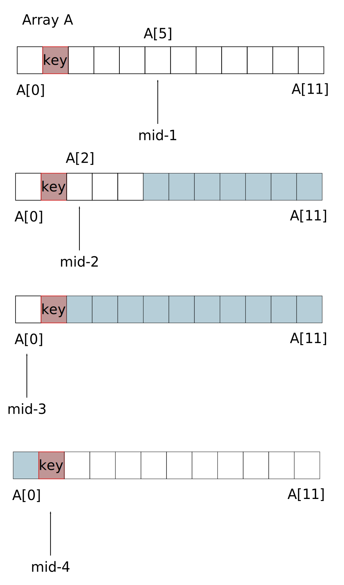
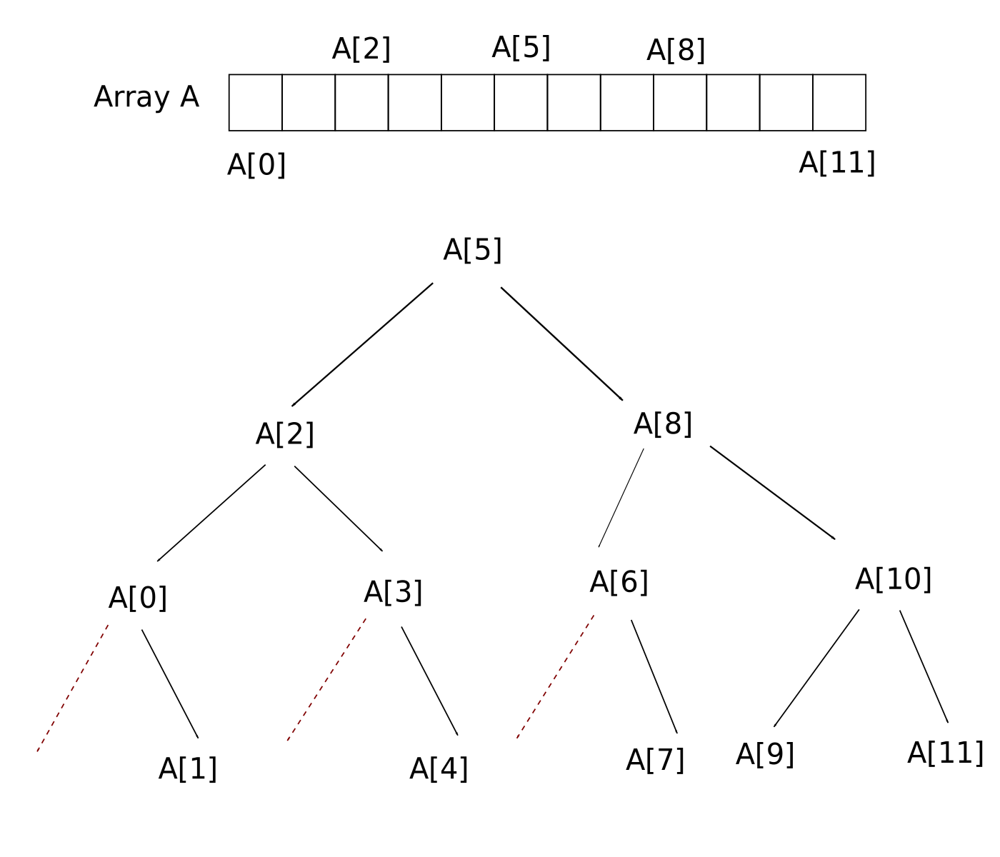

# Searching Arrays

There are two primary algorithms which enable a user to search for an element in the given array: `linear search` and `binary search`.

## Linear search

This involves processing, at worst, all elements of an array to find a required element. Linear searching does not account for repeated occurrences of an element. 

For a given array `A` of length `length`, a linear search algorithm for an element `key` of type `int` is:

```cpp
int linearSearch(int key){
for (int i = 0; i < length; i++)
{
    if(A[i]==key){
        return i;
    }
}
return -1;
} 
```

The total number of searches is `1 + 2 + 3 + ... + n`, where n is the length of the array `A`. This is also `n(n + 1)/2`. The average number of searches is thus `n+1/2` which scales to a time complexity of `O(n)`.

## Improvements to linear searching

If the same array is searched again for the same (or previously the same) elements, then one can shift the position of the key element towards the beginning of the array. This reduces the worst-case time complexity. There are two possibilities:

1. `Transposition`: where the required element is moved one place closer to the initial first element `A[0]` and if necessary, substituting the initial element.
2. `Move to head/front`: where the required swaps places with the initial element. This is particularly useful if the element is frequently sought after with all other elements mostly neglected.

## Binary search

Binary searches only work on sorted arrays of `int` or `float` _etc_. The key procedure is to compare the magnitude of the middle element in an array or subsection of an array with the key element. 

In the case of an array of increasing integers, the key element is compared to the middle element. If they are unequal then the array is essentially halved, the present midpoint is ignored and a new midpoint is assigned dependent on the relative magnitude of the key element to the middle element. The halving process repeats until the number of elements in a subsection is zero.

One deduces the new midpoint as the floor value of `(low + high)/2`.



Note that binary search computes at most `log2 n` cycles, where n is the array length. This can be roughly shown by taking the maximum number of search attempts equal to the number of times the array is halved `m`: `length/2^m`. 

The binary search method continues up until there is only one element targeted. This means that `length/2^m` is greater than or equal to 1. 

Hence, `2^m` less than or equal to `length`, which after taking log (base 2) yields `m = log2 length`. The worst case time complexity is therefore `O(log2 n)`.

A binary search tree shows that the tree height is measured in multiples of `log2 n`:



The left-hand branch is followed if the key is less than the middle element. The right-hand branch is followed if the key is greater than the middle element.

The average time complexity is also `O(log2 n)`. 

The sum of all possible searches is a finite series: `1 + 1*2 + 2*4 + 3*8 + ...` which simplifies to `1 + 1*2^1 + 2*2^2 + 3*2^3 + ...`, reducing to the sum of `i + 2^i`, where `i = log2 n`. 

Following this, the average time complexity `[log2 n + 2^(log2 n)]/n` then becomes `[log2 n + n^(log2 2)]/n`.

Finally, this approximates to `O((log2 n)/n + 1)`.

The algorithm loops through if-statements, ensuring that low <= high.

```cpp
while(low <= high){
    mid = floor((low + high)/2);

    if (key == A[mid]){
        return mid;
    } else if (key < A[mid]){
        high = mid -1;  //*
    } else {
        low = mid + 1;  //*
    }
}
return -1;
```

A recursive form _without_ a while loop can be implemented by calling a suitably written function at the above indicated points*.

```cpp
int binarySearch(int arr[], int low, int high){

    if (low < high){
        mid = floor((low + high)/2);

        if (key == arr[mid]){
            return mid;
        } else if (key < arr[mid]){
            high = mid - 1;
            binarySearch(arr, low, high);
        } else {
            low = mid + 1;
            binarySearch(arr, low, high);
        }
    }
    return -1;
}

```
