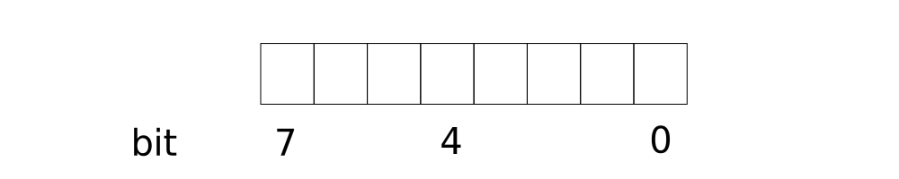
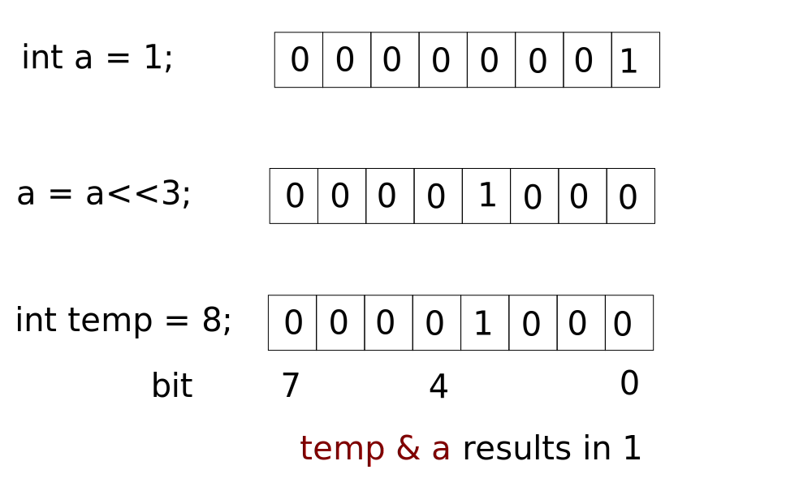
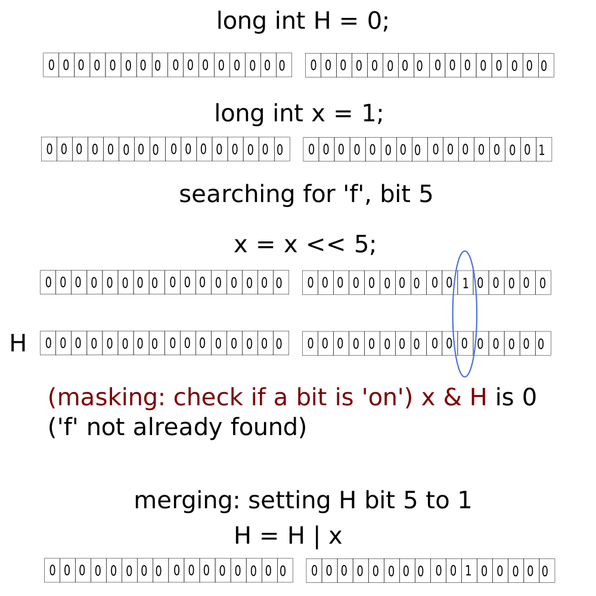
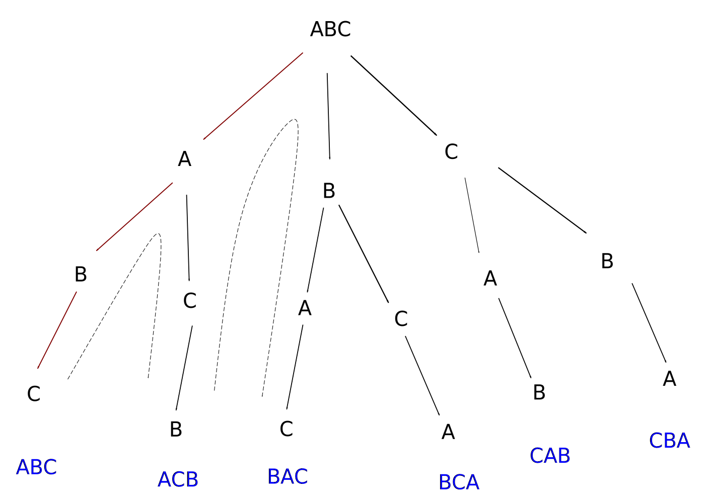
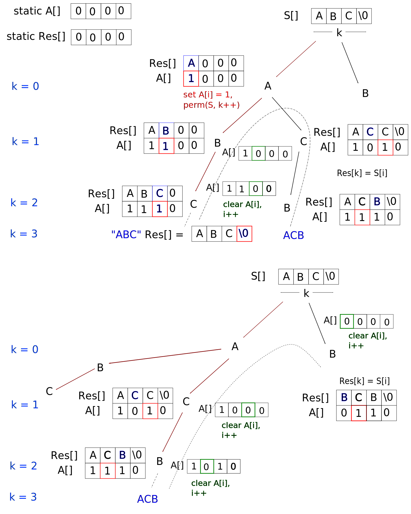

# Strings in C and C++

American Standard Code for Information Interchange `ASCII` codes start from 0 and end at 127, so a total of 128 bits, or 7-bits. In memory, each representation is usually stored as one byte, or 8 bits.

Codes 65-90 are A-Z. The character 'A' (single quotes) is stored as the value 65 in one byte of memory. For lowercase a-z, they are codes 97-122. The ASCII numerical codes for 0-9 are 48-57. The constant offset of 32 allows one to change the case of any character or character in a string.

Other languages, including Japanese, Chinese, Hindi etc. are defined in Unicode.

Let `temp = 'A';`. Other than using `cout << temp`, a character can be printed with `printf()` as `printf("%c", temp);`.

## Array of characters

Declare `char arrayOfChars[10];`. One can also initialise each element on declaration.

The size of the array can be determined without defining its length, using `char arrayOfChars[] = {'A', 'B'};`. This array `charOfArrays` would have a length of 2. Similarly, the ASCII codes can be used instead: `char arrayOfChars[] = {65, 66};`. Furthermore, the following conditional statement is valid: `if (someChar >= 'b') {...}`.

An array with a defined length but fewer initialisations lead the compiler to pad zeros (literally) to uninitialised elements.

Strings are array of characters. In C and C++, the first zero padded element is '/0' (slash-zero), a null character/string delimiter/string terminator/end of string character (marker). This signals the end of the string.

String lengths are determined by the position of the delimiter.

## Printing and scanning strings

One can use the aforementioned array of characters approach, including the '/0' character.

One can use double quotes: `char aString[] = "My name is ";`. The null character is automatically appended. At present the string `aString` is stored in the stack frame of the parent function.

One can declare a pointer to string, in which case, the string is stored in the heap and the string pointer is held in the stack. The statement `char* aString = "My name is ";` without brackets achieves this. One can dereference the pointer as normal with `*aString`.

The argument for `printf()` to print a string is `%s` as: `printf("%s", aString);`. The command `cout` needs `cout << aString;`. 

User input is achieved similarly with `scanf()` and `cin`. Note that `scanf` stops reading at the next whitespace character. To read a string with whitespace, use get-String `gets()`.

## Finding the length of a string

This method is provided in the standard libraries and (like many methods in this course) are outlined to illustrate and understand their operations.

```cpp
int main()
{
    char* s = "greetings";
    int i;
    for (i = 0; s[i] != '/0'; i++)
    {
        //keep cycling through to the end
    }
    printf("Length of the string is %d", i);
    return 0;
}
```

The above method forms the basis of other string traversing routines (changeCase(), numberOfVowels(), containsAZaz(), isPalindrome etc.). For example:

```cpp
int main()
{
    char s[] = "greetings";
    int word = 0;
    for (int i = 0; s[i] != '/0'; i++)
    {
        if (s[i] == ' ' && s[i-1] != ' ')
            word++;
    }
    printf("There are %d word(s) in the string", word);
    return 0;
}
```

## Reversing a string

Strings are usually immutable (compiler dependent) though they can be utilised as mutable by declaring the string as an array of characters, as shown below:

```cpp
int main()
{
    char A[] = "dude";
    int i, j;
    char temp;
    for (j = 0; j != '\0'; j++)
    {
        //go to the delimiter
    }
    j--;
    for (i = 0; i < j; i++, j--)
    {
        temp = A[i];
        A[i] = A[j];
        A[j] = temp;
    }
}
```

One can modify the above reversing algorithm to define isPalindrome().

```cpp
int main()
{
    char A[] = "dude";
    int i, j;
    char temp;
    for (j = 0; j != '\0'; j++)
    {
        //go to the delimiter
    }
    j--;
    for (i = 0; i < j; i++, j--)
    {
        if (A[i] != A[j])
            printf("The string %s is not a palindrome", A);
            break;
    }
}
```

## Finding duplicated characters in a string using hash tables

Hash tables are data structures which implement the storage of data, the address of which is largely based on the value itself. While offering fast search operations (compared to other search methods such as linear search and binary search) hashing does occupy more memory since the data structure is scattered over a wider area. Hash tables are demonstrated in the next example.

The goal is to initialise an array which records a tally showing how often each character appears in the string. In this example, each element in the array corresponds to a lower-case letter. Take the string, "finding". By using the ASCII codes, the memory locations minimally range from 100 (for 'd') to 110 (for 'n'). Even for five different characters, the array (a continuous data structure) needs to reserve space for all lower case characters, that is, 97 - 122 (corresponding to 'a' - 'z'). (A linked list would be smaller.) The array of length 26 which stores the tally is referred to as a __hash table__.

```cpp
int main()
{
    char A[] = "finding";
    int hashTable[26] = {0};
    int i;

    for (i = 0; A[i] != '\0'; i++)
    {
        //increment the value at the hashtable
        hashTable[A[i] - 97]++;
    }

    //now look throught the hashTable to find duplicated characters
    for (i = 0; i < 26; i++)
    {
        if (hashTable[i] > 1)
        {
            //the hashTable element position relates to the character
            printf("The character %c ", i+97);
            //print the frequency
            printf("appeared %d times\n", hashTable[i]);
        }
    }
}
```

The complete search for duplicates is O(n+n) or just O(n). A similar approach for upper-case letters can be implemented.

## Finding duplicated characters in a string using Bitwise operations

To review the necessary bitwise operations:

### Left-shift with `<<`

Recall that a byte is represented by eight bits, from left to right, `int 1` is 00000001, `int 8` is 00001000 and so on. The smallest int is 0 and the largest is 255. Bits in a byte are identified by zero-based indices so bit 0 is the right-most, and bit 7 is the left-most in a 8-bit byte.



The statement `H = H<<1` shifts all ones _and_ zeros to the left by one place in the byte `H`. Each shift to the left doubles (2^1) the present value. Two shifts `H<<2` increases the value by 2^2, four shifts `H<<4` increases the value by 2^4 and so on.

### Bits ORing (merging) and ANDIing (masking)

These operations are related to boolean logic `||` and `&&` expect that they are now bitwise, `|` and `&`.

|    a      |     b         |  Bitwise AND       |  Result |
|-----------|:-------------:|:------------------:|:-------:|
|    1      |     1         |     &              |    1    |
|    1      |     0         |     &              |    0    |
|    0      |     1         |     &              |    0    |
|    0      |     0         |     &              |    0    |

The decimals 10 & 6 = 2. The term masking derives from the left-shift operations on a byte with decimal value 1 and binary value 00000001, and then performing the bitwise &. The effect is to determine if a bit in a given byte is 1.

For example, the decimal 8 is in binary as 00001000. We take a separate byte `a` with value 00000001 and then perform `a<<0; eight&a`. This would give a 0 at the least significant (right-most, zeroth) bit. The operations `a<<1; eight&a` and `a<<2; eight&a` would also result in zeros. Finally, `a<<3; eight&a` gives binary 1, signalling that bit three in byte `eight` is a one.



|    a      |     b         |  Bitwise OR        |  Result |
|-----------|:-------------:|:------------------:|:-------:|
|    1      |     1         |     \|             |    1    |
|    1      |     0         |     \|             |    1    |
|    0      |     1         |     \|             |    1    |
|    0      |     0         |     \|             |    0    |

The decimals 10 | 6 = 14. Using the same examples from ANDing (masking), merging is about turning any zero bit in `eight` to a 1. So to switch bit 6 in `eight` on, we perform five left-shifts and then perform a bitwise | operation. Overall, this is `a<<5; eight|a`.

### Using bitwise operations to find duplicated characters

The array hash table `H` needed must store states for all 26 characters, as a bit. Conveniently, we then use a 32-bit structure to store this representation, which in C or C++ is an `int` or `long int`. This example would use the first 26 bits of the int but pad all bits with zeros, 'off'.

The code below is explained as follows. Check if the corresponding switch, the bit, is 'on' by performing masking. For instance, 'f' would need to be placed in bit 102 - 97 = 5 of `H` (actually the sixth bit since the structure is zero-based). We check if bit 5 is on by running `x<<5; x & H` (the compiler uses the binary forms of `int`'s `x` and `H`). If the result is 1 then 'f' was already located somewhere in the string. If the bit is marked 0 then this is the first instance of 'f', and we set the sixth bit in `H` as 1, by performing merging. Subsequent detection of 'f' would then signify a duplicated character.

Note that `H` is not a hash table or array, so position zero is on the right.



The time complexity is linear, O(n).

```cpp
int main()
{
    char A[] = "finding";
    long int H = 0, x;
    int i;

    for (i = 0; A[i] != '\0'; i++)
    {
        x = 1;  //reset
        //left-shift right-most 1 by A[i]-97 places; A[i] is the ASCII code at i
        x = x<<A[i]-97;

        //perform masking+ check if the bit in H is also a 1
        if (x & H > 0)
        {
            printf("%c is duplicated", A[i]);
        } 
        else
        {
            //if it is not 1, then perform merging to switch the bit at i 'on'
            H = x | H;
        }
    }
}
```

One can determine if two string are anagrams by building one hash table and checking for negative values.

```cpp
int main()
{
    //assume that both strings are in lowercase
    char A[] = "medical";
    char B[] = "decimal";
    char hashTable[26];
    int i;

    for (i = 0; A[i] != '\0'; i++)
    {
        hashTable[A[i]-97]++;
    }

    for (i = 0; B[i] != '\0'; i++)
    {
        hashTable[B[i]-97]--;
        if (hashTable[B[i]-97] < 0)
        {
            printf("The strings are not anagrams of each other");
            break;
        }
    }

    if (B[i] == '\0')
        printf("The strings are anagrams of each other");

    return 0;
}
```

## String permutations

Recall that a permutation is a set of possible configurations of a items, where the order of each item is important. A string "ABC" can be written in 3! permutations (for n items, then n!), some of which are "ACB", "BAC", "CAB" and so on. One can use a _state space tree_ to deduce all possible permutations.



We start with ABC and then _back-track_ (along the dashed line) to deduce all other permutations, by swapping items in the sequence. Instead of ABC, how about ACB. Then start with a different first letter, B. And so on. The act of deducing all possible outcomes is termed a _brute-force_ method.

The generation of the permutations can be achieved by running recursive functions.

```cpp
void permutation(char S[], int k)
{
    // array A[] records whether a item is available or not, and is indexed by i
    // A[i] corresponds to S[i]. If A[i] == 0 then S[i] is copied across to Res[i]
    static int A[10] = {0};

    // array Res[] is a temporary array which is built up according to the items available 
    static char Res[10];
    int i;

    // k indicates the position in S[] where we should begin scanning (initially, this should be set to 0)
    // check if we're at the end of the string
    if (S[k] == '\0')
    {
        Res[k] = '\0';
        printf("Res");
        // at this point, permutation() returns
    }
    else
    {
        for (i = 0; S[i] != '\0'; i++)
        {
            // If A[i] == 0 then S[i] is copied across to Res[i]
            if (A[i] == 0)
            {
                // copy the element from S to the temporary array Res[] and flag it as unavailable (1) in A[]
                Res[k] = S[i];
                A[i] = 1;
                // increment k and re-scan from the next position in S
                permutation(S, k+1);

                //by now, we've printed a permutation (that is S[k] is '\0'), so reset the availability and move along user string S[]
                A[i] = 0;
            }
        }
    }
}

int main()
{
    char myString[] = "ABC";
    permutation(myString, 0);
    return 0;
}
```

The tree diagram of the above is given here:



An alternative which swaps the low `l` (usually 0) and high `h` (usually array length - 1) elements, until `l == h`.

```cpp
#include <iostream>

using namespace std;

void permutation2(char [], int, int);
void swap(char &, char &);

int main()
{
    char test[] = "ABC";
    cout << "The permutations of " << test << " are " << endl;
    permutation2(test, 0, 2);
    return 0;
}

//l directs the starting point of the array to generate permutations (usually 0)
//h is the index of the char before null char (usually length - 1)
void permutation2(char S[], int l, int h)
{
    int i;

    if (l == h)
    {
        printf(S);
        printf("\n");
    }
    else
    {
        for (i = l; i <= h; i++)
        {
            swap(S[l], S[i]);
            permutation2(S, l+1, h);
            swap(S[l], S[i]);
        }
    }
}

void swap(char &x, char &y)
{
    char temp = x;
    x = y;
    y = temp;
}

```

The program is in [/code/StringPermutationRecursive/](/code/StringPermutationRecursive/)