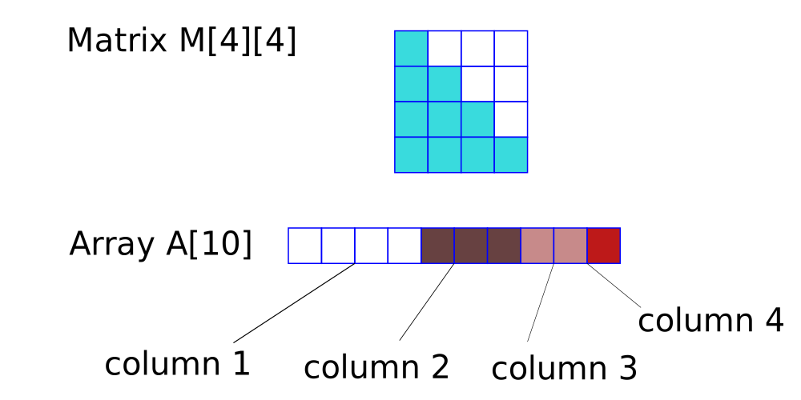
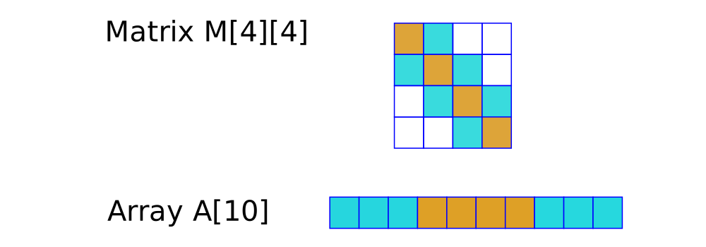
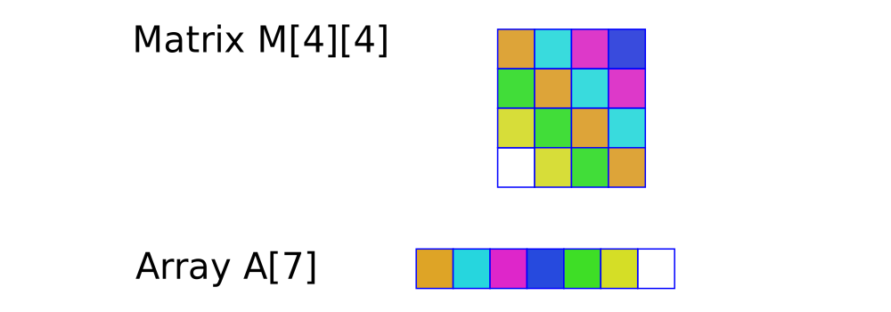

# Matrix methods in C and C++

## Diagonal matrices

Define as matrix `M[i,j] = 0 if i != j`

For space saving benefits, one uses a single-dimensioned array to store all diagonal elements. Arrays are zero based, whereas matrices covered here are one-based. 

The dimensions of the matrix `M` are given by m and n, and accessed by array `A` indices i and j.

The diagonal elements at M[i,j] are:

```cpp
if (i == j)
    A[i-1];
```

Any diagonal matrix function must check if indices i and j are equal before setting and getting values from the array.

```cpp
struct Matrix
{
    int A[10];
    int n;      //present dimension of the matrix (the dimension of A[] must be at least this)
};

void SetDiagonal(struct Matrix *m, int i, int j, int x)
{
    if(i == j)
        m->A[i-1] = x;
}

int GetDiagonal(struct Matrix m,int i,int j)
{
    if(i == j)
    return m.A[i-1];
    else
    return 0;
}

//general method for all matrices
void DisplayMatrix(struct Matrix m)
{
    int i,j;
    for(i = 0; i < m.n; i++)
    {
        for(j = 0; j < m.n; j++)
        {
            if(i == j)
                printf("%d ", m.A[i]);
            else
                printf("0 ");
        }
        printf("\n");
    }
}
```

## Class implementation of diagonal matrices

Moving towards a C++ class form of a matrix, as opposed to C structure:

```cpp
class Diagonal
{
    private:
        int *A;
        int n;

    public:
        Diagonal()
        {
            n = 2;
            A = new int[2];
        }

        Diagonal(int n)
        {
            this->n = n;
            A = new int[n];
        }

        ~Diagonal()
        {
            delete []A;
        }

        void Set(int i, int j, int x);
        int Get(int i, int j);
        void Display();
        int GetDimension(){return n;}
};

void Diagonal::Set(int i, int j, int x)
{
    if(i == j)
    A[i-1] = x;
}

int Diagonal::Get(int i, int j)
{
    if(i == j)
    return A[i-1];
    return 0;
}

void Diagonal::Display()
{
    for(int i = 1; i <= n; i++)
    {
        for(int j = 1; j <= n; j++)
        {
            if(i == j)
                cout << A[i-1] << " ";
            else
                cout << "0 ";
        }
    cout << endl;
    }
}
```

## Lower-triangular matrices

This can defined as an array A[i,j] such that

```cpp
if (i < j)
    A[i-1] = 0;
```

The matrix is stored in a single-dimensioned array. The number of elements in the lower triangle is the __ceiling value__ of:

```math
1 + 2 + 3 + ... + n = n(n+1)/2 elements
```

Given the dimensions of the square matrix, one can then initialise a single-dimensioned array of length `n(n+1)/2`. There are two methods of filling the array: row-by-row (or row major mapping/representation) or column-by-column (or column major mapping/representation).

### Row-major mapping


Access to row 3, column 2 is achieved by skipping to row 3, and then adding two elements. Generally, for i > 0 and j > 0, `M[i][j] = A[(1 + ... + i-1) + j-1]` which is `M[i][j] = A[(i(i-1)/2) + j-1]`.

### Column-major mapping



This approach focuses on filling by column instead of row. With matrix M[i][j]:

+ the index of M[3][3] is [4 + 3] + 0

+ the index of M[4][3] is [4 + 3] + 1

+ the index of M[4][4] is [4 + 3 + 2] + 0

The first part [] can br related to j as `[n + (n-1) + (n-2) + ... + (n-(j-2))]`. The second part is the difference `i-j`. The general forumla is the sum of these two parts, that is, the index in A[] of M[i][j] is 

+ `[n + (n-1) + ... + (n-(j-2))] + i - j`

Note there are `j-1` terms in the first part []. Thus, the general formula simplifies to:

+ `M[i][j] = [n(j-1) - (1 + 2 + ... + (j-2))] + i - j`

Finally, we combine more terms in [], to give:

+ `M[i][j] = [n(j-1) - ((j-2)(j-1)/2)] + i - j`

The C based structure approach for column-major mapping is given below:

```cpp
struct Matrix
{
    int *A;
    int n;
};

void SetLowerDiag(struct Matrix *m, int i, int j, int x)
{
    if(i >= j)
        m->A[m->n*(j-1) + (j-2)*(j-1)/2 + i-j] = x;
}

int GetLowerDiag(struct Matrix m, int i, int j)
{
    if(i >= j)
        return m.A[m.n*(j-1) + (j-2)*(j-1)/2 + i-j];
    else
        return 0;
}

void DisplayLowerDiag(struct Matrix m)
{
    int i, j;
    for(i = 1; i <= m.n; i++)    
        {
            for(j = 1; j <= m.n; j++)        
            {
                if(i >= j)
                    printf("%d ",m.A[m.n*(j-1) + (j-2)*(j-1)/2 + i-j]);
                else
                    printf("0 ");
            }
        printf("\n");
        }
}
```

## Upper-triangular matrices

The algorithms which handle upper-triangular matrices are similar to that of lower-triangular matrices but with the difference of 

a. swapping row-major for column-major

b. the swapping the index `i` with index `j`

c. changing the requirement so we set or get values only if 
`i<=j`

We perform (a) because the array of a row-major mapped upper-triangular matrix is the same form as that of the column-major mapped lower-triangular matrix. The first set of elements in the array is composed of n elements from the nxn matrix M.

The code for finding the index in an array which follows row-major of an upper-triangular matrix is:

`M[i][j] = [n(i-1) - ((i-2)(i-1)/2)] + j - i`

The above formula was previously used as the column-major representation of a lower-triangular matrix:

`M[i][j] = [n(j-1) - ((j-2)(j-1)/2)] + i - j`

## Symmetric matrices

Essentially, `M[i][j] = M[j][i]`. One can store the elements from the 'lower-triangle' or 'upper-triangle' part of the matrix and store it in a single-dimensioned array. The remaining elements in the matrix are populated automatically (this follows directly from the column-major mapping of C based structure, `Matrix`):

```cpp
#include <stdio.h>
#include <stdlib.h>

struct Matrix
{
    int *A;
    int n;
};

void Set(struct Matrix *m, int i, int j, int x)
{
    if(i >= j)
        m->A[m->n*(j-1) + (j-2)*(j-1)/2 + i-j] = x;
}

int Get(struct Matrix m, int i, int j)
{
    if(i >= j)
        return m.A[m.n*(j-1) + (j-2)*(j-1)/2 + i-j];
    else
        return 0;
}

void DisplaySymmetric(struct Matrix m)
{
    int i,j;

    for(i = 1; i <= m.n; i++)
    {
        for(j = 1; j <= m.n; j++)
        {
            if(i >= j)
                //print the lower triangle as before
                printf("%d ", m.A[m.n*(j-1) + (j-2)*(j-1)/2 + i-j]);
            else
                //unlike displaying lower triangular matrices, invert indices i and j and print
                printf("%d ", m.A[m.n*(i-1) + (i-2)*(i-1)/2 + j-i]);
        }
        printf("\n");
    }
}

int main()
{
    struct Matrix m;
    int i, j, x;
    printf("Enter Dimension\n");
    scanf("%d", &m.n);
    m.A = (int *) malloc(m.n*(m.n+1)/2 * sizeof(int));
    printf("enter all elements\n");

    for(i = 1; i <= m.n; i++)
    {
        for(j = 1; j <= m.n; j++)
        {
            scanf("%d", &x);
            Set(&m, i, j, x);
        }
    }
    printf("\n\n");
    DisplaySymmetric(m);
    return 0;
}

```

The program is located in [/code/SymmetricMatrices/](/code/SymmetricMatrices/).

## Tridiagonal matrices

Defined such that all elements off the diagonal (i-j = 0), the upper (i-j = -1) and lower (i-j = 1) diagonals are zero. Overall, all values of the matrix `M[i][j] = 0 for ||i-j|| > 1`. 

There will be `3n - 2` elements on the diagonals, for any nxn square matrix. We store them in a single-dimensioned array diagonal by diagonal.



Once the requirements in terms of i and j are met, one can access the elements in array A[] from their matrix M indices using:

+ lower diagonal (i-j = 1): `index(A[i][j]) = i - 1`

+ diagonal (i-j = 0): `index(A[i][j]) = n - 1 + (i-1)`

+ upper diagonal (i-j = -1): `index(A[i][j]) = 2n - 1 + (i-1)`

Approach the method by first asking for the indices of the element in matrix M required. Decide which diagonal the user has asked for using `if (i-j == -1){...} else `. Then apply the above expression to retrieve the index of the element in array A[]. Then display or update the value. 

A tridiagonal matrix is one type of _square-band matrix_ where the number of diagonals on either side of the diagonal is equal but can be greater than one. All elements off the diagonals are zero.

## Toeplitz matrices

This is matrix in which all elements in the same diagonal are equal. That is, `M[i][j] = M[i-1][j-1]`.

There is not requirement for the values between each diagonal to equal or not. The storage of such a matrix can be achieved by again using a single-dimensioned array and recording the values of the first row and the first column. This would require `n + (n-1)` elements.



The user can could input the first row and column values. The display of the Toeplitz matrix can be achieved with the following:

+ upper triangle (i <= j): `index(A[i][j]) = j - i`

+ lower triangle (i > j): `index(A[i][j]) = n + i - j - 1`

The approach is similar. Ask for the indices of the element in matrix M required. Decide which diagonal the user has asked for using `if (i <= j){...} else `. Then apply the above expression to retrieve the index of the element in array A[]. Then display or update the value.