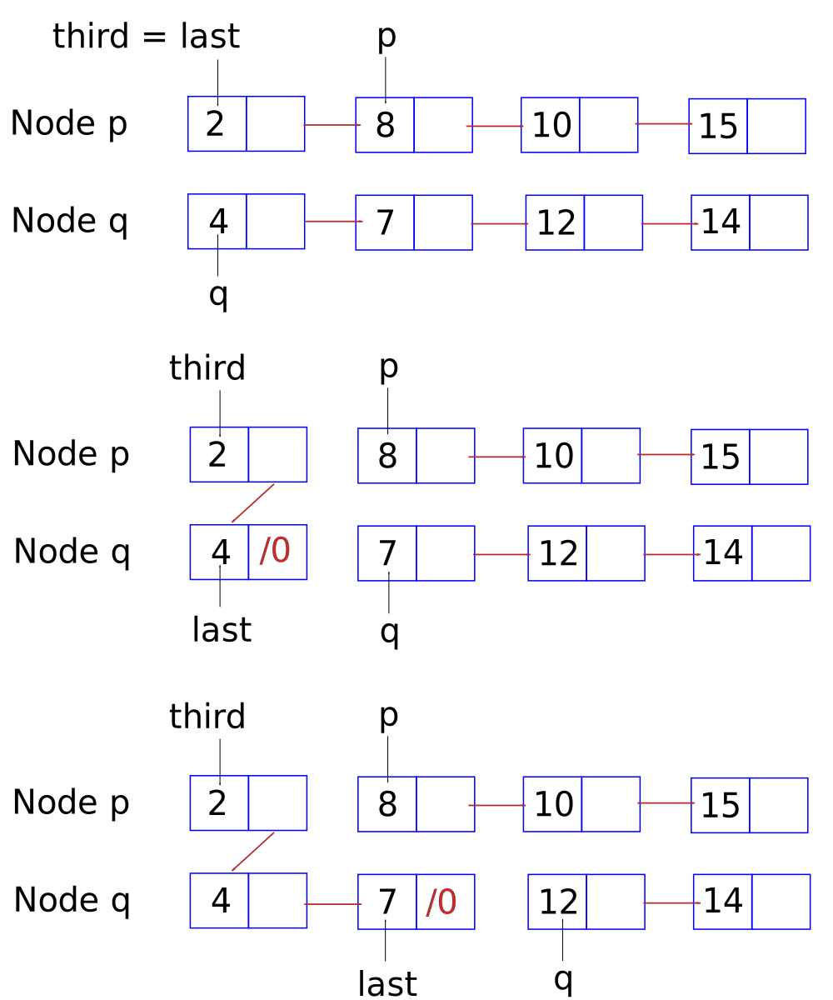
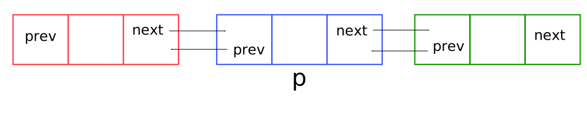

# Linked lists

 A linked list a collection of __nodes__ which contain a value (data) sometimes referred to as the _key_ and an address to the next node. Unlike arrays, these have potentially unlimited memory capacity (hardware memory dependent) and are distributed over the heap. Linked lists are not stored in the stack.

 The first node or _head node_ (pointer) points to the second node, which contains the first value. The head node does not possess a data value but is merely a pointer which resides in the stack. Subsequent nodes reside in the heap. For circular linked lists, described below, the head node can have a data value.

Linked lists can be implemented by structures:

```cpp
struct Node
{
    int data;
    struct Node* next;  //an example of a self-referential structure
};
```

Since `int` pointers occupy the same amount of memory as the value they reference, a single node above requires twice the memory of the data type. The head node can be declared in C with:

```cpp
struct Node * p;
p = (struct Node *) malloc(sizeof(struct Node));
```

In C++, the node can defined by a class or a structure. As a structure, the first node is declared with C++ using:

```cpp
struct Node * p;
p = new Node;

//access the data values

p->data = 10;
p->next = 0;    //points to nothing; a null pointer NULL
```

## Moving along the linked list

A useful set of statements in which the head node traverses the linked list is given below. Pointer `q` is the temporary pointer which traverses across the linked list. Pointer `p` is initially located in the stack, as the head node.

```cpp
struct Node *p, *q;
q = p;          // assign q to the location of p->data
q = p->next;    // move q to the data of the next node (p->next is itself a pointer to the next data value)

//check if q != NULL (or effectively, !(p->next)) then continue...

p = p->next;    // move p to the data of the next node
```

A null pointer has an address of zero, a pointer is `NULL` or `!pointer` is true. Pointers which point to some definite address are `true`.

## Displaying (and counting the number of nodes of) linked lists

In C and C++, with structures:

```cpp
struct Node
{
int data;
struct Node *next;
}*first=NULL;   //first is a global pointer to Node

void Display(struct Node *p)
{
    while(p!=NULL)
    {

        //insert a counter > 1 here to record the number of nodes processed...

        printf("%d ", p->data);
        p = p->next;
    }
}
```

The recursive form of Display can be constructed as follows:

```cpp
void RecursiveDisplay(struct Node *p)
{
    if(p!=NULL)
    {
        RecursiveDisplay(p->next);
        printf("%d ", p->data);
    }
}
```

Note that the above RecursiveDisplay also displays the nodes in reverse order. Changing the order so that we have a tail recursion, as opposed to head recursion, will print the nodes in the order they appear starting from the head node.

In C++, with classes:

```cpp
class Node{
public:
    int data;
    Node* next;
};

//somewhere in main() or some other calling function (nullptr is a C++ keyword)
    Node* p = head;
 
    while (p != nullptr){
        cout << p->data << " -> " << flush;
        p = p->next;
    }
```

Both recursive and iterative forms of Display() are time complexity of O(n). The space complexity for recursive form is also O(n+1) or just O(n), compared to iterative which is a constant O(1). 

## Creating a linked list

A linked list can be initialised from an array `A`, of length `n`. __This pattern is applied for many of the examples outlined below.__

```cpp
struct Node
{
    int data;
    struct Node *next;
}*first = NULL, *second = NULL, *third = NULL;  //have three global pointers to potentially build three linked lists

void newLinkedList(int A[], int n)
{
    int i;
    struct Node *temp, *last;

    //build the first, head node (simply a pointer) and initialise the second node (key and pointer)
    first=(struct Node *) malloc(sizeof(struct Node));
    first->data = A[0];
    first->next = NULL;
    last = first;

    //build the self-referential struct Node, in Node.
    for(i = 1; i < n; i++)
    {
        temp = (struct Node*) malloc(sizeof(struct Node));      //new node created somewhere on the heap
        temp->data = A[i];                                      //fill with key with array data
        temp->next = NULL;                                      //set the next node location as NULL (signifies the 'new end')
        last->next = temp;                                      //update the previous node's NULL pointer to point to temp's 'data'
        last = temp;                                            //set pointer last to point to temp's key

        //by now, the temp node is part of the growing linked list...
    }
}
```

## Linked list functions

### The node count and summing the nodes

The sum of all nodes and the number of nodes in a linked list can be implemented by cycling through `while` loops, incrementing or summing as long as the `Node` pointer `p->next == true`. The sum code is commented in the node count function below:

```cpp
int count(struct Node *p)
{
    int l = 0;
    // int s=0;
    while(p)
    {
        l++;
        // s += p->data;
        p = p->next;
    }
    return l;
}

//the recursive form is...

int RecursiveCount(struct Node *p)
{
    if(p!=NULL)
        return RecursiveCount(p->next) + 1;
    else
        return 0;
}
```

### Finding the largest and smallest node

One can traverse through the entire linked list to find the largest key (and similarly the smallest key).

```cpp
int Max(struct Node *p)
{
    int max = INT32_MIN;
    while(p)
    {
        if(p->data > max)
            max = p->data;
        p = p->next;
    }
    return max;
}
```

### Searching linked lists

Searching linked lists is generally quite expensive compared to arrays. One could perform a linear search, processing each node until the required node data is found.

Improvements to the linear search of linked lists borrows from the improvements to linear searching of arrays. Recall, for arrays:

1. `Transposition`: where the required element is moved one place closer to the initial first element `A[0]` and if necessary, substituting the initial element. This makes subsequent searches for the same element faster.
2. `Move to head/front`: where the required swaps places with the initial element. This is particularly useful if the element is frequently sought after with all other elements mostly neglected.

For linked lists, it is more convenient to code the second improvement, move-to-front.

For linked lists, we move nodes as opposed to swapping the key between nodes. In this case, we have two pointers, one as a tail-pointer which follows (and is one node behind) the key pointer. Upon finding the key, we assign the tail pointer to the address of the node after the key pointer. The code is given below:

```cpp
struct Node * LinearSearch(struct Node *lead, int key)
{
    struct Node *tail = 0;
    while(lead != NULL)
    {
        if(key == lead->data)
        {
            tail->next = lead->next;
            lead->next = first;
            first = lead;
            return lead;
        }

        tail = lead;          //move tail pointer one node forward
        lead = lead->next;    //move leading pointer one node forward
    }
    return NULL;
}
```

### Inserting nodes into a linked list and creating linked lists

First create a new node anywhere in the heap. Then decide where in the linked list the new node will be inserted.

+ Inserting at the beginning is O(1) time complexity. After declaring the new node, assign the data value and set the new node's `next` pointer to point to the first data node in the linked list. Change the first pointer (in the stack) address so that it points to the new data of the new node.

+ Inserting a new node at a given node `N` anywhere after the first node is more involved. Build a new node somewhere in the heap. Traverse the linked list `N-1` times with a pointer `p` which was initially set to the first node (use a `for` loop). Set the new node's `next` pointer to match `p->next`, then change `p->next` to point to `N`. The time complexity here is worst-case, O(N). Compare this to an insertion into an array which is similarly expensive.

The code (with the structure repeated for reference) is given below for both cases:

```cpp
struct Node
{
    int data;
    struct Node *next;
}*first=NULL, *second=NULL, *third=NULL;

void Insert(struct Node *p, int index, int x)
{
    struct Node *newNode;
    int i;
    if(index < 0 || index > count(p))
        return;
    newNode = (struct Node *) malloc(sizeof(struct Node));
    newNode->data = x;
    if(index == 0)
    {
        newNode->next = first;
        first = newNode;
    }
    else
    {
        for(i = 0; i < index-1; i++)
            p=p->next;

        newNode->next = p->next;
        p->next = newNode;
    }
}

int count(struct Node *p)
{
    int l = 0;
    while(p)
    {
        l++;
        p = p->next;
    }
    return l;
}
```

Incidentally, the `insert()` method can be looped to create a new linked list, extending from the beginning or end, or inserting somewhere in between nodes.

To insert a new node after the last node only, the time complexity is constant O(1), as long as you know the address of the first and last nodes.

```cpp
struct Node
{
    int data;
    struct Node *next;
}*first=NULL, *second=NULL, *third=NULL;

insertLast(int x)
{
    Node * t = new Node;
    t->data = x;
    t->next = NULL;
    if (!first)
    {
        //if the linked list is empty
        first = t;
        last = t;
    }
    else 
    {
        last->next = t;
        last = t;
    }
}
```

### Sorted linked lists

One can check if a linked list is sorted by calling the function `isSorted()`:

```cpp
int isSorted(struct Node *p)
{
    int min = -65536;
    while(p != NULL)
    {
        if(p->data < x)
            return 0;

        min = p->data;
        p = p->next;
    }
    return 1;
}
```

This achieved by traversing along the linked list, comparing the data value and incrementing the pointer value at the same time.

```cpp
struct Node
{
    int data;
    struct Node *next;
}*first=NULL, *second=NULL, *third=NULL;

void insertInSorted(struct Node *p, int x)
{
    struct Node *newNode, *trailing = NULL;
    newNode = (struct Node*) malloc(sizeof(struct Node));
    newNode->data = x;
    newNode->next = NULL;

    if(first == NULL)
        //if the linked list is empty
        first = newNode;
    else
    {
        //traverse along the linked list, while reassigning the trailing pointer
        while(p && p->data<x)
        {
            trailing = p;
            p = p->next;
        }

        if(p == first)
        {
            newNode->next = first;
            first = newNode;
        }
        else
        {
            newNode->next = trailing->next;
            trailing->next = newNode;
        }
    }
}
```

### Deleting nodes

The most important step to remember here is to free the memory that the deleted node occupies. Use `free`.

```cpp
//assume here that the linked list holds integers, the type returned
int Delete(struct Node *p, int index)
{
    struct Node *trailing = NULL;
    int x = -1, i;
    if(index < 1 || index > count(p))
        return -1;
    
    if(index == 1)
    {
        trailing = first;
        x = first->data;
        first = first->next;
        free(trailing);     //use free() if malloc was used; use delete, an operator, if new was used
        return x;
    }
    else
    {
        for(i = 0; i < index-1; i++)
        {
            trailing = p;
            p = p->next;
        }
        trailing->next = p->next;
        x = p->data;
        free(p);        //use free() if malloc was used; use delete, an operator, if new was used
        return x;
    }
}
```

### Deleting nodes with duplicated data in a sorted linked list

The essential approach here is the compare adjacent node data values and free the node if the values are equal.

```cpp
void removeDuplicate(struct Node *p)
{
    struct Node *trailing = p->next;
    while(trailing != NULL)
    {
        if(p->data != trailing->data)
        {
            //move along the list
            p = trailing;
            trailing = trailing->next;
        }
        else
        {
            p->next = trailing->next;
            free(trailing);
            trailing = p->next;
        }
    }
}
```

### Reversing a linked list

Two methods can reverse the nodes of a linked list.

+ Interchanging the elements (the values)
+ Interchanging the links (the pointers)

The latter method is generally preferred. Linked list nodes reside at seemingly random positions in the heap and so it would be largely meaningless to interchange data values when the resultant list is also randomly distributed. Instead, one should change the direction of the link, given be Node's `next` pointer.

#### Interchanging the elements

Initialise an (auxiliary) array of the same length as the linked list. Copy across all the elements to the array. Then re-assign all elements of the linked list in the reverse order.

```cpp
void changeElements(struct Node *p)
{
    int *A, i = 0;
    struct Node *q = p;
    A = (int *) malloc(sizeof(int)* count(p));

    //fill the auxiliary array and move the pointer q along the linked list
    while(q != NULL)
    {
        A[i] = q->data;
        q = q->next;
        i++;
    }
    q = p;
    i--;

    //re-assign the linked list in the reverse order
    while(q != NULL)
    {
        q->data = A[i];
        q = q->next;
        i--;    //we're going backwards...
    }
}
```

The time complexity is O(2n) or just O(n). The method requires the movement of data (with a type which must be known) between linked lists and arrays.

#### Interchanging the links: sliding (tailing) pointers

This starts with three pointers. The three pointers `p`, `q` and `r` occupy three consecutive nodes. The central node is the node which is modified at the time. The first and third pointer are needed to recall the previous pointer values. 

The method effectively reverses the 'direction' of the link to the next node. Instead of pointing the next node, the pointer is changed so that it points to the previous node.

```cpp
void changeLinks(struct Node *p)
{
    struct Node *q=NULL, *r=NULL;

    while(p!=NULL)
    {
        // first three statements slide the pointers r, p and q
        r = q;
        q = p;
        p = p->next;

        //reverse the direction of the link
        q->next = r;
    }
    first=q;
}
```

This approach is much simpler. Data need not be exchanged.

The recursive version of changeLinks(), in outline, slides to the end of the linked list from the beginning. The function terminates and the previous call re-assigns the link. In the method below, pointer `tail = NULL` and pointer `p` should point to the second node.

```cpp
void changeLinksRecursive(struct Node *tail, struct Node *p)
{
    //keep calling itself until p reaches the last node, where 
    if(p)
    {
        changeLinksRecursive(p, p->next);
        //initially, q now points to the first node and tails pointer p
        //when p == null, the direction of the last link is reversed
        p->next = tail;
    }
    else
        //Node's first
        first = tail;
}
```

### Concatenating and merging linked lists

Two linked lists can be joined be setting the `last` property of the last node (in one list) to the address of the second node of another linked list.

```cpp
//two nodes A and B
p = A;
while (p->next != NULL)
{
    p = p->next;
}
p->next = B;
B = NULL;   //previously pointed to the second node of Node B
```

The time complexity depends on the number nodes in Node A, so O(n).

One can also combine two sorted linked lists into a single linked list (specifically, _merging_) is somewhat analogous to the code needed to merge two sorted arrays, with the exception of data transfer. Briefly, one checks the value at both linked lists and re-assigns the link.

```cpp
struct Node
{
    int data;
    struct Node *next;
}*first = NULL, *second = NULL, *third = NULL;

//merge two Node, p and q
void Merge(struct Node *p, struct Node *q)
{
    struct Node *last;
    if(p->data < q->data)
    {
        third = last = p;
        p = p->next;
        third->next = NULL;
    }
    else
    {
        third = last = q;
        q = q->next;
        third->next = NULL;
    }

    while(p && q)
    {
        if(p->data < q->data)
        {
            last->next = p;
            last = p;
            p = p->next;
            last->next = NULL;
        }
        else
        {
            last->next = q;
            last = q;
            q = q->next;
            last->next = NULL;
        }
    }

    if(p)
        last->next = p;
    if(q)
        last->next = q;
}
```

Follow the above code with the schematic below for the first few iterations:



The pointer last trails pointers `p` and `q`. The last assignments link pointer 'last' to remaining nodes of one linked list. Note that pointers `p` or `q` can be more than one node ahead of the other.

## Linked Lists in C++

The [attached](/code/linkedListCPP.cpp) unit in C++ will be used the to demonstrate some of the examples presented in the remainder of this article.

## Looped/circular linked lists

A _looped linked list_ does not have any node with a `NULL` pointer at the last node. The looped linked list possesses a last node which points to any other node in the _same_ linked list. Linked lists described thus far do have a last node with a `NULL` pointer, and are known as _linear linked lists_.

One can check for looped linked lists by

+ comparing the address of all nodes and finding a repeated address
+ comparing the value of all nodes which are unique, and looking for repeated values
+ using two pointers, and racing them around the loop until they meet

We describe the last option here.

One pointer will migrate forward by two nodes (faster) and the other pointer will migrate by one node. At some point in a looped linked list (although not necessarily during the first lap) both pointers will be assigned to the same node. If one of the pointers ends up being `NULL` then the linked list is not looped. 

The length of the loop section is always less than `n` and determines how long it takes for the two pointers to 'coincide'. The time complexity is O(n).

```cpp
int isLoop(struct Node *f)
{
    struct Node *p, *q;
    // start at the beginning of Node f
    p = q = f;

    //start the race and continue until a NULL pointer is found or p == q
    do
    {
        p = p->next;
        q = q->next;
        // q is advanced an extra node ahead during each iteration
        q = q ? q->next : q;
    }
    while((p && q) && (p != q));

    if(p == q)
        return 1;
    else
        return 0;
}
```

A node with a head node only, and one which points to itself, is also a circular linked list.

## Displaying a circular linked list

Previously, we displayed linear linked lists by processing each node until we reached the end node with NULL pointer. For circular linked lists, we process each node until we return to the head node. One stores the address of the head node and uses a `do...while` loops to force at least one iteration:

```cpp
void Display(Node *p)
{
    do
    {
        printf("%d ", p->data);
        p = p->next;
    }
    while (p != head);
}
```

Recursively, the circular list is navigated with a flag value that marks the number of iterations carried out.

```cpp
void Display(Node *p)
{
    static int flag = 0;
    if (p != head || flag == 0)
    {
        flag = 1;
        printf("%d ", p->data);
        Display(p->next);
    }
    flag = 0;
}
```

Once the second call to Display() is performed, `flag = 1`. When the last node is printed, `p = head`. Hence, the tail recursion ends and the circular list is not traversed a second time. The second assignment of `flag = 0` is needed if Display() is called again. Recall, static variables are initialised on program start-up and persist until shutdown. The static variable is only accessible in the block it is declared in.

## Inserting into a circular linked list

For any circular list of length `n`, there are `n+1` points of insertion (the point between the head and tail node is the same; in linear lists, the node before the head is not the same as the node after the last). In the case of insertion before the head node, a pointer must first traverse the entire list and reach the last (tail) node. This is thus O(n) in time complexity. In the case of insertion after the head node, the insertion follows the same procedure as the insertion of a linear linked list.

The snippet below was taken from the C++ [unit](/code/linkedListCPP.cpp) referenced earlier. The Length() method is also provided in the unit.

```cpp
struct Node
{
    int data;
    struct Node *next;
} * Head;

void Insert(struct Node *p, int index, int x)
{
    struct Node *t;
    int i;
    if(index < 0 || index > Length(p))
        return;

    //this part relates to the insertion before the head node
    if(index == 0)
    {
        t = (struct Node *) malloc(sizeof(struct Node));
        t->data = x;
        if (Head == NULL)
        {
            Head = t;
            Head->next = Head;
        }
        else
        {
            while(p->next != Head)
                p = p->next;
                
            p->next = t;
            t->next = Head;
            Head = t;
        }
    }
    //this part relates to the insertion at any other point after the head node
    else
    {
        for(i = 0; i < index-1; i++)
            p=p->next;

        t=(struct Node *)malloc(sizeof(struct Node));
        t->data = x;
        t->next = p->next;
        p->next = t;
    }
}
```

## Deletion of a node in a circular linked list

The deletion of a node at any point after the head node (but not before it) is the same as the deletion of a node of a linear linked list.
The deletion of the head node is a new consideration in this article. The deletion requires the reassignment of the head node and then the deletion of the head node.

```cpp
struct Node
{
    int data;
    struct Node *next;
} * Head;

int Delete(struct Node *p, int index)
{
    struct Node *q;
    int i, x;
    if(index < 0 || index > Length(Head))
        return -1;
    
    //deleting the head node starts here...
    if(index == 1)
    {
        //start at any node and traverse to the last node with pointer p
        while(p->next != Head)
            p = p->next;        
            
        x = Head->data;
        //if circular linked list is made up of one node (the head node)
        if(Head == p)        
        {
            free(Head);
            Head = NULL;
        } 
        //if the circular list has more than one node then re-assign the node addresses
        else
        {
            p->next = Head->next;
            free(Head);
            Head = p->next;
        }    
    }
    //deleting any other node starts here...
    else    
    {
        for(i = 0; i < index-2; i++)
            p = p->next;        
        
        q = p->next;        
        p->next = q->next;       
        x = q->data;
        free(q);    
    }
    return x;
}
```

## Doubly linked lists

Linked lists discussed to this point are known specifically as singly linked lists, which contain only one address, referred here as `next`. A linked list with two addresses, `previous` and `next` as it were, are known as `doubly linked lists`.

Doubly linked lists can be traversed in two directions, whereas singly linked lists can only be traversed in one direction.

The structure of a doubly linked list can take the following form:

```cpp
struct Node
{
    struct Node * prev;
    int data;   //could also take other data-types if needed
    struct Node * next;
}
```

Initially, a new node is set such that the `prev` and `next` addresses are initially `null` and the data value is assigned as required. Many of the methods on singly linked lists apply to doubly linked lists.

The initialisation of an array of integers (in this case) starts by preparing the first node and then handling all other nodes.

```cpp
class Node{
public:
    Node* prev;
    int data;
    Node* next;
};

//this could also be approached from a constructor point of view
void newLinkedList(int *A, int n) {
 
    head = new Node;
    head->prev = NULL;
    head->data = A[0];
    head->next = NULL;
    Node* tail = head;  //this will be updated below, as appropriate
    
    //prepare all remaining nodes
    for (int i = 1; i < n; i++){
        Node* t = new Node;
        t->prev = tail;
        t->data = A[i];
        t->next = tail->next; // tail->next is pointing to NULL
        tail->next = t;
        tail = t;   //doubly-linked list in action
    }
}
```

### Inserting nodes in a doubly linked list

This is where one utilises the `prev` pointer. Inserting before the head node involves the setting of three pointers, and then changing the pointer of the list, `first`. The time complexity is constant, O(1).

```cpp
Node *t = new Node;
t->data = someValue;
t->prev = NULL;
t->next = first;    //first could labelled instead as head
first->prev = t;
first = t;
```

Inserting at any point after the head node to position `pos` (that is, position lies in between the nodes where insertion is needed), can be achieved with:

```cpp
Node *t = new Node;
Node *p = first;
t->data = someValue;
for (int i = 0; i < pos-1; i++)
    p = p->next;

t->next = p->next;  //p->next might be NULL, thus t becomes the tail node
t->prev = p;
//if p-next was NULL then p->next->prev is also NULL, so we only set p->next->prev if p->next is not NULL
if (p->next)
    p->next->prev = t;
p->next = t;
```

Note the notation `p->next->prev` is actually the next node's `prev` pointer, visualised from:



The worst-case time complexity is O(n), n is the length of the linked list.

### Deleting from a doubly linked list

As with insertion, the deletion of the first node is special case and the deletion of other nodes can be generalised. For deletion of the first node:

```cpp
Node *p = first;
first = first->next;    //this could be NULL if there is only one node present; no problem
extractedValue = p->data;
delete p;
//if there is more than one node present
if(first)
    first->prev = NULL;
```

Deleting any other node (in this example, node `N`) is carried out with:

```cpp
Node *p = first;
for (int i = 0; i < N-1 i++)
    p = p->next;

p->prev->next = p->next;    //this might be NULL, again, no problem
//as above insertion, check if there is a successive node
if (p->next)
    p->next->prev = p->prev;
extractedValue = p->data;
delete p;
```

The time complexity of deleting the first node is O(1) and the complexity of other nodes is worst-case O(n).

### Reversing a doubly-linked list

Reversal is achieved by swapping `prev` and `next` for all nodes in the doubly linked list. The conditional applied to the last node also applies here.

```cpp
void Reverse() {
    Node* p = head;
    Node* temp;
    while (p){
        temp = p->next;
        p->next = p->prev;
        p->prev = temp;
        p = p->prev;
 
        // Need to check the condition at the last node again
        if (!p->next){
            p->next = p->prev;
            p->prev = NULL;
            head = p;
            break;  //reversal finished
        }
    }
```

`Circular doubly linked list` operations involve the greatest number of pointer changes. There are never any tail (or head) nodes as such, so both `prev` and `next` pointers of three nodes are edited on insertion and deletion.

In summary, the node labelled `head` (or `first`) functions as a reference point for all pointer based operations on linked lists.

## Summary and comparisons between linked lists and arrays

Doubly linked lists require more memory than singly linked lists. Both require more memory than equally sized arrays.

Doubly linked lists generally require more pointer based operations then singly linked lists.

These days, circular doubly linked lists offer all features of the linked lists available and are implemented in libraries provided in other languages, such as Java. To save memory, one can implement their own circular singly linked lists.

### Arrays and linked lists

+ Arrays are preferentially used when the number of elements is already known. Otherwise, use linked lists.
+ Arrays are more compact than linked lists, since there is no pointer associated with each data value.
+ Elements of an array can be accessed randomly, the address of an element is uniformly determined by the size of the element.
+ Linked lists are always located in the heap whereas arrays are arrays can be saved in the stack (faster) or the heap.
+ _Insertion and deletions at the beginning of arrays is generally slower than the same operations at the beginning of linked lists_. This is because one needs to shuffle all other elements in the array. For linked lists, one only changes the address of the node pointers, while leaving all other nodes alone.
+ The converse is also true: _insertion and deletion closer to the end of an array (esp. the last element) is generally faster than that for linked lists_. Linked lists must be traversed to reach the end of the list, arrays are accessed directly.
+ For the shuffling of large data values (anything other than primitive types) is more of a concern when arrays are involved. Linked lists do not involve shuffling of data.
+ Linear and binary search are available for data structures. Binary search of arrays is O(log n) but longer for linked lists at O(n log n). This is because one can access the central element directly in arrays whereas in linked lists, the central element is accessed by traversing the linked list.
+ As will be demonstrated later, sorting methods are generally preferred with arrays compared to linked lists.