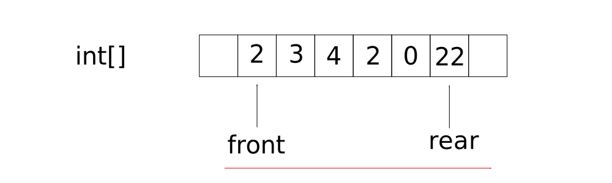
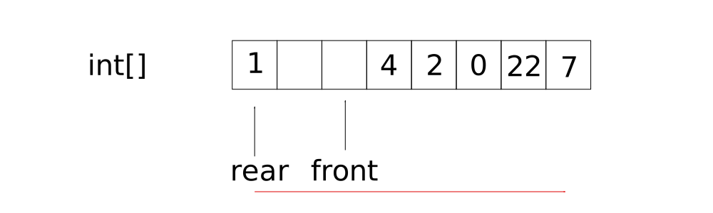
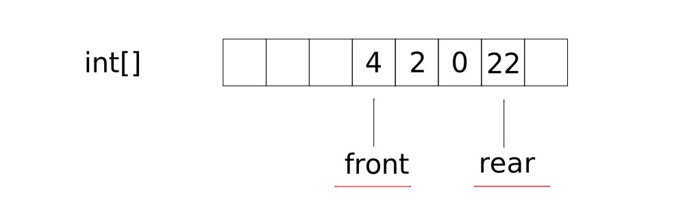

# The Queue data structure

Queues operate on the FIFO principle. Elements are added at the rear of a queue and deleted from the front.

Queues are made up data types which are defined by the elements stored and two pointers, one which handles the front of the queue operations and one which handles the rear of the queue.

As with the stack, queue methods are standardised by name:

+ enqueue(x) - add an element x (to the rear of the queue)
+ dequeue() - remove the element (from the front of the queue)
+ isEmpty()
+ isFull()
+ first() - return the front element
+ last() - return the rear element

Queues can be implemented using either arrays or linked lists.

## Queues and arrays

An array in theory only requires one pointer to store the address of the rear element, since the array itself points to the front element. There are drawbacks to this however, as will be explained later.

Enqueueing takes O(1) time provided one knows the number of elements present. Dequeuing takes at worst O(n) time since each remaining element must be shuffled to the front of the array (following the FIFO principle).

### Using two pointers

To avoid shuffling the elements, one can instead employ two pointers and shift the position of the first element of the array. The array in memory is not changed during this process.



The condition `isEmpty` is true of `ptr(front) == ptr(rear)` _after_ the last element is removed from the array. That is, remove the element, check if `ptr(front) == ptr(rear)`. If true then the queue is empty, otherwise advance ptr(front). Repeat until `ptr(front) == ptr(rear)`. Some authors may prefer `ptr(front) > ptr(rear)` condition.

When applying two pointers, the condition `isFull()` is true when `ptr(rear) == array.size - 1`.

## Implementing queues with an array

First note that pointers described above are really indices, so the structure given below only uses a pointer to reference the start of an array in the heap.

```cpp
struct Queue
{
    int size;   //size of array Qarray at runtime
    int front = -1;
    int rear = -1;
    int * Qarray;
};
```

```cpp
void newQueue(struct Queue *q, int size)
{
    q->size = size;
    q->front = q->rear = -1; //if defaults are not already set
    q->Qarray = (int *) malloc(q->size * sizeof(int));
}
```

The enqueue() and dequeue() methods shift the indices before adding or removing elements:

```cpp
void enqueue(struct Queue *q, int x)
{
    if(q->rear == q->size - 1)
        printf("Queue is Full");
    else
    {
        q->rear++;
        q->
        Q[q->rear] = x;
    }
}

int dequeue(struct Queue *q)
{
    int x =- 1;
    if(q->front == q->rear)
        printf("Queue is Empty\n");
    else
    {
        q->front++;
        x = q->Q[q->front];
    }
    return x;
}
```

Both methods are constant time complexity. Notice here how the front and rear indices are always advanced forward, so at some point the queue must be reinitialised or the 'pointers' must be reset (otherwise one would find the queue is empty or full). Some of the array placeholders prior to the front pointer may be vacant.

By default, the pointers can be reset whenever the condition `isEmpty` is true. Another solution would be to employ circular queues.

## Circular queues

In a circular queue, the element pointed to by the front pointer is always vacant. The front and rear pointers advance but once they reach the end of the array, they are pointed to the beginning again. This ensures that the array is filled up to `size - 1` elements, unlike the non-circular queue described above.



A circular queue `isFull()` is true when the rear pointer is behind the front pointer. We use the remainder arithmetic, mod or `%` to deduce the next index.

```cpp
(q->rear + 1) % q->size == q->front;
```

For example, if rear points to element 7 of an array of size 8, and front is pointing to element 0, then the array is full. `8 % 8 == 0` is true. Similarly, if rear points to element 3 of an array of size 8, and front points to element 4 (which itself is always empty), then `4 % 8 == 4` is also true.

We move the rear pointer and then enqueue using:

```cpp
q->rear = (q->rear + 1) % q->size;
q->Q[q->rear] = x;
```

To dequeue, we advance the front pointer in the same way as the rear pointer. First we check if the queue is empty, and then dequeue.

```cpp
int x = -1;
if (q->front == q->rear)
{
    printf("Queue is empty");
}
else
{
    q->front = (q->front + 1) % q->size;

    //return x as method output
    x = q->Q[q->front];
}
return x;
```

As with non-circular queues, enqueue() and dequeue() are both O(1) time complexity.

## Queues and linked lists

Queues are implemented with linked lists using two pointers, to ensure that insertion time is constant O(1). Initially, both pointers are null. The condition `isEmpty()` is true when the front pointer is null.

The condition `isFull()` is true when the heap is full, and signified when instantiation of a new node fails, _i.e._

```cpp
Node * t = new Node;
if (t == NULL)
{
    isEmpty() = true;
}
```

Enqueuing. With the first node added, both front and rear pointers are pointed to the non-NULL address of the first node. From this point, `front != NULL` and this means that the next node will not be the first node. Further additions mean `front != rear` and rear points to the last node. Then `rear->next == NULL` is true.

With dequeuing, the front node is advanced before the first node is removed. Both enqueuing and dequeuing in this way means both are O(1) operations.

```cpp
struct Node
{
int data;
struct Node *next;
}*front = NULL, *rear = NULL;

void enqueue(int x)
{
    struct Node *t;
    t = (struct Node*) malloc(sizeof(struct Node));
    if(t == NULL)
        printf("Queue is full\n");
    else
    {
        t->data = x;
        t->next = NULL;
        if(front == NULL)
            front = rear = t;
        else
        {
            rear->next = ;
            rear = t;
        }
    }
}

int dequeue()
{
    int x =- 1;
    struct Node* t;
    if(front == NULL)
        printf("Queue is Empty\n");
    else
    {
        x = front->data;
        t = front;
        front = front->next;
        free(t);
    }
    return x;
}
```

## Double-ended queues, DEQueues

Referred to as DEQueue, these can be implemented with arrays or linked lists. With regular queues, front and rear pointers are used for insertion and deletion, respectively. DEQueues permit front and rear pointers to facilitate both insertion and deletion. Thus, DEQueues do not adhere to the FIFO principle.



There is much more flexibility with linked lists since arrays are of fixed length and it is not always possible to insert from the front of an array. One can insert with front pointers if the pointer points to an element other than the first element.

There are other variants of DEQueues. `Input-restricted DEQueues` prohibit insertion from the front and `Output-restricted DEQueues` prohibit deletion from the rear. Deletion from the rear and insertion from the front, respectively, are permitted. Again, these variants are still not FIFO data structures.

## Priority Queues

Some OSes support prioritisation of threads. Elements in an arrays can be prioritised similarly, and passed to queues with the same priority designation. Such queues are referred to as priority queues.

Priority queues group elements which are acted on based on priority. The queue with the highest priority is acted on first, followed by any others.

### Single priority queues

Some elements contain data types which themselves signify a priority. For example, lower integers could have higher priority than larger integers.

Each element is inserted into a queue in the usual way above. Such insertions are constant time operations. However, deletion is based on priority, so one must scan the queue and look for the element with the highest priority, and then delete it. Thus the queue is behaving as a priority queue. Deletion is then, at worst, O(n). Remaining elements of an array (not a linked list) are then reshuffled, which also takes O(n).

Insertion (and reshuffling) based on priority is also possible. One would eventually build an array of, for example, integers in descending order (highest priority first) which takes O(2n) time. Deletion is constant time and performed at the front of the priority queue.

Priority queues are best represented as binary heaps, [discussed later](/25_Binary_Heaps.md). The insertion and deletion methods are both `O(log n)` time complexity.

## Implementing queues with two stack ADTs

A queue has been built and now one will use two stack ADTs to manage enqueueing and dequeueing.

Enqueue means push an element from a collection into a stack S1.

Dequeueing an element is given by two steps:

1. Check if stack S2 is empty. If not, then check and delete the top element from S2. If S2 is empty, then pop all all elements from S1 and push to S2.
2. Pop an element from S2.

Overall, we have not used the queue ADT to implement a queue but instead two stack ADTs. The code below is based on a C++ class `Queue`:

```cpp
void Queue::enqueue(int x) {
    S1.push(x);
}
 
int Queue::dequeue() {
    int x = -1;
    if (S2.empty()){
        if (S1.empty()){
            cout << "Queue is empty" << endl;
            return x;
        } else {
            while (!S1.empty()){
                S2.push(S1.top());
                S1.pop();
            }
        }
    }
    x = S2.top();
    S2.pop();
    return x;
}
 ```
