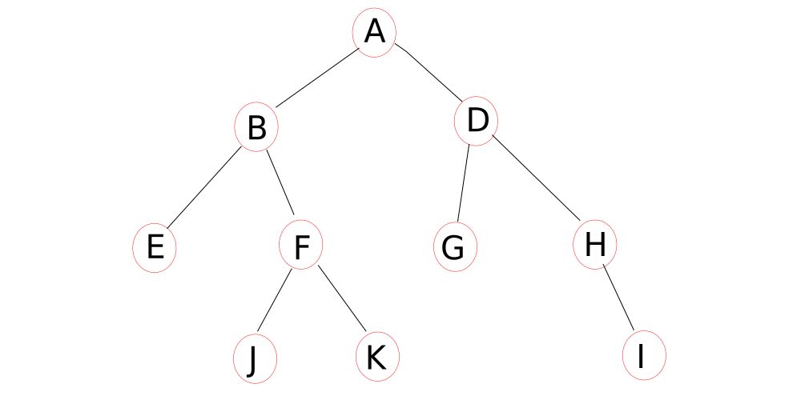
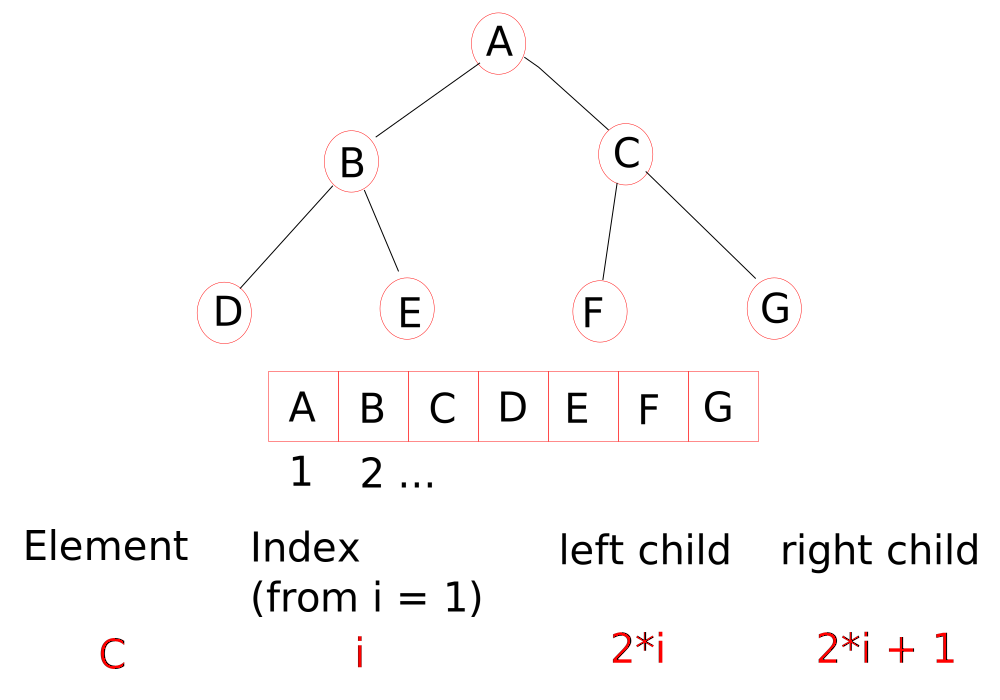
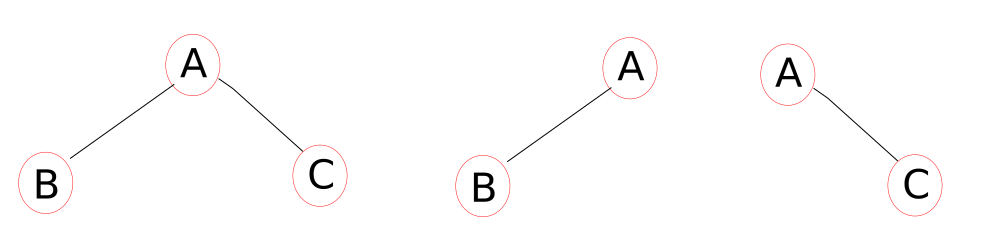
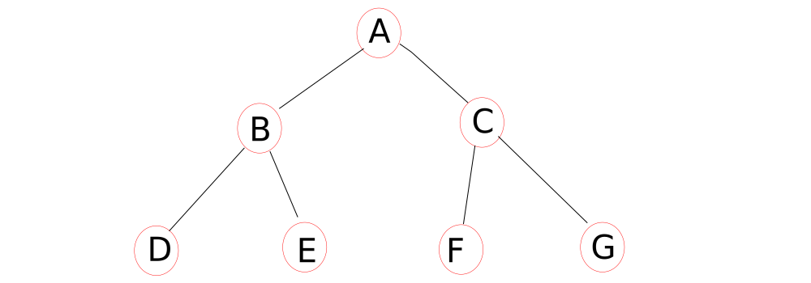
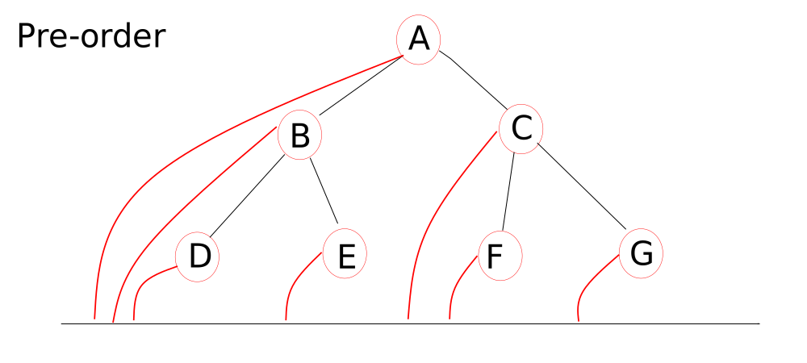
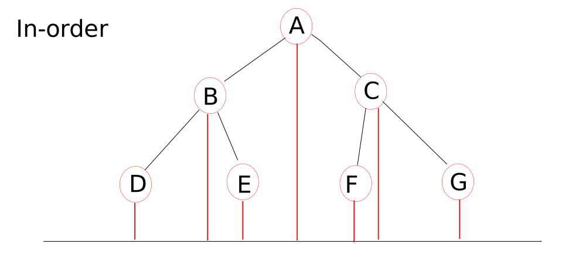
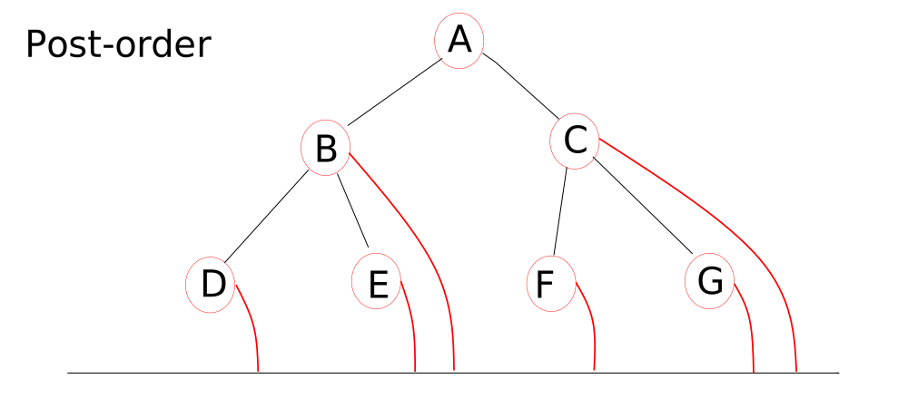
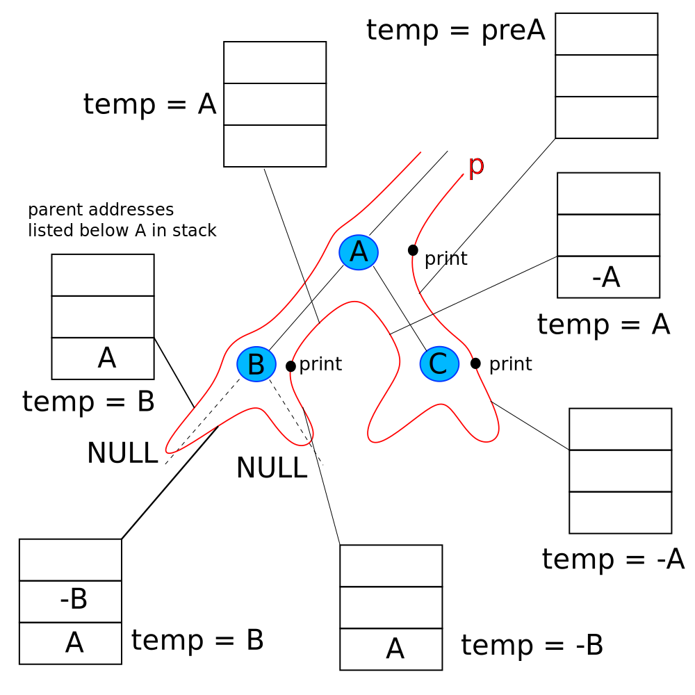
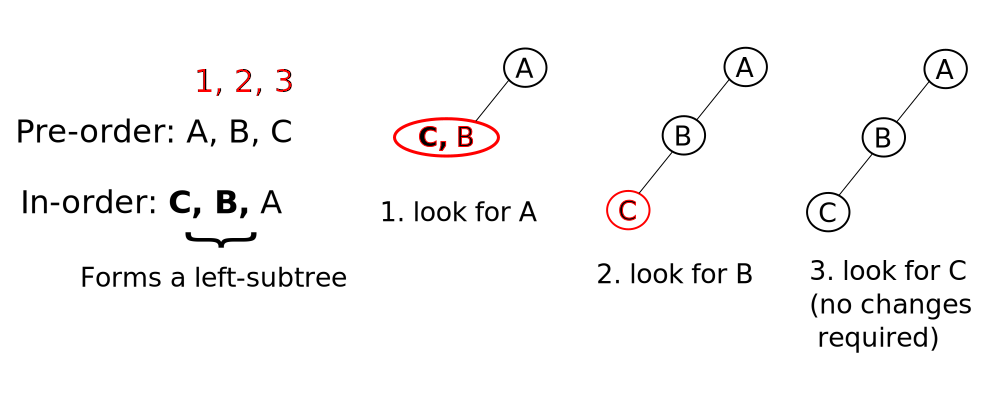

# Tree data structures



Tree data structures are composed of _nodes_ and _edges_. Some other terminology:

+ __Root__: uppermost node A
+ __Parent__: node connected above a given node
+ __Child__: node connected below a given node
+ __Siblings__: nodes with the same parent node
+ __Descendants__: all nodes connected below a given node
+ __Ancestors__: all nodes connected above a given node (not including siblings)
+ __Degree of a node__: number of edges or nodes below a given node
+ __Degree of a tree__ : (usually) any value greater than or equal to the largest degree of a node (see later)
+ __Internal and external nodes__: internal, where degree of the node `> 0`; external nodes are the `leaf` nodes, with a degree of zero
+ __Levels__: designates the position relative to the root. Root is assigned level 1, its children are level 2 and so on...
+ __Height of a tree__: Number of levels, in addition to the level given by the root node. A tree made up of one node has a height of zero. Essentially, the number of edges along one path from the root node, `height = level - 1`.
+ __Forest__: a collection of trees

Most of the material presented is concerned with __binary trees__, that is, trees in which all nodes have no more than two child nodes.

## Binary trees

With three unlabelled nodes, one can derive five differently shaped trees.


The general number of binary trees that can be generated is given by the Catalan number. The number of trees with the maximum height (equalling n nodes) is given by `2^(n-1)`.

Alternatively, T(n) can be deduced from the sum of `T(i - 1) * T(n - i)` from `i = 1` to `i = n`.

With three labelled nodes, there will be more permutations. So `ABC` can be written as `ACB` and `BAC` and so on. In general, the number of trees with `n` nodes is `T(n) * n!`.

### Node deduction from tree height

What would be the minimum and maximum number of nodes in a tree of given height `h`. 

For the minimum, this would equal the `h + 1` nodes. 

The maximum number of nodes is given by the sum of a GP series, `a + ar + ar^2 + ar^3 + ... ar^k = a/(r - 1)[(r^(k + 1) - 1)]`. Since r = 2 and a = 1 (on inspection) for the binary tree, then the maximum number of nodes for height `h`, we have `(2^(h + 1) - 1)` nodes.

### Height deduction from number of nodes

Conversely, what would be the minimum and maximum height of a tree with a given number of nodes?

The maximum height with `n` nodes is `n - 1`.

The minimum height is essentially the inverse of the formula for the maximum number of nodes. This results in the minimum height `h = [log[2](n + 1)] - 1`.

Making some approximations, we can state that:

+ the height of a binary tree is roughly between log N to N, with N = number of nodes
+ the number of nodes is roughly between H and 2^H, with H = height of a binary tree

### Number of nodes with a given degree in a binary tree

Through examination, one can observe that the `number of nodes with degree 2 = number of nodes with degree zero + 1`.  There is no clear relationship regarding nodes with degree one.

### Strict binary trees

Strict binary trees are also referred to as _proper_ or _complete_ binary trees. Strict binary trees can only have either zero or two child nodes, unlike a general binary tree, in which the nodes can have zero, one or two child nodes.

The minimum number of nodes for general binary trees (of height `h`) and for strict binary trees are the same : `n(min) = 2h + 1`.

The maximum number of nodes for a strict binary tree of height `h` is `n(max) = 2^(h + 1) - 1`. (Compare this to `n = [log[2](h + 1)] - 1` for general binary trees.)

The minimum height of a strict binary tree is the inversion of maximum number of nodes `n`: `height(min) = log[2](n + 1) - 1`.

The maximum height of a strict binary tree is the inversion of minimum number of nodes `n`: `height(max) = (n - 1)/2`.

For strict binary trees, the height varies between (roughly) log n and n nodes, similar to general binary trees.

The number of internal nodes `internal` and external nodes `external` in a strict binary tree is differs by one: `external = internal + 1`.

## m-ary trees

The degree of a tree is given by `m`, and as already mentioned the value represents the maximum number of child nodes any node in the tree can possess. There are 3-ary trees, 4-ary trees __etc.__

A 3-ary tree can appear to be a binary tree if all nodes have no more than two child nodes. In other words, one cannot deduce if an m-ary tree is a 3-ary tree or binary tree by simply looking at the tree diagram. A _binary_ tree diagram satisfies the same requirements for 3-ary, 4-ary, 5-ary (and so on) trees.

There are also _strict m-ary trees_ available, which are less ambiguous with regards to nomenclature. Such trees have nodes which have no child nodes or m-child nodes only.

### Analysis of m-ary trees

With general and strict binary trees, m = 2, and the minimum number of nodes `n` at a given height `h` is given by: `n(min) = 2h + 1`. For strict m-ary trees, this becomes `n(min) = mh + 1`.

With strict binary trees, the maximum number of nodes at a given height is `2^(h + 1) - 1`. For strict m-ary trees, this becomes `n(max) = m^(h + 1) - 1`.

Moving to minimum and maximum height with a given number of nodes `n`, for strict m-ary trees we have:

+ `height(min) = log[m](n + 1) - 1`
+ `height(max) = (n - 1)/m`

Regarding the number of internal `internal` and external `external` nodes, for strict m-ary trees we have:

+ `external = m*internal + 1`

## Representation of binary trees

Binary trees can be represented using either arrays or linked lists. For the moment, the first index is given the value of 1, not 0.

### Array representation

Binary tree nodes are stored along with the relationship between parent and child nodes.



The parent of a node is given by the floor value of `i/2`, so elements F and G have a parent at `i = 3`.

### Linked (list) representation

Most authors refer to this configuration as 'linked representation' instead of 'linked list representation' to emphasis the non-linear tree structure of a tree. Trees are not linear (list-list).

The node structure is the same as that of a doubly linked list. The node is defined as:

```cpp
struct Node
{
    struct * Node lChild;
    int data;   //or char or some other data type as needed
    struct * Node rChild;
};
```

Leaf nodes have two null pointers, `lChild` and `rChild`. More generally, for a tree with n-nodes, there will be `n+1` NULL pointers (equal to the number of external nodes in a strict binary tree).

Most trees are represented as linked lists and is the focus of the remaining ideas outlined.

## Full and complete binary trees

A _full binary tree_ is one which contains the maximum number of nodes. Consequently, the height of a complete binary tree can have a maximum of `n(max) = 2^(h + 1) - 1` nodes.

A _complete binary tree_ is understood by noting if there are null elements between the first and last non-null elements in the binary tree array representation. Null elements after the last non-element are permitted. For example, element G (above) can be missing (with all others present) but elements B - F cannot (while G is present).

Array representations and stack operations on trees require arrays to be filled from 'left to right' without any null entries, hence 'incomplete' binary trees are not stored as arrays.

All full binary trees are complete, but the converse is not always true.

## Strict and complete binary trees

Strict binary trees are not necessarily complete binary trees (envisage elements D and E missing, above).

If we remove elements E - G (above), then we have a binary tree which is complete but not strict. If elements D, E and G are missing then the binary tree is neither complete nor strict.

## Binary tree traversal

There are four types of tree traversal: _preorder_, _postorder_, _inorder_ and _level_.



Pre-order: (node) A, B (left-subtree), C (right-subtree)
In-order: B (left-subtree), A (node), C (right-subtree)
Post-order (vertical L-to-R, then parent node): B (left), C (right), A (node)
Level-order (horizontal top-to-bottom): (first level) A, (second level) B, C

For the second tree, we have:

Pre-order: A, B, ... or just A, B
In-order: B, A, ... or just B, A
Post-order: B, ..., A, or just B, A
Level-order: A, B, ... or just A, B

For the third tree, we have:

Pre-order: A, ..., C or just A, C
In-order: ..., A, C or just A, C
Post-order: ..., C, A or just C, A
Level, order: A, ..., C or just A, C

For larger trees, one breaks down to subtrees and handles traversal within each subtree.



Pre-order: A, (B, D, E), (C, F, G) or just A, B, D, E, C, F, G
In-order: (D, B, E), A, (F, C, G)
Post-order: (D, E, B), (F, G, C), A
Level-order: A, (B, C), (D, E, F, G)

### Visual methods when traversing trees

Draw lines from each node and scan along the horizontal line.







Note how in pre-order, the node is examined before its children (hence "pre-order"). In in-order, the nodes are viewed left-to-right as shown in the tree. In post-order, the node is viewed after its children (hence "post-order"). 

An alternative visual method with markings:


Another involves pointing either left, up or right and move along the boundary similarly, and then record the node to which your finger or an arrow is pointing to the node. This method is appreciated with a good following of the previous method.

Note that the first element of a pre-order traversal of a tree is always the same the last element of a post-order traversal.

### Building a binary tree

Each node of the binary tree is represented by a node of a doubly linked list. Another array Q (if the number of tree nodes is already known) or a linked list Q (if not) stores the address of the node being initialised. The construction of a binary tree follows the level-order traversal method, so the sequence of elements (pointers) in the array Q follows the order of a level-traversed binary tree.

```cpp
/*
the following utilises a structure and class, Queue:
    class Node{
    public:
        Node* lchild;
        int data;
        Node* rchild;
    };

    class Queue{
    private:
        int size;
        int front;
        int rear;
        Node** Q;  // [Node*]*: Pointer to [Pointer to Node]
    public:
        Queue(int size);
        ~Queue();
        bool isFull();
        bool isEmpty();
        void enqueue(Node* x);
        Node* dequeue();
    };
*/

struct Node *root = NULL;

void buildBinaryTree()
{
    //temporary pointers to the binary tree nodes
    //t is used to build new tree nodes, p is used to store the address of the previously created tree node
    struct Node *p, *t;
    int x;

    //Linked queue with 100 elements
    struct Queue q;
    create(&q, 100);

    //start building the tree
    printf("Enter root value ");
    scanf("%d", &x);

    root=(struct Node *) malloc(sizeof(struct Node));
    root->data = x;
    root->lchild = root->rchild = NULL;

    //send the address of the root node to Queue q
    enqueue(&q, root);

    //start building the child nodes
    while(!isEmpty(q))
    {
        //store the previous node address in p in preparation with link to next node
        p = dequeue(&q);
        printf("Enter left child of %d ", p->data);
        scanf("%d",&x);

        //when x == -1, there is no node, start with the left then the right nodes
        if(x != -1)
        {
            t=(struct Node *) malloc(sizeof(struct Node));
            t->data = x;
            t->lchild = t->rchild = NULL;
            p->lchild = t;
            enqueue(&q, t);
        }

        printf("Enter right child of %d ", p->data);
        scanf("%d", &x);
        
        if(x != -1)
        {
            t=(struct Node *) malloc(sizeof(struct Node));
            t->data = x;
            t->lchild = t->rchild = NULL;
            p->rchild = t;
            enqueue(&q, t);
        }
    }   
}
```

## Traversing a tree recursively

### Pre-order traversal

Here, one navigates to the left-child until the last (leaf) node is reached. Following this, the sibling right-hand node is called, which itself is also a leaf node. The parent node is then processed.

Each node is initialised with two pointers, the left-child and the right-child.

```cpp
void preOrder(Node *t)
{
    //check if this is a leaf node
    if (t != null)
    {
        printf("%d", t->data);
        preOrder(t->left_child);
        preOrder(t->right_child);
    }
}
```

The resident (newly-found) node is printed before any of its child nodes.

Note that the stack will store at most the height `h` of the tree `h + 2`, to include the self-called null pointers of the leaf nodes. The space complexity matches the minimum and maximum height of a general (though complete) tree: `h = n - 1`, that is, O(n). The best-case would be `h = [log[2](n + 1)] - 1`, that is,O(log[2]n).

The method preOrder() is called `2n + 1` times for a tree with n nodes, hence the degree of time complexity is O(n).

### In-order traversal

The in-order method block differs to the pre-order method by the sequence of recursive calls.

```cpp
void inOrder(Node *t)
{
    //check if this is a leaf node
    if (t != null)
    {
        preOrder(t->left_child);
        printf("%d", t->data);
        preOrder(t->right_child);
    }
}
```

In-order calls place precedence to the left-child before printing the new resident node itself (cf. pre-order). The time and space complexities for inOrder() are the same as that for preOrder().

### Post-order traversal

The post n-order method block is essentially a different sequence of calls, this time with both child nodes handled first before the resident node.

```cpp
void postOrder(Node *t)
{
    //check if this is a leaf node
    if (t != null)
    {
        preOrder(t->left_child);
        preOrder(t->right_child);
        printf("%d", t->data);
    }
}
```

### Iterative tree traversal methods

Here are some of the key conditions:

+ whenever one attempts to traverse to the left- or right-child of a node, store the address of the resident node in the stack
+ if the current pointer to a node is `NULL` it means that there are no child nodes, so to return to the parent node, pop the stored address from the stack
+ if the current pointer is `NULL` and the stack is empty, it means that one has completed tree traversal

A new structure which represents the stack, which store the addresses of nodes, pointers.

```cpp
void Tree::iterativePreOrder(Node *p) {
    struct Stack stk;

    while (p != NULL || !isEmpty(stk)){
        if (p != NULL)
        {
            printf("%d", p->data);
            push(&stk, p);
            p = p->lchild;
        } else {
            //at the end of a left, leaf node, go to the right-child node
            p = pop(stk);
            p = p->rchild;
        }
    }
}
 
void Tree::iterativeInOrder(Node *p) {
    struct Stack stk;

    while (p != NULL || !isEmpty(stk)){
        if (p != NULL)
        {
            push(&stk, p);
            p = p->lchild;
        } else {
            //at the end of a left, leaf node, print the current node and then go to the right-child node
            p = pop(stk);
            printf("%d", p->data);
            p = p->rchild;
        }
    }
}
 
void Tree::iterativePostOrder(Node *p) {
    struct Stack stk;

    //stores the address as a int (used twice, see below)
    long int temp;

    while (p != NULL || !isEmpty(stk)){
        // p is looking along all left-child nodes until NULL is found (no more left-child nodes) while storing parent node addresses in
        // the stack

        if (p != NULL)
        {
            push(&stk, p);
            p = p->lchild;
        } 
        else
        {
            temp = pop(stk);
            if (temp > 0)
            {
                push(&stk, -temp);
                p = ((Node *) temp->rchild);
            }
            else
            {
                printf("%d", ((Node *) temp->data));
                p = NULL;
            }
        }
    }
}
```

Post-operator, with the stack status, is outlined below:



### Level traversal

In this method, one employs a queue data structure to store the address of the node to be processed. This also means that the sequence of addresses matches the level-order traversal of the nodes of the tree.

```cpp
void LevelOrder(struct Node *root)
{
    struct Queue q;
    create(&q, 100);

    printf("%d ", root->data);
    enqueue(&q, root);

    while(!isEmpty(q))
    {
        //note the following pertains to nodes in the same subtree, with a parent node 'root'; each iteration moves to a different subtree
        root=dequeue(&q);

        if(root->lchild)
        {
            printf("%d ", root->lchild->data);
            // this next enqueue stores the starting point of the next level (the queue is populated with null elements so only the 
            // enqueueing of non-null elements changes the overall queue ADT)
            enqueue(&q, root->lchild);
        }

        if(root->rchild)
        {
            printf("%d ", root->rchild->data);
            enqueue(&q, root->rchild);
        }
    }
}
```

## Building trees from traversals

All of pre-order, in-order and post-order traversals will generate multiple trees. It is not possible to generate a desired tree from a combination of all traversals without also generating other trees.

In some cases, choosing a pair of traversals will also yield different trees. A pre-order sequence and post-order sequence will result in different trees. 


Revisiting this figure, the pre-order A, B, C and post-order C, B, A can yield the first two and last two trees (assume the node A is the parent, followed by node B).

There are unique trees formed however. A pre-order of A, B, C and in-order of C, B, A is represented by the first tree only. A post-order of C, B, A and in-order A, B, C is represented by the last tree only.

To generate a tree from two traversals (pre- and in-, post- and in-), list the pre (or post) order traversal and write the in-order below. Go through each node in the pre or post traversal and locate the same node in the in-order traversal. This node in the in-order traversal will form the parent/root node of the present subtree. Nodes listed to the left are part of a left-child subtree and all nodes listed to the right are part of a right-child subtree.

For example, pre-order (A, B, C) and in-order (C, B, A) shows (C, B) are to the left of the root node A.



Time complexity is O(n) to scan the pre-order sequence and for each scan, process up to n nodes from the in-order sequence, so worst-case, traversal to tree is O(n^2). A C++ implementation is provided [here](https://algorithms.tutorialhorizon.com/make-a-binary-tree-from-given-inorder-and-preorder-traveral/).

## Deducing the number of nodes and height of a tree

Regarding the number of nodes, one starts at the root node and recursively calls the same function `count()` on the left child nodes, followed by the right child nodes.

```cpp
int count(Node *p) {
    int x;
    int y;
    if (p != NULL){
        //follows a post-order form of method calls (general approach for most tree processing)
        x = count(p->lchild);
        y = count(p->rchild);

        //note that the return value below can be used to find, for example, the sum or product of all nodes, instead of the number of nodes
        return x + y + 1;
    }
    return 0;
}
```

When a given terminal subtree is processed, the two recursive calls return a value of two. All leaf nodes `return 0`.

The height of the tree is based on summing the largest number of consecutive nodes, either from the left-child or right-child.

```cpp
int height(Node *p) {
    int l = 0;
    int r = 0;
 
    if (p != NULL){
        l = height(p->lchild);
        r = height(p->rchild);

        // pick the longest sequence of nodes
        if (l > r){
            return l + 1;
        } else {
            return r + 1;
        }
    }
    return 0;
}
```
