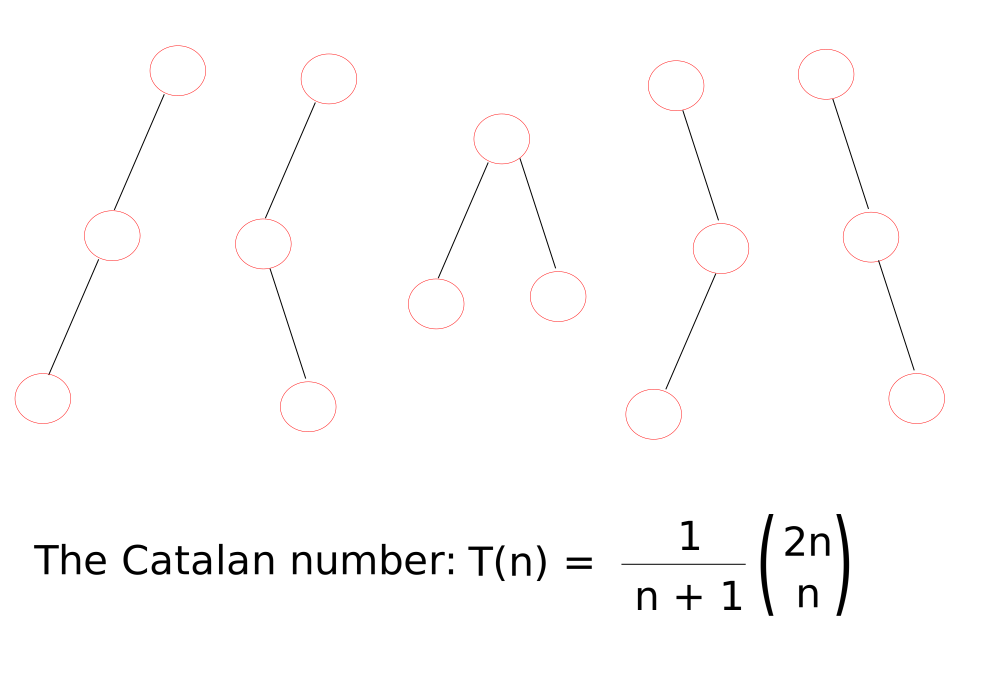
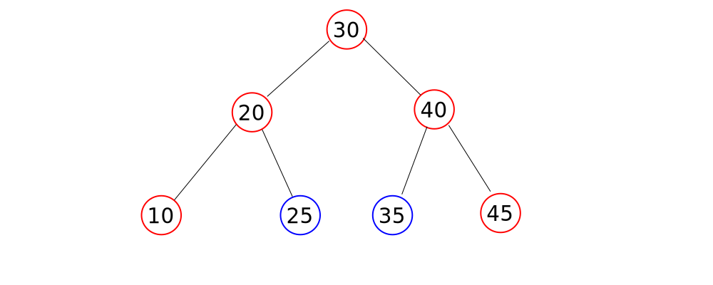
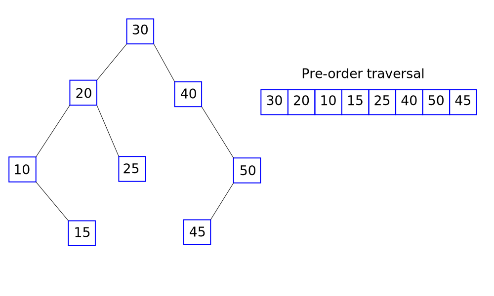

# Binary Search Trees BST

These are binary trees in which the left child node stores a value which is smaller than the parent, and a right-child node that stores a value larger than the parent.  Such structures are optimised for binary search behaviour.

Some value properties:

+ All nodes store unique values
+ All in-order traversals produce a sorted list of elements
+ For a BST with `n` nodes, there are always Catalan number of BSTs possible



BSTs are usually represented by linked lists ('linked representation') but can be implemented with arrays. Assume that BSTs are not strict binary trees in the following discussion.

## Searching with a BST

Starting from the parent node, one compares the required element with the node value and traverses either left or right if the required element does not equal the current node. Move to the left if the required element is less than the parent element, or, move to the right if the required element is greater than the parent node.

The time complexity of a binary search in a tree is the same as its height. Previously, the height varies between (roughly) log n and n nodes. BST trees are generally constructed such that leaf nodes are found at the highest level only. Therefore binary searches are of the order O(log[2] n), whether the search is performed recursively or iteratively.

Binary searches can be performed recursively. The base case is when a `NULL` pointer is encountered, and hence the element is not found.

```cpp
Node * recursiveBinarySearch(Node * t, int value)
{
    if (t == NULL){
        return NULL;
    }

    if (value == t->data){
        return t;
    }
    else if (value < t->data){
        recursiveBinarySearch(t->lchild, value);
    }
    else
        recursiveBinarySearch(t->rchild, value);
}
```

Iteratively, the same method would be:

```cpp
Node * iterativeBinarySearch(Node * t, int value)
{
    while (t != NULL)
    {
        if (value == t->data){
            return t;
        }
        else if (value < t->data){
            t = t->lchild;
        }
        else
            t = t->rchild;
    }
    return NULL;
}
```

## Inserting into a binary search tree

BSTs are ordered, so searching for the element to be inserted establishes if insertion is needed and, if needed, where the element should go. The pointer t tracks the current position in the tree and can be `NULL` (when an insertion is needed). A trailing tail pointer is therefore needed to store the previous node's position, should pointer t be `NULL`. The code follows `iterativeBinarySearch()` quite closely.

Another pointer to a new Node, given here as `p` is used to create a new Node, if needed.

```cpp
Node * iterativeInsertIntoBST(Node * t, int value)
{
    Node * tailPtr = NULL, * p;
    while (t != NULL)
    {
        tailPtr = t;
        if (value == t->data){
            return t;
        }
        else if (value < t->data){
            t = t->lchild;
        }
        else
            t = t->rchild;
    }
    // t is NULL so insertion needed
    p = (struct Node *) malloc(sizeof(struct Node));
    p->data = value;
    p->lchild = p->rchild = NULL;

    if (p->data < tailPtr->data){
        tailPtr->lchild = p;
    }
    else
        tailPtr->rchild = p;
}
```

Since insertion follows the BST search, the time complexity is O(log[2] n).

The recursive form of insertion is given below. The important call is whenever the current pointer t is `NULL`, at which point a new Node is created. The `lchild` or `rchild` conditions were established prior to the recursive call.

```cpp
Node * recursiveInsertIntoBST(Node * t, int value)
{
    Node * p;   //used to build a new Node

    if (t == NULL){
        p = (struct Node *) malloc(sizeof(struct Node));
        p->data = value;
        p->lchild = p->rchild = NULL;
        return p; //done; return the pointer to either calls below
    }

    //find the correct subtree to explore
    else if (value < t->data){
        t->lchild = recursiveInsertIntoBST(t->lchild, value);
    }
    else
        t->rchild = recursiveInsertIntoBST(t->rchild, value);
    
    return t;
}
```

Note that at present, the BST is not strictly binary until all insertions are matched with a sibling node.

The construction of a BST can be carried out using the search algorithm. Insertion takes O(n) time complexity (always after a finding a leaf node) and searching takes O(log[2] n) time. Since one is required to insert n elements, and each search requires O(log[2] n), a BST build has O(n log[2] n) time complexity.

## Deleting from a BST

The deletion of leaf nodes is quite straightforward since the node is deleted and the parent node pointer (to the former node) is set to `NULL`.

The deletion of internal nodes requires more thought.

### Deletion of the root node

In this case, an option about which node should represent the new root node needs addressing. The approach taken assigns the root node to either the in-order predecessor or the in-order successor of the deleted root node. This approach reduces the number of subsequent operations on other nodes, which would otherwise require re-assigning/re-arranging.

Thinking about it, the in-order predecessor will always be larger than all nodes in the left subtree of root, and less than the root node.



Likewise, the in-order successor will always be the smallest element of the right-subtree of the root node but also larger than the root node. Deciding which node to assign as the new root node is not discussed further here and at this stage is chosen arbitrarily. (Generally, for fewer operations it is simpler to assign the node which itself is a leaf node.)

Note that the deletion of leaf nodes satisfies the criteria that there are no in-order predecessor or in-order successor nodes. Concern with what node replaces the leaf node is not required.

### Deletion of a parent node (other than root)

The deletion of a parent node other than the root node will always involve subsequent node rearrangement. One can choose either the in-order predecessor or the in-order successor of the parent node, in the same way as that for the root node. The operation which requires the least number of subsequent changes involves choosing a in-order predecessor or the in-order successor which is a leaf node.

```cpp
Node* DeleteNode(Node *p, int value) {
    Node* q;
 
    if (p == NULL){
        return NULL;
    }
 
    if (p->lchild == NULL && p->rchild == NULL){
        //current node is a leaf node, evaluate its value
        if (p == root){
            root = NULL;
        }
        //current leaf node is the required node, so delete
        delete p;
        return NULL;
    }
 
    if (value < p->data){
        p->lchild = DeleteNode(p->lchild, value);
    } 
    else if (value > p->data){
        p->rchild = DeleteNode(p->rchild, value);
    } 
    //reached the non-leaf node to be deleted; the subsequent operations** are arbitrary and can be customised as desired
    else {
        if (Height(p->lchild) > Height(p->rchild)){
            //choose** the left-subtree which has the greater height and return the in-order predecessor
            q = InPre(p->lchild);
            p->data = q->data;
            p->lchild = DeleteNode(p->lchild, q->data);
        } else {
            //choose** the right-subtree which has a height <= left subtree; return the in-order successor
            q = InSucc(p->rchild);
            p->data = q->data;
            p->rchild = DeleteNode(p->rchild, q->data);
        }
    }
    return p;
}
```

The methods `Height()`, `InPre()` and `InSucc()` are iterative methods which return the height of a subtree, and in-order predecessor and in-order successor pointers, respectively.

```cpp
int Height(Node *p) {
    int x;
    int y;
    if (p == NULL){
        return 0;
    }

    x = Height(p->lchild);
    y = Height(p->rchild);

    return x > y ? x + 1 : y + 1;
}
 
Node* InPre(Node *p) {
    while (p && p->rchild != NULL){
        p = p->rchild;
    }
    return p;
}
 
Node* InSucc(Node *p) {
    while (p && p->lchild != NULL){
        p = p->lchild;
    }
    return p;
}
```

## Generating BSTs from pre-order traversals

Given any list of elements, one can build a BST by comparing the incoming element with the root node. The root node is the first element of the list (or array). If an element is smaller than a parent, it goes to the left, otherwise it goes to the right.

Moreover, BSTs can also be generated from isolated pre-order or post-order traversals alone. In-order sequence comparisons (used previously in conjunction with pre- or post-order traversals) are not needed here. See below for an example:



We do not need to look for an element from an in-order list in a pre-order list.

Reiterate here that a BST subtree has elements in the left-subtree such that they are all less than the parent node. As one traverses to the next subtree, the requirement is the still true and so all nodes in the left-subtree to the next node are also lower in value. Similar conditions can be drawn for the right-subtrees. These checks are carried out on the pre-order array, in the snippet for generating a BST, below:

```cpp
// array called pre, of n int's
void createFromPreOrder(int *pre, int n) {
 
    // Create root node
    int i = 0;

    root = new Node;
    root->data = pre[i++];
    root->lchild = root->rchild = NULL;
 
    // Iterative steps
    // pointer t marks the current node, pointer p stores the previous one and then pushes the address to the stack
    Node* t;
    Node* p = root;
    struct Stack stk;
 
    //i is not always incremented, so use while loop
    while (i < n){
        // Left child case
        if (pre[i] < p->data){
            t = new Node;
            t->data = pre[i++]; //advance i whenever a new node is populated
            t->lchild = t->rchild = NULL;

            p->lchild = t;  //establish the link with the growing tree
            stk.push(p);    //store the address of p in the stack
            p = t;          //let p catch up to t
        } else {
            // Right child cases, when incoming element pre[i] is larger than the current node

            // Incoming element must satisfy: stk.top() > pre[i] > p->data
            // if the stack is empty than compare pre[i] to 32767, otherwise compare pre[i] to the data from the top of the stack

            if (pre[i] > p->data && pre[i] < (stk.empty() ? 32767 : stk.top()->data)){

                t = new Node;
                t->data = pre[i++];
                t->lchild = NULL;
                t->rchild = NULL;

                p->rchild = t;
                p = t;
            } else {
                //if not, send p to the previous parent and pop the address (i is not advanced and pre[i] needs to be inserted elsewhere)
                p = stk.top();
                stk.pop();
            }
        }
    }
}
```

## Some of the drawbacks to BSTs

The order of insertion of elements affects the height of the BST, not the elements themselves. One can order the elements from the set {1, 2, 3, 4, 5, 6, 7, 8, 9} in different ways and get BSTs with different heights. All BSTs will be within a height of between `log[2] n` and `n`. This goes back to the point that BSTs presented in this section are not strict binary trees. They will not all have the minimum height of `log[2] n`.

The height of BSTs is better controlled using AVLs, discussed in the next section.
