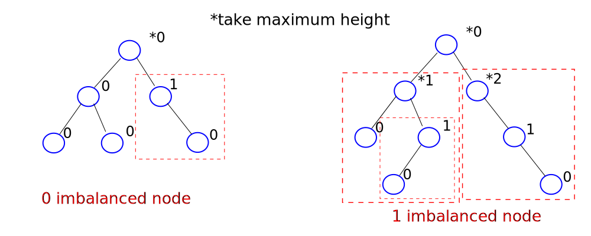
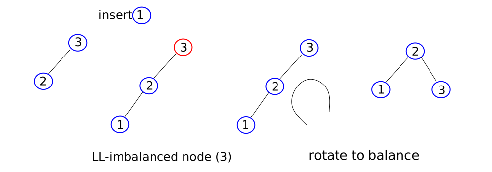
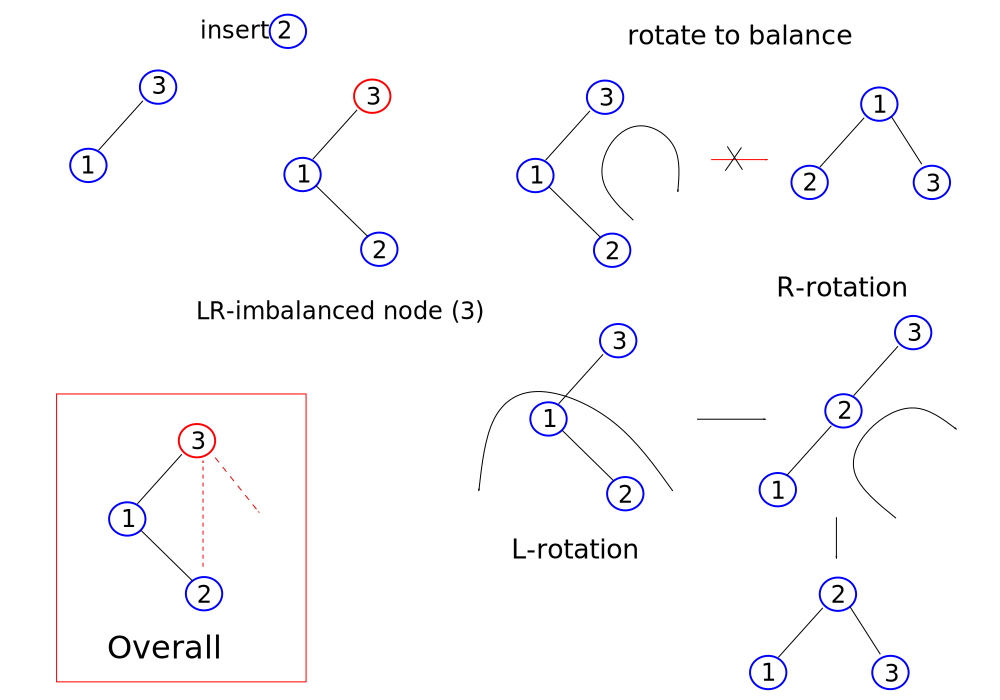
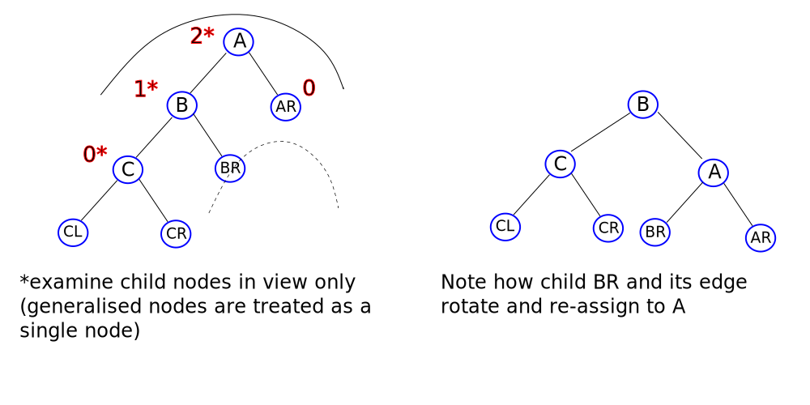
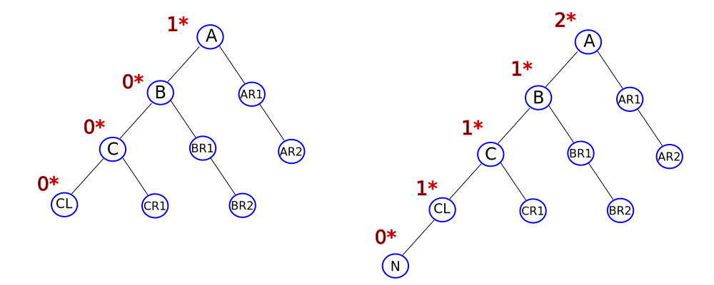
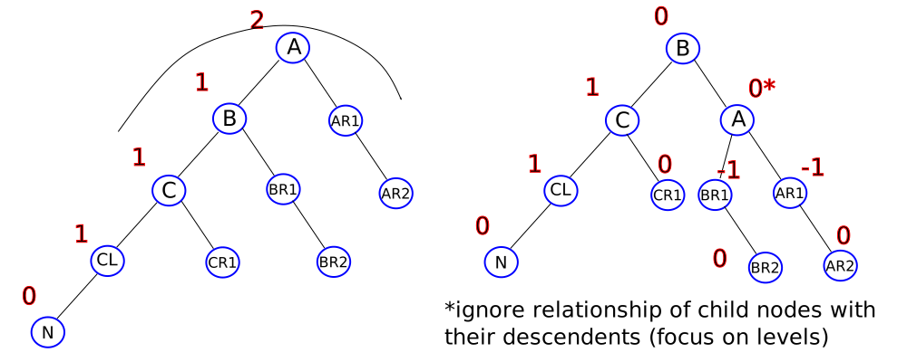
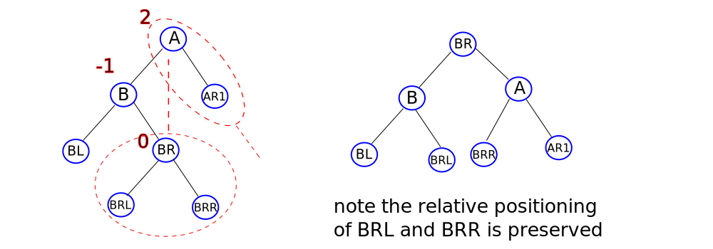

# AVL Trees

Named after inventors Adelson-Velsky and Landis, AVL trees are height-balanced BSTs.

A `balance factor = height of left subtree - height of right subtree`, is used to ensure there are no excessively unbalanced nodes. It minimises the overall height of a tree by maximising the use of the nodes available. Balance factors of [-1, 0, 1] are sought after.

Generally, balance is taken as the absolute value `|height of left subtree - height of right subtree|` since it does not always matter which subtree is longer. Thus, a tree is `imbalanced` if `|height of left subtree - height of right subtree| > 1`.



The above balance factors assume the absolute balance factor. An imbalance of 3 or more is largely ignored because the method of counting levels and deducing balancing factors concerns three consecutive nodes only (then 2 - 0 = 2, at most).

## Inserting nodes into an AVL tree, with rotations

In building an AVL tree, current nodes are rotated so as to balance the overall tree.



The above imbalanced node is referred to as a `left-of-left imbalanced` node. This naming convention states the relationship between the imbalanced node (3) and the inserted node (1). The rotation is similarly referred to as `LL-rotation`, or `right-rotation` or even `clockwise rotation`. There is no standard nomenclature. In this article, we will use LL-rotation to match the LL-imbalance.

All rotations (and balance factors) are performed over three nodes only.

Analogously, there is also `RR-imbalanced` nodes possible and rectified with `RR-rotations`. Note that both LL-rotations and RR-rotations lead to the same balanced tree.

Another two types of imbalanced nodes are `LR` and `RL`.



RL-imbalanced nodes and rotations follow similarly.

LL- and RR-rotations are viewed as single rotations, and RL- and LR-rotations are viewed as double rotations. Rotations not only reveal how to balance BSTs into AVL trees, they also relate all BSTs together.

## More general BST balancing

If one were to observe the balance factor of a node and neglect the absolute expression, then:

+ a positive balance factor has a longer left-subtree
+ a negative balance factor has a longer right-subtree

If one were to expand to larger BSTs, then one can observe the effect on other, largely ignored, child nodes/subtrees.



What happens when a new node is inserted? Note the changes to the balance factors, and how node A becomes imbalanced.



The insertion is described by looking at three nodes only, in this case, A, B and C. As far as these three nodes are concerned, node N was inserted and resulted in node A becoming LL-imbalanced. Node N traversed the left child of A (B) and the left child of B (C), presumably because it has the lowest value of the tree in view. The insertion caused on the three nodes to become imbalanced. Other nodes may become imbalanced but they would require independent attention.

Note that this description is not concerned about the relationship between node N and node CL. Node N could be the left-child or right-child of node CL. To balance the tree, we need to perform an LL-rotation around node A.



Note, also, how the relationship between BR1 and BR2 are preserved. Only the edge of B-BR1 is rotated.

Regarding a LR imbalance and rotation, consider the following:



The node inserted was either BRL or BRR, either of which traversed left of A and right of B. The LR rotation thus focuses on the three nodes A, B, and BR.

Replacing the generalised labels with real values reveals how one BST is converted into another BST.

The complete code for AVL insertion and rotations is given below.

```cpp
#include <stdio.h>

struct Node
{
    struct Node *lchild;
    int data;
    int height;
    struct Node *rchild;
}*root = NULL;


int NodeHeight(struct Node *p)
{
    int hl, hr;
    //if p and its lchild are NULL, then return 0
    hl = p && p->lchild ? p->lchild->height : 0;
    hr = p && p->rchild ? p->rchild->height : 0;

    //return the greatest height
    return hl > hr ? hl + 1 : hr + 1;
}

int BalanceFactor(struct Node *p)
{
    int hl, hr;
    //if p and its lchild are NULL, then return 0
    hl = p && p->lchild ? p->lchild->height : 0;
    hr = p && p->rchild ? p->rchild->height : 0;

    //positive or negative balanace factors assumed
    return hl - hr;
}

//performed when left-subtree is larger than the right-subtree from node p
struct Node * LLRotation(struct Node *p)
{
    //temporary pointers: pl is p's lchild; plr is pl's rchild (recall, plr's edge might need re-assigning)
    struct Node *pl = p->lchild;
    struct Node *plr = pl->rchild;

    //perform the quick switch ('single' rotation)
    pl->rchild = p;
    p->lchild = plr;

    //with nodes in place, re-assign their height property
    p->height = NodeHeight(p);
    pl->height = NodeHeight(pl);

    //change the identity of root if necessary
    if(root == p)
        root = pl;

    //return address of previously imbalanced node
    return pl;
}

//ideas for LRRotation carry across from LLRotation
struct Node * LRRotation(struct Node *p)
{
    struct Node *pl = p->lchild;
    struct Node *plr = pl->rchild;

    pl->rchild = plr->lchild;
    p->lchild = plr->rchild;

    plr->lchild = pl;
    plr->rchild = p;

    pl->height = NodeHeight(pl);
    p->height = NodeHeight(p);
    plr->height = NodeHeight(plr);

    if(root == p)
        root = plr;
    return plr;
}

//for brevity, RR and RL rotations, while analogous, are omitted from this snippet

struct Node *RInsert(struct Node *p, int key){

    //t is the pointer to the inserted Node
    struct Node *t = NULL;

    //if insert to an empty tree...
    if(p == NULL)
    {
        t = (struct Node *)malloc(sizeof(struct Node));
        t->data = key;
        t->height = 1;
        t->lchild = t->rchild = NULL;
        return t;
    }

    // if insertion requires rebalancing
    // choose left or right from root/parent
    if(key < p->data)
        p->lchild = RInsert(p->lchild, key);
    else if(key > p->data)
        p->rchild=RInsert(p->rchild,key);

    //check balance of root/parent
    p->height = NodeHeight(p);
    if(BalanceFactor(p) == 2 && BalanceFactor(p->lchild) == 1)
        //p is an LL-imbalanced node
        return LLRotation(p);
    else if(BalanceFactor(p) == 2 && BalanceFactor(p->lchild) == -1)
        //p is an LR-imbalanced node
        return LRRotation(p);
    else if(BalanceFactor(p) == -2 && BalanceFactor(p->rchild) == -1)
        //p is an RR-imbalanced node
        return RRRotation(p);
    else if(BalanceFactor(p) == -2 && BalanceFactor(p->rchild) == 1)
        //p is an RL-imbalanced node
        return RLRotation(p);

    return p;
}

int main()
{
    root = RInsert(root, 50);
    RInsert(root, 10);
    RInsert(root, 20);
    return 0;
}
```

## Generating AVL trees

Balanced BSTs are generated by inserting nodes, checking balance factors and then rotating if required. This also ensures that absolute balance factors greater than 2 are produced.

When two or more imbalanced nodes are introduced on insertion, the first node that is re-balanced is the first ancestor node. Successive ancestor imbalanced nodes are then balanced.

## Deletion of nodes from AVL trees

Essentially, the procedure to delete nodes from an AVL tree is the same the deletion of nodes from a BST. The difference is is that rotations are carried out with AVL trees if one or more nodes become imbalanced.

Deleting a node from one side makes the opposite side longer. One can consider a series of general cases.

+ Deleting from the right-side leads to node with balance factor 2. To rebalance this node, one would need to perform a left-rotation. Furthermore:
  + If the left-child node of the parent is +1, then the rotation needed to rebalance the parent node is specifically called `L1` rotation, where 1 represents the balance factor of the left-child node. A single rotation is needed, that is, LL.
  + If the left-child node is -1, then the rotation needed to rebalance the parent node is referred to as `L-1` rotation. A double rotation, LR, is then needed. Note the result of L1 and L-1 is the same.
  + If the left-child node is 0, the either L1 or L-1 rotation will rebalance the parent node, however, the resultant trees will not be the same. Whichever rotation is chosen, the procedure is referred to as an `L0` rotation.

The nomenclature `L1`, `L-1` and `L0` are specifically referring to rotations which follow deletions.

When deleting from the left-side, the right-side becomes 'heavier' and gives rise to `R1`, `R-1` and `R0` rotations in the same way as outlined above.

## Height vs node analysis for AVL trees

The minimum and maximum no. of nodes for an AVL tree of given height `h` is the same as that for BSTs. Recall that BSTs discussed previously are not always strict binary trees.

+ Maximum no of nodes:  2^(h) -1
+ Minimum no of nodes:  described with an recurrence relation
  + When h = 1, then nodes n = 1
  + When h = 2, then nodes n = 2
  + When h > 2, then nodes N(h - 2) + N(h - 1) + 1, where N(h) is the minimum no. of nodes at height `h`

The last relation is actually the Fibonacci series, a 'balanced' series.

__Note that these formulae apply when the height of an AVL tree with one node is taken as `1` not `0`__.

The minimum and maximum height with a given no. of nodes `n` is given by the inverse of the above formulae.

+ Minimum height:  log[2] n + 1
+ Maximum no of nodes:  use the relation for minimum no. of nodes and solve for height `h`

The last relation is approximately `1.44 log[2] (n + 2)`.
