# Other search trees

## 2-3 (search) trees

`2-3 trees` are extensions of the idea of BSTs. BSTs are characterised by one parent node storing one key (value), followed by zero or two child nodes. 2-3 trees are search trees which are composed of a parent node which stores two keys and three child nodes, each of which store two keys. They are also referred to as `multiway` or `M-way` trees (M represents the degree of a node).

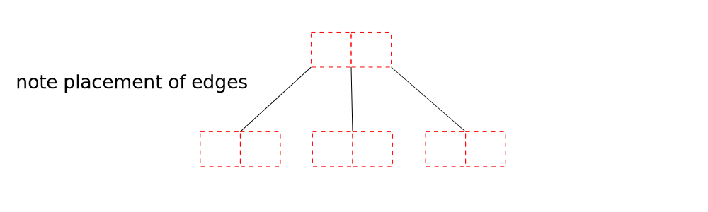

2-3 trees are height balanced, just as AVLs are height balanced. Each node (of degree m) must have a ceiling value of a minimum of `m/2` children, which for 2-3 trees is 2 children. The maximum number of children is the same as the highest degree possible, that is, three. Hence, these trees are referred to as `2-3` trees.

The children are labelled `left`, `middle` and `right`. The key value pairs in each node are ordered. Their value compared to the parent node is outlined below:

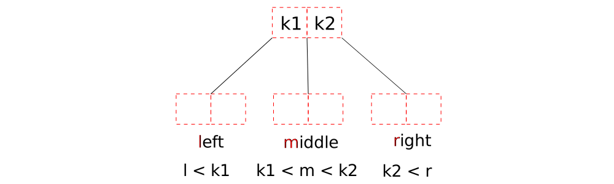

All key values must be unique but all nodes need not be assigned two keys. Some nodes can contain one key, with space for another key.

### Inserting and building 2-3 trees

Insertion of nodes is accomplished as follows (note how the height is automatically balanced when nodes split):

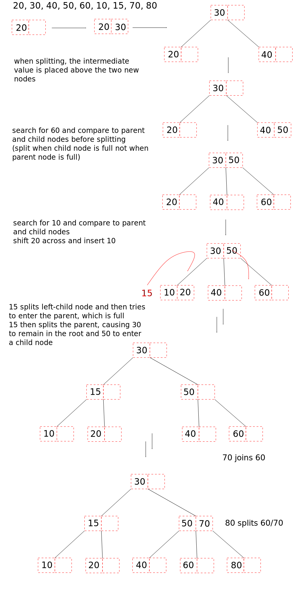

### Deleting from a 2-3 tree

There are three main operations: delete from a pair of keys, delete from one key then either (i) borrow or (ii) merge. Generally, borrow is performed when the sibling node has two keys and merging is performed when a sibling has only one key. Borrowing is preferred to merging. Like insertion, note how the height is automatically balanced.

(i) When deleting from a leaf node which contains a pair of keys, simply delete the desired key value and place the remaining key in the first slot of the pair.

(iii) When deleting from a leaf left or right node with one key value, delete the key value and merge the empty node and middle node.

+ If deleting from the right leaf node (remove the empty right node) and send the higher value of the parent pair down to the middle node (this should create a full child node)

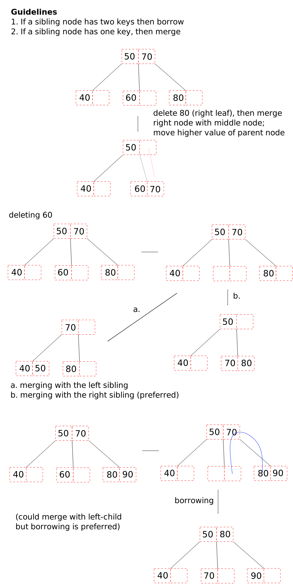

When deleting a sole key from a middle node, one can then merge either the left or right sibling nodes with the vacant middle node. _Note how the parent node is singly occupied to the left, meaning that the right-child node is always removed and the left-child is always present_.

+ If merging the right node and the vacant middle node, move the higher value from the parent node down to the revised middle node (and remove the vacant right node)
+ If merging the left node and the vacant middle node, move the lower value from the parent node down to the left child node (and remove the vacant right node). Shift the right child node to the middle child node and shift remaining parent key to the left.

(ii) Another case is one referred to as borrowing, which redistributes keys amongst nodes.

Below are examples of deleting from internal nodes. These are accompanied by multiple operations (borrowing and shifting).

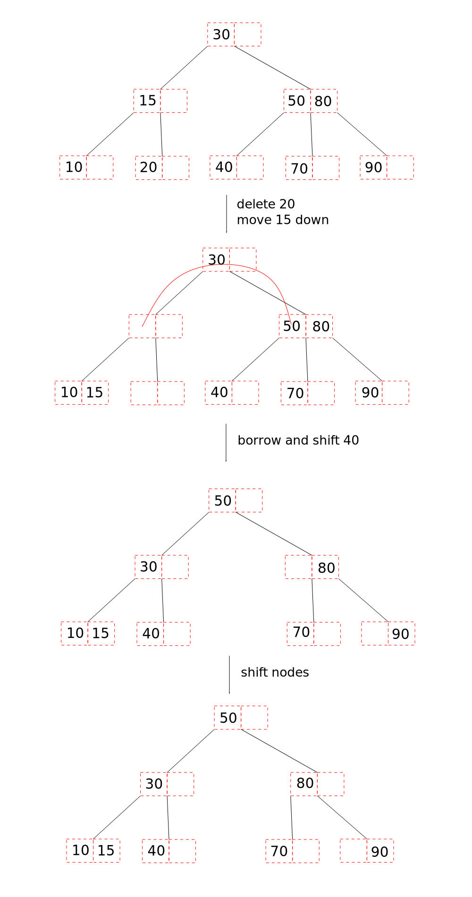

Next is deleting from the root node. When deleting the root, replace it with the in-order predecessor or successor node.

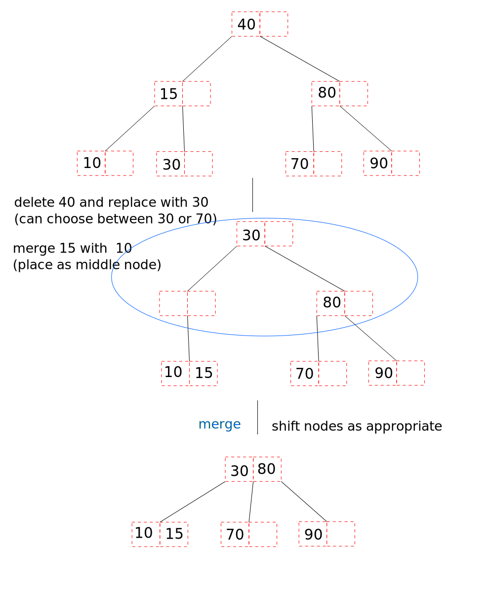

## 2-3 tree analysis

The minimum number of nodes of a 2-3 tree, given height `h` is `2^(h+1) - 1`.

The maximum number of nodes of a 2-3 tree, given height `h` follows a GP series and is given by `3^(h+1) - 1/(3 - 1)` or just `1/2(3^(h+1) - 1)`.

The maximum height is related to the minimum number of nodes. Max height with number of node `n` is given by `h = log[2] (n + 1) - 1`.

The minimum height with a given number of nodes `n` is given by `h = log[3] (2*n + 1) - 1`.

## Uses of 2-3 trees

Database management systems. Binary searches are quite efficient and storing more than one value per node permits quick access to more data, compared to BSTs. 2-3 trees are generally lower in height than BSTs (log[3] cf. log[2]).

## 2-3-4 trees

Many of the ideas about 2-3 trees carry across to 2-3-4 trees. They are height balanced binary trees with a degree of up to four, and with three keys per node.

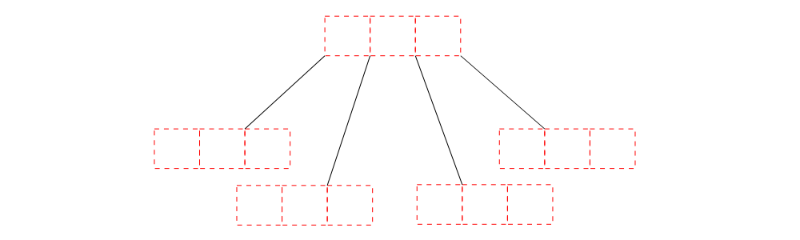

### Inserting into and deleting from a 2-3-4 tree

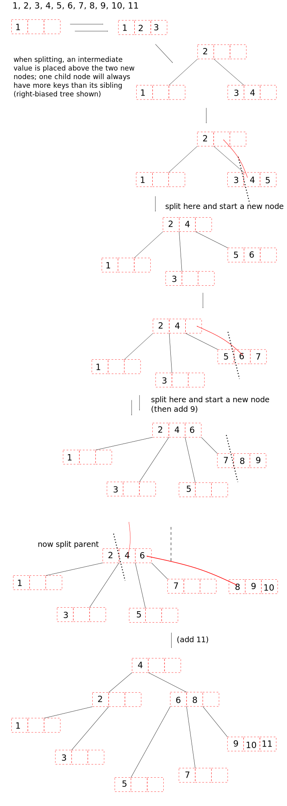

The operations for deletion for 2-3 trees are more or less appicable to 2-3-4 trees. Borrowing is permitted when a sibling has two or more keys (there is no requirement for a node to have a full three keys).

## Red-black search trees

Red-black trees are height-balanced binary search trees, in which each node is either red or black. Some of the ideas about balancing come from 2-3-4 trees. As will be apparent, red-black trees are essentially a different way of describing 2-3-4 trees, and shows the same operations and restrictions however with respect to the colour of the node: red and black.

The root node is black. `NULL` nodes (e.g. nodes after leaf nodes) are signified by black nodes.

The number of black nodes from and including the root to other black nodes is always the same (a red-black tree is balanced if it satisfies this criteria). One can include or preclude the black NULL 'leaf' nodes when assessing the balance, the sum should be the same provided the choice is the same.

Two consecutive/joined red nodes are not permitted.

Newly inserted nodes (except for the root node) are always red.

The height of a red-black tree is given by `log n < height < 2 log n`. Recall, AVL trees are up to about `1.44 log n`.

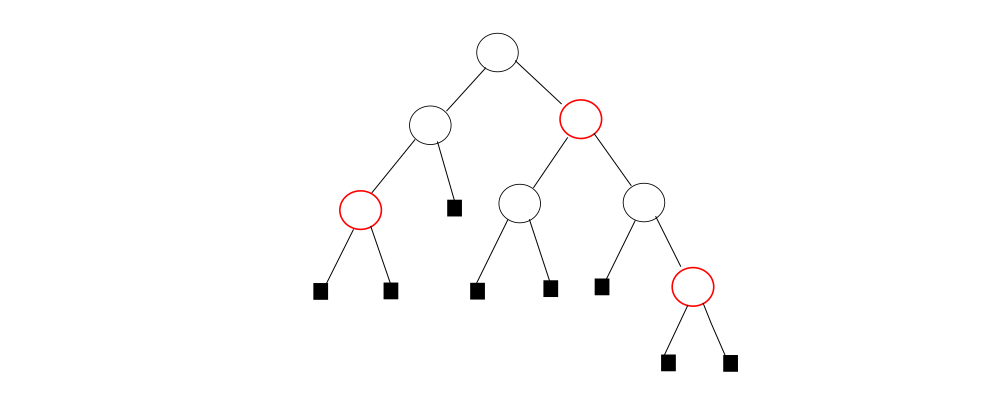

## Inserting and building red-black trees

Insertion is performed like all other BSTs, with the lower value branching to the left and higher value branching to the right.

The insertion of root is always black. It may seem as though inserting new nodes as red opposes the requirement that no two neighbouring nodes are red. This is addressed via (a) re-colouring or (b) rotation, depending on what else is in the tree.

+ If the sibling of the parent is also red, then the parent node and its sibling are recoloured black. The newly inserted node remains red. For larger trees, all other ancestor nodes are recoloured (inverted, as red <-> black) in steps until there are no red-red sequences. Root remains black.

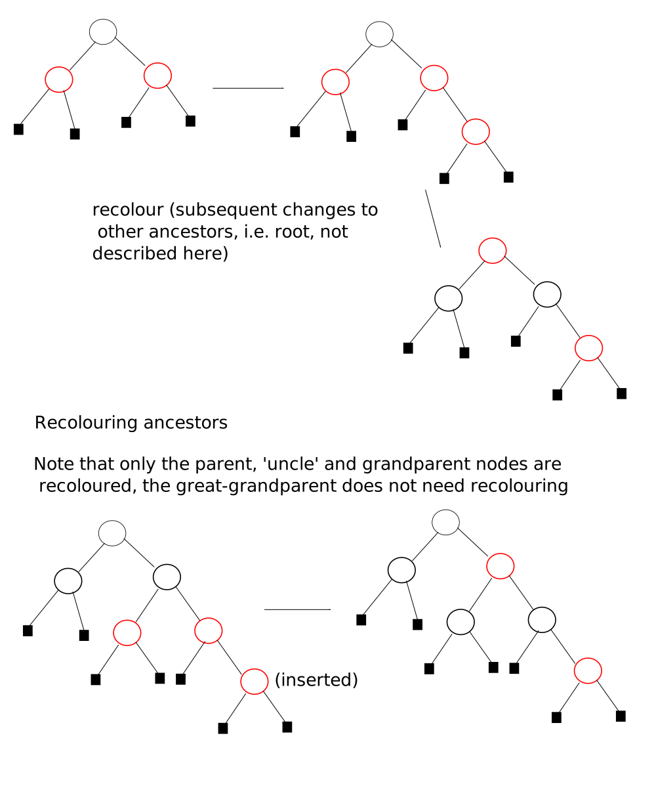

+ If the sibling of the red parent is NULL (and therefore black), then one performs rotation.
  + With the equivalent RR and LL imbalanced nodes of AVL trees, one performs the same rotation for red-black trees. However, such rotations are known as `zig-zig` rotations not RR- or LL-rotations.
  + Similarly, for RL and LR imbalanced nodes of AVL trees, one performs the described RL- and LR-rotations, this time known as `zig-zag` rotations (some reference here to the relationship between the three nodes)

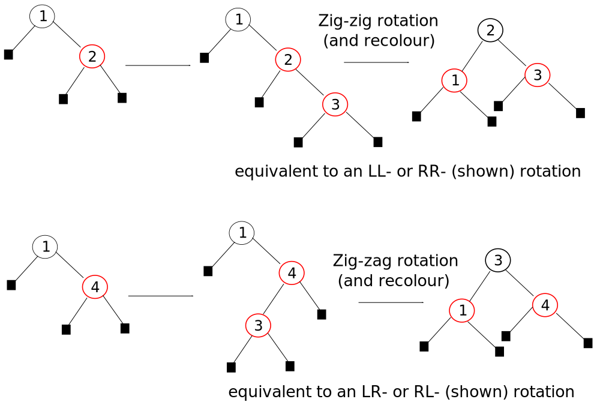

More adjustments are needed of the ancestors yield more red-red sequences.

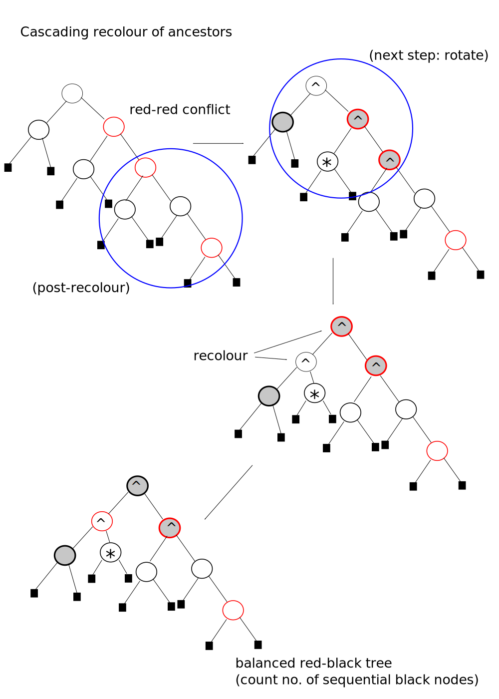

### 2-3-4 trees and Red-black trees

This mostly relates to the relationship between a black node and a child black or red node.

All red child nodes are related to their black parental nodes. A black parent node and any red child nodes belong to the same node of a 2-3-4 node. The maximum number of values would be from one black and two red, i.e. three values, precisely what each node in a 2-3-4 tree can take.

Two consecutive black nodes are not related to each other, or in other words, are not part of the same node. A black parent node belongs to a parent 2-3-4 node, and the black child node belongs to a different, child 2-3-4 node.

Following the guidelines regarding the building of a small 2-3-4 tree example and red-black tree with the same key values reveals the above.

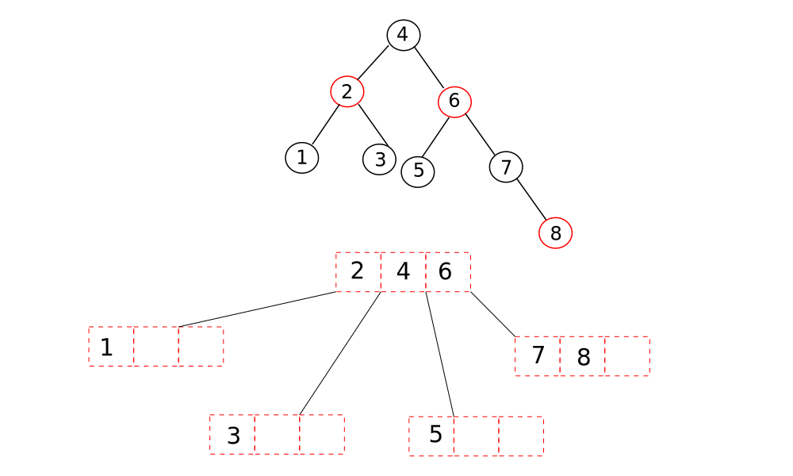

## Deleting from red-black trees

When deleting nodes, it is necessary to maintain tree balance (no. of black nodes in sequence from the root).

Some guidelines:

+ Deleting a red leaf node is simple, nothing-else to follow up with
+ Deleting a red internal node then requires choosing the in-order predecessor or successor. If one happens to be a red leaf node, then perform the replacement (same as BSTs) and delete the red leaf node.
+ All red nodes are followed by at least one black node (NULL or non-NULL). Deleting a red internal node with one (not two) non-NULL black node is then followed by replacing the red internal node with the black node.

The complications of red-black tree deletion are all due to the handling of black nodes. Deleting black nodes temporarily breaks the sequence of black nodes and therefore balance of the tree. As such, rotations and recolouring are employed to re-balance the tree. The increase in the number of black nodes is measured by a tree's _blackness_, which is not explored in more depth here.

+ If one wants to delete a black leaf node, check its sibling. If the sibling is red _and_ lies to the right then delete the black node and perform a zig-zig/RR-rotation. If the sibling is red _and_ lies to the left then delete the black node and perform an zig-zig/LL-rotation.

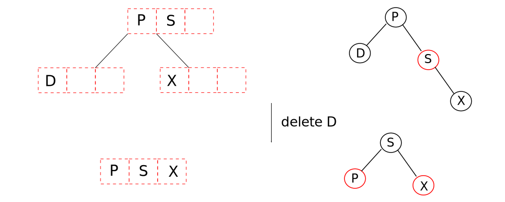

If the black node has a red parent node and a black sibling node then there are choices:
+ If the sibling has (also) black children then delete the required node and recolour the sibling and parent node

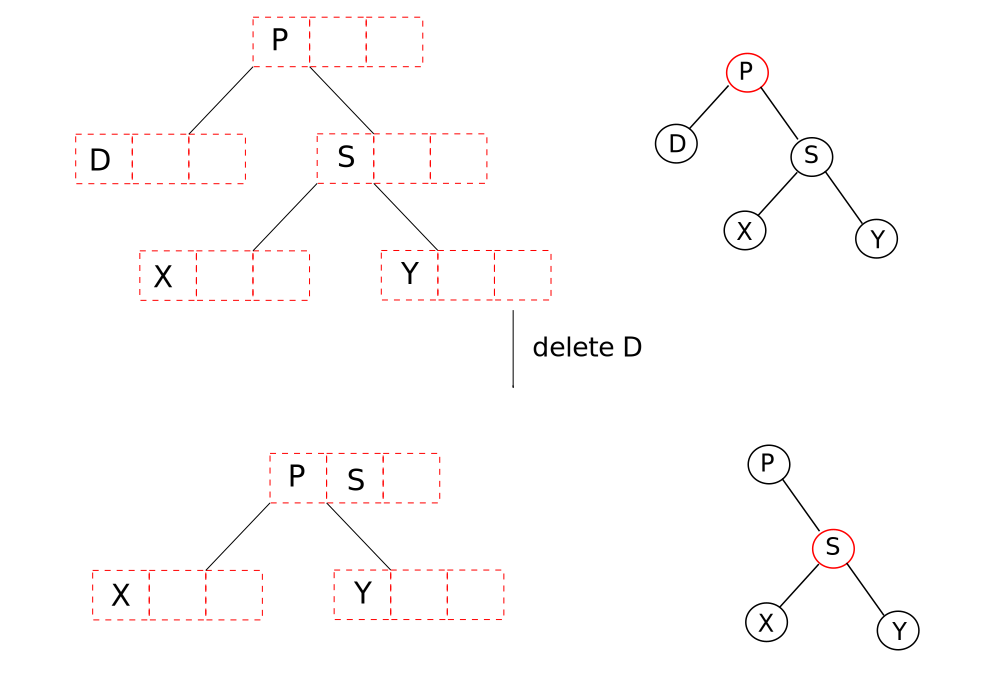

+ If the sibling has one red child node then delete the required node and perform a zig-zag rotation (LR or RL). No recolouring is needed.

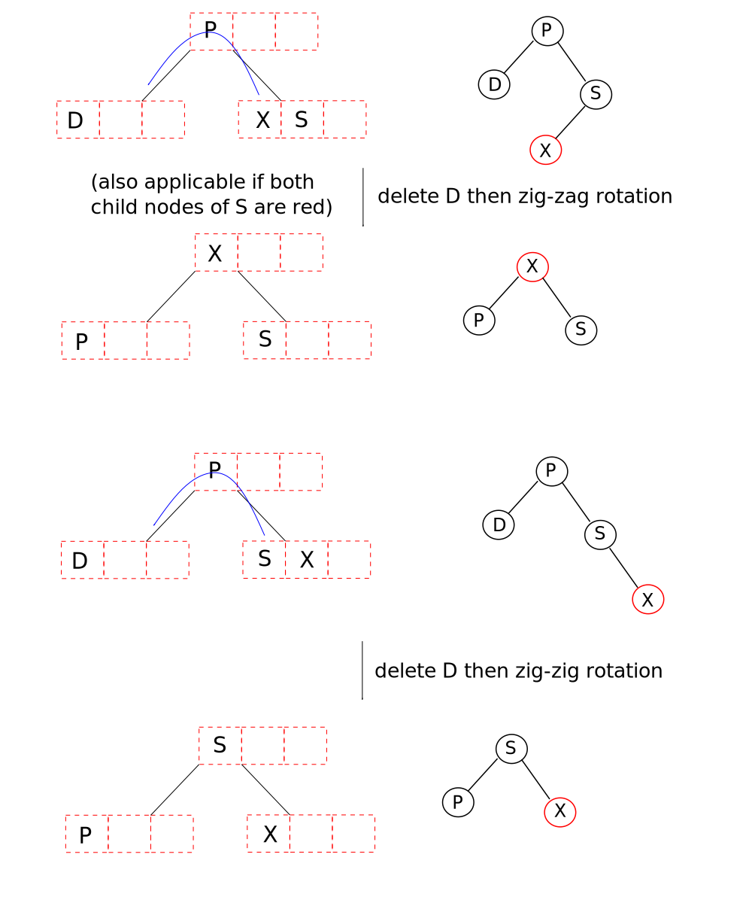
