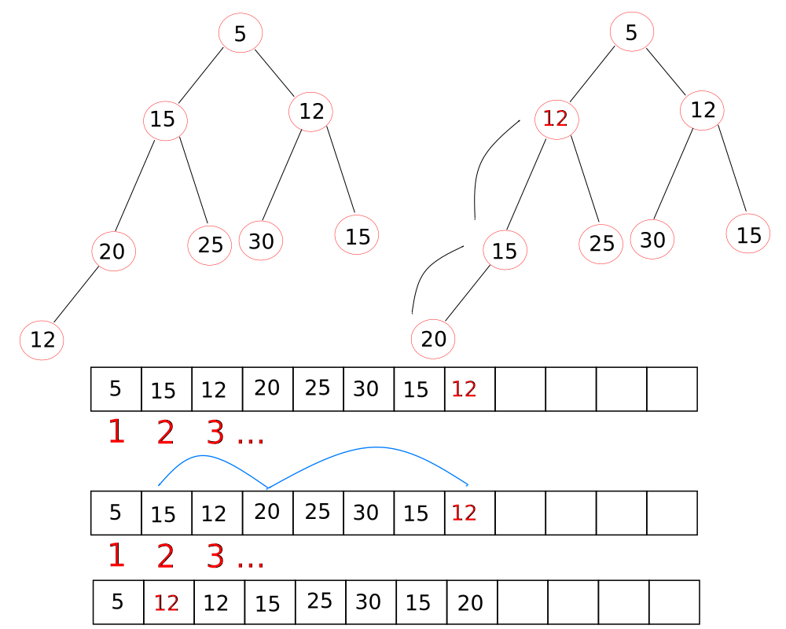

# The heap

All binary heaps are complete binary trees, with height of `log[2] n` with `n` nodes. Binary heaps, unlike BSTs, are not used for searching purposes (discussed later).

There are two types of binary heap:

+ Maximum heap: all parent nodes store a value which is greater than or equal* to its ancestors (*duplicate keys are allowed).
+ Minimum heap: (shown below) all parent nodes store a value which is less than or equal to its ancestors.


Binary heaps are mostly represented by arrays, though they can be implemented with linked lists. All elements in the array are populated between the first and last element.

## Inserting into a binary heap

Recall from binary trees that the parent of a node is given by the __floor__ value of `i/2` in an array with index `i`, this time starting at `i = 1` not the conventional `i = 0`. We follow these requirements here when adding values to an array representation of a complete binary tree.



One compares with the parent node, in turn, until the parent node is greater than or equal to the inserted node (maximum heap) or less than or equal to the inserted node (minimum heap).

```cpp
//this really takes an array of length n (n elements) and reorganises it; insert the required value to an array and then pass it to insertIntoHeap()

void insertIntoMinHeap(int A[], int n){
    int temp, i = n;

    temp = A[n];

    //integer division returns floor values by default
    //change the while condition to re-arrange for maximum heaps
    while (i > 1 && temp < A[i/2]){
        A[i] = A[i/2];
        i = i/2;
    }

    A[i] = temp;
}
```

The time complexity is the same as the height of the tree, that is, `log[2] n`.

## Creating a binary heap

The idea is to proceed with `in-place` heap creation, in which one builds a binary heap without making a copy. One starts with a populated array and marks the position of the array where the remaining elements are not sorted. Then perform the above insert method, as appropriate for either a minimum heap or maximum heap and move the marker up by one place. All without making a copy of the array.

To account for the zero-based nature of arrays, one sets the zeroth element as zero, and then all other elements store the keys of the binary heap.

```cpp
for (int i = 2; i < array_length; i++){
    //for a minimum binary heap
    insertIntoMinHeap(A, i);
}
```

The above loops processes all elements effectively builds a binary heap from the same array.

The time complexity for inserting `n` elements is `n * log[2] n` or just O(n log[2] n).

## Deleting from binary heaps and Heap sorting arrays

To maintain a complete binary on deletion and sorting, the only node that can be deleted from a binary heap is the root node. This frees the first (`i = 1`) element in the array and then populated with the last element of the array. This ensures the binary heap is complete. The array is then sorted, depending on whether it is a maximum binary heap or minimum binary heap.


As demonstrated below, the delete method can be extended to give a heap sort method.


Notice how the elements in the array are becoming sorted in increasing order. Each time an element is deleted, the next largest element becomes the root (and becomes the next element to be deleted). The child node of element `i` is given by `2i` and `2i + 1`.

```cpp
void deleteFromBinaryHeap(int A[], int n){

    //x temporarily stores the element to be deleted, i is used to traverse the parent node, j traverses the child nodes
    int x, i = 1;
    int j = 2 * i;

    //remove the last element and swap
    x = A[1];
    A[1] = A[n];

    while (j < n - 1){
        //compare right child with left child and move pointer j to child with the largest key
        if (A[j + 1] > A[j]){
            j++;
        }

        //compare parent with 'largest' child
        if (A[i] < A[j]){
            swap(A[i], A[j]);

            //move both pointers down to the next level
            i = j;
            j = 2 * i;
        } else
            break;
    }

    A[n] = x;
    }
}
```

## Heapify: fast binary heap creation

The insertion of an element involves the upward traversal of a node towards the root until the maximum or minimum heap requirements are satisfied. The deletion of the root node involves the downward traversal of the node.

Instead of starting from the first element of the array (for insertion), we start at the last element. One then applies the following protocol for each element, going from right-to-left in the array (sim here is to create a maximum heap):

+ Inspect the child nodes and check if any are larger
+ Swap with the largest child (if present)
+ Inspect the child and their children and swap if necessary. Continue until the values are ordered correctly or whenever there are no remaining child nodes.

The approach of this algorithm involves fewer operations because all leaf nodes are (`(n + 1)/2` elements) never require swapping. The binary tree is already built and all that remains is to process each node, effectively starting from the penultimate level. Contrast to insert, which builds the binary tree and swaps elements before continuing. Some swapping may end up being superseded. The time complexity of heapify is O(n), compared to insert which is O(n log n).

The traversal progresses down the tree as opposed to the aforementioned inert method which processes nodes up the tree.

```cpp
void Heapify(int A[], int n){
    // # of leaf elements: (n+1)/2, index of last leaf element's parent = (n/2)-1
    for (int i = (n/2)-1; i >= 0; i--){
 
        int j = 2 * i + 1;  // Left child for current i
 
        while(j < n - 1){
            // Compare left and right children of current i
            if (A[j] < A[j+1]){
                j = j++;
            }
 
            // Compare parent and largest child
            if (A[i] < A[j]){
                swap(A, i, j);
                //move down another level and check the grandchildren...
                i = j;
                j = 2 * i + 1;
            } else {
                break;
            }
        }
    }
}
```

## Binary heaps as priority queues

Take a list of integers. Assume that the magnitude of the value is the same as its priority, the higher the number the higher the priority. (Values of lowest magnitude which have higher priority can also be implemented.)

If the higher value has higher priority, then build a maximum binary heap, `O(log n)` time. On deletion, also `O(log n)`, (or processing at least), the root node is the highest priority, one need not search for it. If a lower value has higher priority then build a minimum binary heap. The root node is then (automatically) the lowest value and highest priority element.