# Sorting methods

Sorting methods are developed with the following aspects in mind:

+ No. of comparisons required
+ No. of element swaps to carry out
+ How the method behaves when the data that is sorted or unsorted (aim to perform fewest operations, O(n), if a collection is already sorted)
+ How stable the method is: how the method preserves the previous ordering of duplicated elements e.g. numerical and then, as previously, alphabetical
+ Memory efficiency

There are two main types of sorting methods: _comparison-based sorts_ and _index-based sorts_

+ Comparison based sorts
  + The following are O(n^2): bubble, insertion, selection
  + The following are O(n log n): heap, merge, quick, tree
  + Shell sort, O(n^[3/2])
+ Index based sorts (faster at O(n) but more memory demanding)
  + count, bucket/bin, radix

## Bubble sort

In bubble sort, the highest (or lowest element) is fed to the beginning of an array or list, through a series of consecutive passes. To feed the last element to the top would require a maximum of `n` passes for a collection of `n` elements.

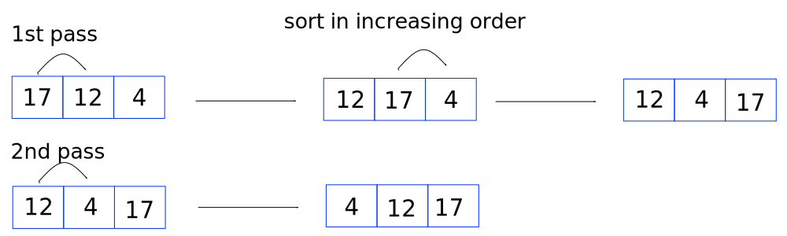

In the above case, the first pass sorts the largest element, 17. The next pass sorts the next largest element, 12. In each pass, the sorted element mimics a bubble rising to the surface. The ideas applied to a sorted list of increasing elements can be applied to a sorted list of decreasing elements.

The first pass requires `n - 1` comparisons, and a maximum of `n - 1` elements are swapped. Since the largest element is at the end of the list, this element ignored in subsequent passes. Hence, the second pass requires `n - 2` comparisons and a maximum of `n - 2` elements are swapped. This continues until the last pass compares `n - (n - 1)` elements, which can also swap a maximum of `n - (n - 1)` elements in the last pass.

A maximum of `n - 1` passes are required (can't compare the zeroth element with itself). The number of comparisons for a collection of three elements is `2 + 1`. The number of comparisons for `n` elements is the sum `(n - 1) + (n - 2) + ... + (n - (n - 1))` or in reverse, `1 + 2 + 3 + ... + (n - 1)`, which is `n(n - 1)/2`. The maximum number of elements swapped is also `n(n - 1)/2`. This gives a time complexity of O(n^2).

Other uses of bubble sort:

+ quickly find the largest (or smallest) element, by running the first pass only
+ quickly find `m` largest (or smallest) elements, by running `m` passes

Bubble sort is stable since the method does not swap the sequence of two or more identical elements in the given list. The group of identical elements might change depending on the values of other different elements but the sequence within the group of identical elements is preserved. Thus, bubble sort is deemed stable.

One can make bubble sort more adaptive by checking if a swap was needed at the earliest opportunity. This results in a time complexity of O(n) (the outer for loop is run once).

```cpp
void bubbleSort(int A[],int n)
{
    //i represent the number of passes
    int i, j, flag = 0;
    for(i = 0; i < n-1; i++)
    {
        flag = 0;
        for(j = 0; j < n-i-1; j++)
        {
            if(A[j] > A[j+1])
            {
            swap(&A[j], &A[j+1]);
            flag = 1;
            }
        }
        //stop bubbleSort if a swap was not performed (makes BubbleSort more adaptive)
        if(flag == 0)
        break;
    }
}
```

## Insertion sort

The basis of insertion sort revolves around inserting an element in a sorted array or list by shuffling other elements of the array/revise the pointers of the list. Regarding the linked list, move the trailing pointer before the leading pointer.

Start with an unsorted collection. Mark the end of the growing collection at the end of the first element. The first pass then moves the marker by one element and the second element is extracted. It is then compared to first element and then swapped if necessary. For the example below, we sort all elements in increasing value.

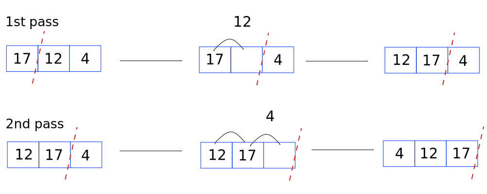

The results of the analysis of insertion sort are similar to that of bubble sort. There are at most `n - 1` comparisons per pass and at most `n - 1` passes. The maximum number of elements that can be swapped also equal the maximum number of comparisons. The total number of comparisons and elements swapped is `n(n - 1)/2` and so the time complexity, at worst, is O(n^2).

Some other observations:

+ Unlike bubble sort, intermediate passes are not particularly useful.
+ Insertion sort is more applicable and better suited to linked lists as opposed to arrays since elements need not be shuffled prior to insertion.

```cpp
//sort in increasing order of int's, lowest first
void insertionSort(int A[],int n)
{
  int i, j, x;

  //set i to the element which precedes the 'marker'
  for(i = 1 ; i < n; i++)
  {
    j = i - 1;

    // create a vacant placeholder at A[i] and store the value in x
    x = A[i];
    while(j > -1 && A[j] > x)
    {
      //A[j+1] is always vacant, swap with the predecessor if necessary
      A[j+1] = A[j];
      j--;
    }

    //j would be one element to the left of the vacant element placeholder
    A[j+1]=x;
  }
}
```

Insertion sort does not swap elements of a sorted collection and compared to the bubble sort, does not need a `flag` value to exit a loop. Insertion sort would require O(n) comparisons and O(1) = 0 elements swapped, overall O(n) << O(n^2). Hence insertion sort is (intrinsically) adaptive. (In fact, both bubble sort and insertion sort are the only two sort methods described in this article which are adaptive.)

Insertion sort is also stable since it only swaps elements which are greater than or less than a previous element, not equal to other elements. The sequencing of identical elements is preserved.

## Selection sort

As demonstrated previously, the example shown here attempts to sort a collection in increasing order, with the lowest element coming first.

The basis of selection sort concerns three pointers. One pointer `i` points to the element which can potentially be replaced. It starts at the beginning of the collection and is incremented after each pass. Pointer `j` traverses along the collection after pointer `i` and updates pointer `k` with the currently lowest found element, initially between pointers `i` and `j` but, if appropriate thereafter between pointers `j` and `k`.

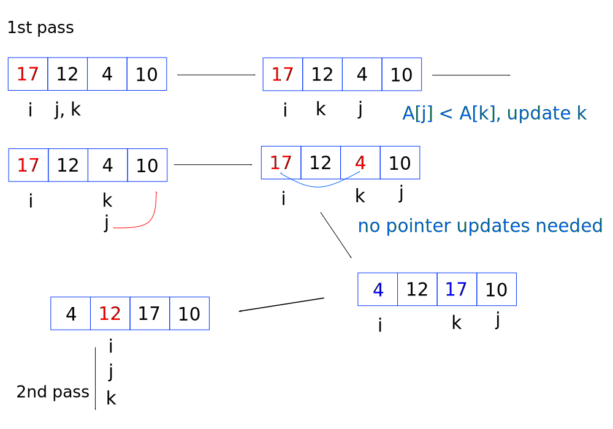

For the 2nd pass, all three pointers point to the next element (unlike the first pass, shown above). At the end of each pass, the elements given by pointers `i` and `k` are interchanged.

It is referred to as selection sort because one is looking/selecting an element from the collection to take the place of a given placeholder, which, in this example was the smallest value from all proceeding elements.

The total maximum number of comparisons is `n(n - 1)/2`, however, the total number of elements swapped is `n - 1`. The last point is demonstrated by the above example: one only swaps elements once the list is processed.

Intermediate passes of selection sort yield the smallest (or largest) value or values.

```cpp
void selectionSort(int A[],int n)
{
  int i, j, k;

  for(i = 0; i < n-1; i++)
  {
    for(j = k = i; j < n; j++)
    {
      if(A[j] < A[k])
        k = j;
    }
    swap(&A[i], &A[k]);
  }
}
```

If pointers `i` and `k` point to the same element (as they would during the 2nd pass onwards) then they would automatically swap with themselves. Selection sort does not check if the collection is already swapped, it would swap ordered elements and result in the same ordered collection, regardless of the state of the collection. Therefore, selection sort is not adaptive.

Selection sort is also not stable. Take a list: 2, 4, __2__, 1, 6. At some point during the first pass, the values 2 and 1 would be swapped resulting in 1, 4, __2__, 2, 6. The sequence of the two 2's is not preserved and thus selection sort is not stable.

## Quick sort

Perhaps the most well known sorting technique, quick sort looks at the position of an element in the collection which will never move places on sorting. All other elements might be misplaced, but there is sometimes one element which will never be swapped.

For example, the value 10 in the following collections (assume we are sorting with increasing value again):

+ 10, 13, 15, 11, 78 (10 is always first)
+ 1, 3, 2, 10, 33, 55, 26 (10 is always in the centre)
+ 2 , 4, 7, 4, 1, 10 (10 is always last)

The value 10 is in a 'sorted position'. In a way, quick sort describes the situation where the value itself finds it place. It does this by trying to arrange the other elements which should be to its left and to its right, without looking more closely at how elements to its left or right should be listed amongst themselves.

Place two pointers, one at the beginning of the collection and one at the end of collection. Make sure that both elements pointed to are in the right place as far as you are concerned (they should be to the left or right). Move either or both pointers towards the centre of the list until you find both are in the wrong place, then swap them.

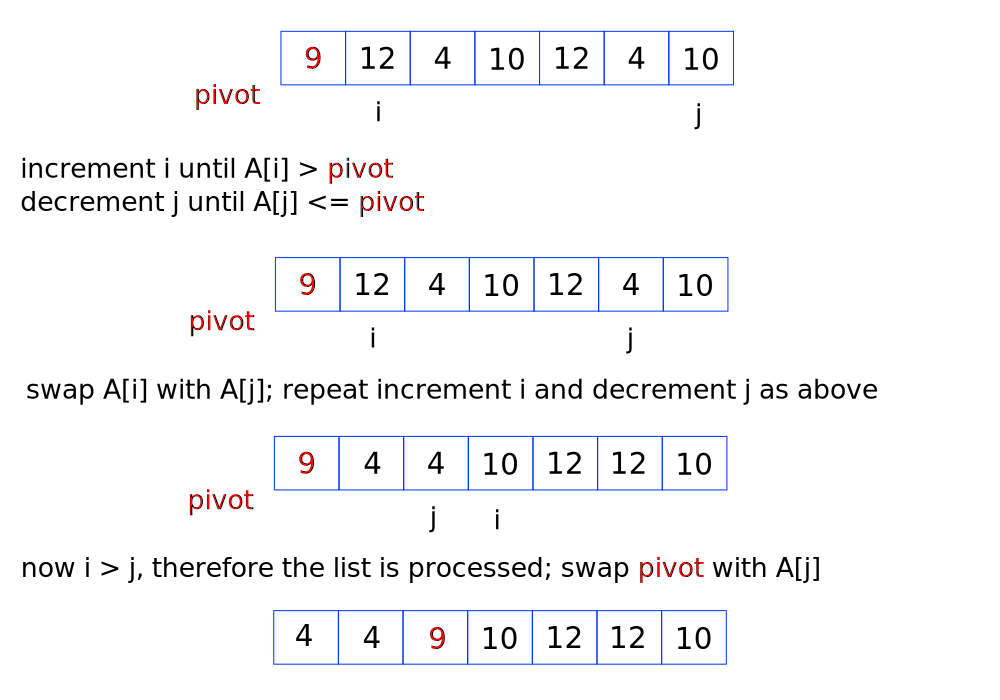

The list is now partitioned into two lists, hence the method referred to as 'partitioning'. The element previously given by the pivot element is now referred to as the partitioning element. Quick sort is then repeated (usually through recursion) on each partitioned list until all elements are fully ordered. If a partition is made up of one element, then quick sort does not take place and no further action is taken place.

If one is presented with the list `10, 20`, then quick sort will swap pivot with itself. This is because pointer `i` will reach 20 (which is greater than 10) and pointer `j` will reach 10 (which is less than or equal to 10). In this case, the pivot element is the same as A[j]. Quick sort will always swap at least one element.

In practice, one processes pointer `i` first until `A[i] > pivot`. Then one processes the other pointer `j` until `A[j] <= pivot`.  The partitioning of a list is achieved as follows:

```cpp
//h is the definite 'upper limit + 1' of the array; A[h] is out of bounds; l is the lower in-bounds limit
int partition(int A[], int l, int h)
{
  //one could also pick a more central pivot element of a sorted list and reduce the time taken for partition() to execute
  int pivot = A[l];

  int i = l, j = h;

  //for a do-while loop, at least one iteration is carried out
  do{
      //traverse forwards with i
      do{i++;} while(A[i] <= pivot);
      //traverse backwards with j 
      do{j--;} while(A[j] > pivot);

      if(i < j)     
        swap(&A[i], &A[j]);
  } while(i < j);   

  swap(&A[l], &A[j]); //j will be in range here, so an array with one element will swap with itself
  return j;
}
```

Partitioning has a time complexity of O(n), for a list (or partition) with `n` elements.

Quick sort calls itself recursively (note that in the recursion, the element which takes the role of the pivot element changes):

```cpp
void QuickSort(int A[], int l, int h)
{
  int j;

  //l is low index, h is high index of array A; an array with one element has l = h
  if(l < h)
  {
    //set the partition element index j
    j = partition(A, l, h);

    //run partition again and sort elements on the LHS; the previous pivot element j becomes the new out-of-bounds index
    QuickSort(A, l, j);
    //run partition on the elements on the RHS
    QuickSort(A, j+1, h);
  }
}
```

The time complexity of quick sort is O(n^2) (more precisely a total of `n(n + 1)/2` comparisons, the sum `1 + 2 + ... + n`) when the collection is already ordered (increasing or decreasing). This represents the worst case degree.

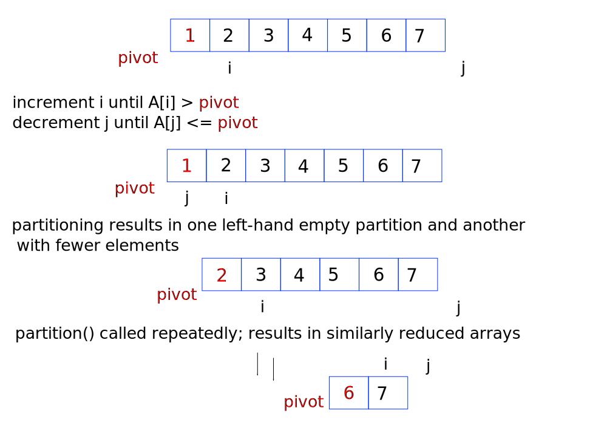

The first pass compared `n = 7` elements (because of pointer `j`), the second pass compared `n = 6` elements. A total of `1 + 2 + ... + n` comparisons or `n(n + 1)/2` comparisons were carried out. The passes with a list of elements in decreasing order results in the same analysis, except that the empty partition appears on the RHS.

If the pivot element chosen resides in the centre of the list, then overall it presents a somewhat faster O(n log[2] n) time complexity. From the identical elements `4`, below, one can see that quick sort is not stable, as red `4` is swapped with black `4`.

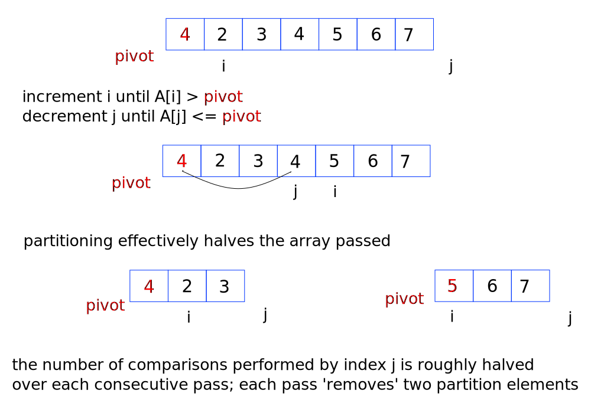

There will be roughly `log[2] n` passes since the partition is split approximately in half. The product lists each have one partition element removed, that is, two partition elements are removed per pass. Compare this to the above example where one of the product lists is `NULL` and only one partition element is removed per pass. The time taken is therefore reduced to `log[2] n` passes. Approximating the number of comparisons as `n` per pass, it means that the time complexity for quick sort in which the partition element is located at the centre of the list is O(n log[2] n). This represents one of the best-cases of quick sort.

Selecting elements more central to the list may help reduce the time required to execute quick sort.

Selection sort focuses on finding the desired _element_ (the smallest or largest element to take the place of zeroth element) and placing it in a chosen/selected position (usually the zeroth element placeholder). Quick sort focuses on finding the _position_ (where all elements to the left and all elements to the right satisfy a certain criteria) and placing the chosen/selected element (the pivot element) there.

Quick sort is sometimes also referred to as 'selection exchange sort' or 'partition exchange sort'.

## Merge sort

The aim is to combine to two ordered lists to produce a single, ordered list. We have already covered the merging of two ordered arrays [here](/11_Array_operations.md)

```cpp
int* MergeFromTwoArrays(int A[], int B[], int m, int n)
{
  int i = j = k = 0;
  int C[100];

  while(i <= m && j <= n)
  {
    if(A[i] < B[j])
      C[k++] = A[i++];
    else
      C[k++]=B[j++];
  }

  for(; i <= m; i++)
    C[k++] = A[i];
  for(; j <= n; j++)
    C[k++] = B[j];
  
  return C;
}
```

Another example. Take a single array in which there appears to be two ordered lists: [1, 3, 5, 2, 8, 10]. List one starts at index 0 and list two starts at index 2. How would one sort the array as one ordered list and save to the same array? We mark the boundaries: index 0 with pointer `l`, the last element of the first sub-array with a pointer `mid` and the end of the second sub-array with pointer `h`. Proceed similarly to Merge and copy the values to a new auxiliary array of identical length.

The modifications needed:

```cpp
void MergeFromOneArray(int A[], int l, int mid, int h)
{
  int i = l, j = mid+1, k = l;
  int B[h+1];

  while(i <= mid && j <= h)    
  {
    if(A[i] < A[j])            
      B[k++] = A[i++];
    else            
      B[k++] = A[j++];    
  }
      
  for(; i <= mid; i++)        
    B[k++] = A[i];
  
  for(; j <= h; j++)        
    B[k++] = A[j];
  
  //copy across B back to A
  for(i = l; i <= h; i++)
    A[i] = B[i];
}
```

Extending the idea, merging more than two arrays, is achieved iteratively. For m-lists, one performs 'm-way merging'. This would involve m-comparisons. Alternatively, one can merge two lists at a time and then merge another list with the merged list. It is not necessary to merge all lists at the same time.

With this extension, one can treat each element in an array  [1, 3, 5, 2, 8, 10] as a sub-array with one element. This approach then means that each sub-array is already sorted. Then one could merge [1] with [3], and then merge [5] with [2], and so on. These new merged lists, each with two elements can be merged again. When carried out iteratively (which is characterised by passes), there will be n elements compared per pass. There will be `log[2] n` passes (an array of eight elements is processed in three passes, a bit like an inverted binary tree). Hence the time complexity for iterative merge sort is `O(n log[2] n)`.

```cpp
void iterativeMergeSort(int A[], int n)
{
  //p handles pass number and is given by p/2
  int p, l, h, mid, i;

  //p cycles through 2, 4, 8, 16,...(corresponds to pass 1, 2, 3, 4,...) until it exceeds the number of elements n
  //p actually represents the maximum number of elements to be merged and is required for h in MergeFromOneArray()
  for(p = 2; p <= n; p = p*2)
  {
    //within each pass are a finite number of merges on an array of length n
    //the first pass p = 2 (and say n = 9), then there are i = 0, 2, 4, 6 (8 won't execute for loop), four merges (h = 1, 3, 5, 7)
    //the second pass p = 4, then i = 0, 4, or two merges (h = 3, 7)
    //the third and final pass p = 8, then i = 0, or one merge (h = 7)
    //i serves as the index to low l, which other indices are based on
    for(i = 0; i+p-1 < n; i = i+p)
    {
      //set low, mid and high parameters
      l = i;
      h = i + p - 1;
      mid = (l+h)/2;  //floor value to get mid
      MergeFromOneArray(A, l, mid, h);
    }
  }

  //this handles the sole odd list left over from the very beginning (e.g. p = 16 and n = 9, then the last element would be missed)
  //l = 0, mid = 7, h = 8
  if(p/2 < n)
    MergeFromOneArray(A, 0, p/2-1, n-1);
}
```

The above snippet can be visualised and traced with the following:

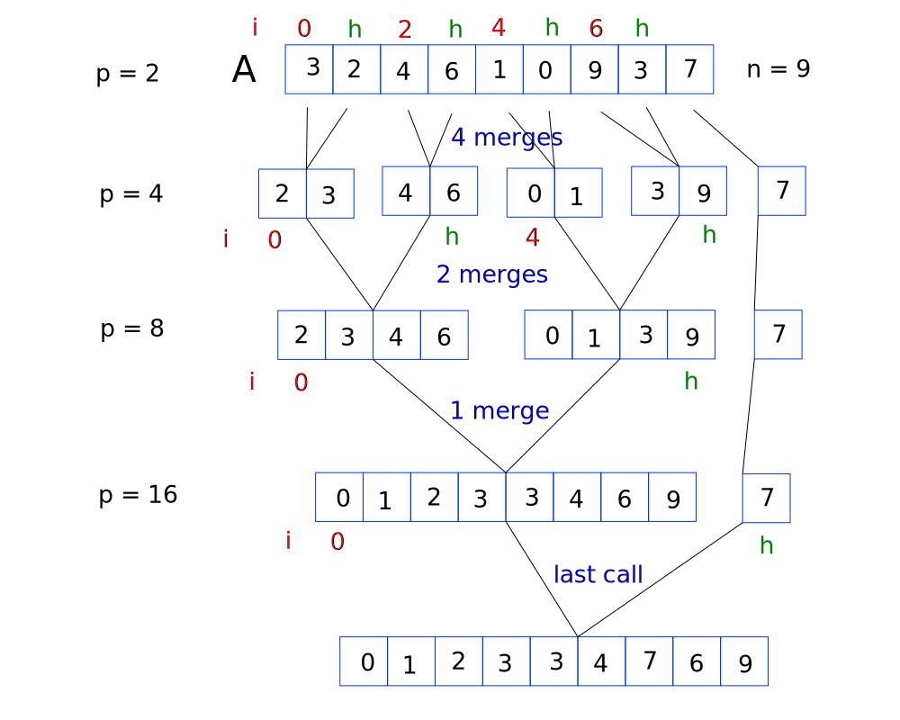

Instead of calling MergeFromOneArray() iteratively, one can call MergeFromOneArray() recursively. The method block appears much simpler and is traced below the snippet. The method breaks down the array to sub-arrays with one element only, which is deemed sorted, and then merges the left and right partitions.

```cpp
void recursiveMergeSort(int A[], int l, int h)
{
  int mid;
  //only runs if the array contains at least two elements, otherwise it terminates the recursion chain
  if(l < h)
  {
    mid = (l+h)/2;
    recursiveMergeSort(A, l, mid);    //LHS
    recursiveMergeSort(A, mid+1, h);  //RHS
    MergeFromOneArray(A, l, mid, h);
  }
}
```

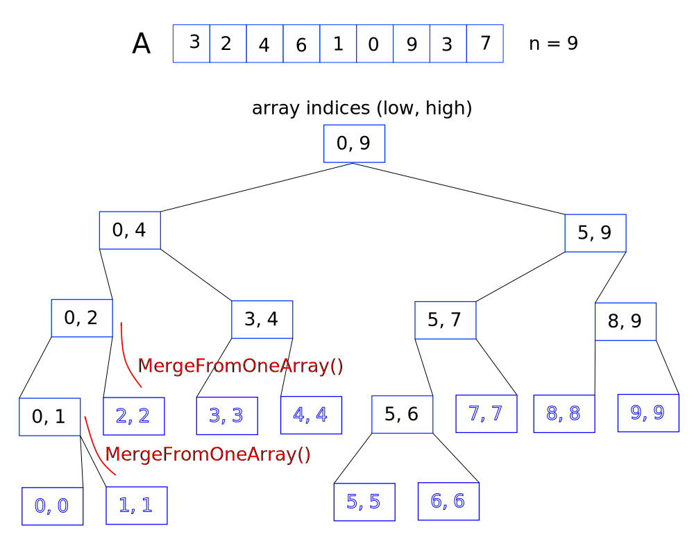

As shown, there are (ceiling of) `log[2] n` recursive calls. Each call will compare at most `n` elements. Hence the time complexity of recursive merge sort is O(n log[2] n), just as it is for iterative merge sort. Memory requirements will naturally be more demanding for the former compared to the latter.

Note that merging occurs after two recursive calls, and is therefore a post-order recursion. The space complexity is based on 'the array + the copy of the array' from calling MergeFromOneArray(), and the height of the longest strand of successive calls log[2] n. The space complexity is thus `n + log[2] n`.

## Count sort

This is an index based sorting method and is the quickest, though quite memory demanding.

With an unsorted array of integers, build another auxiliary array which has the same length as the magnitude of the largest element. Take for example `[3, 5, 7, 5, 5, 12, 8, 4]`. Tally the number of times each element of a certain value appears in the auxiliary array with the corresponding index. That is:

`[0, 0, 0, 0, 0, 0, 0, 0, 0, 0, 0, 0]`

becomes

`[0, 0, 1, 1, 3, 0, 1, 1, 0, 0, 0, 1]`

Then parse the auxiliary array and re-populate the array in the required order. Iteratively process each element and decrement the tally until each reaches zero, then move on.

Time complexity is linear - O(n) and space complexity depends on the magnitude of the largest element. We break up the algorithm so that it determines the largest element and then orders the array.

```cpp
int findMax(int A[], int n)
{
  int max = INT32_MIN;
  int i;
  for(i = 0; i < n; i++)
  {
    if(A[i]>max)
      max=A[i];
  }
  
  return max;
}

void CountSort(int A[], int n)
{
  int i, j, max, *C;

  max = findMax(A, n);
  C = (int *)malloc(sizeof(int)*(max+1));

  //fill auxiliary array C with zeros
  for(i = 0; i < max+1; i++)
  {
    C[i] = 0;
  }

  //process array A and tally up corresponding element count in array C
  for(i = 0; i < n; i++)
  {
    C[A[i]]++;
  }

  //re-populate the array C
  i = 0; j = 0;
  while(j < max+1)
  {
    if(C[j] > 0)
    {
      A[i++] = j;
      C[j]--;
    }
    else
      j++;
  }
}
```

## Bucket (or bin) sort

The ideas carry over from count sort. Bucket, or bin, sort is suitable when only one scan or pass of the array is needed. The auxiliary array is initialised with `NULL` pointers. Each element in the auxiliary array is referred to as a 'bin'. One scans the array that needs sorting and copies the value to the bin whose index matches the value of the element copied. The values are stored in a linked list. As a result, the auxiliary array must have a length which equals the magnitude of the largest element.

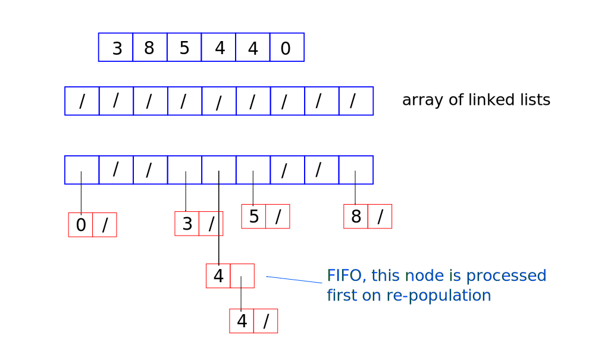

The auxiliary array is then scanned and the unsorted array repopulated, giving a sorted array. For larger elements, a larger auxiliary array is required. The elements are scanned and then repopulated, hence the time complexity is O(n).

```cpp
void binSort(int A[], int n){
  int max, i, j;

  Node * bins;
  max = findMax (A, n);
  bins = new Node* [max + 1]; // array of Node list pointers, including the zeroth bin

  //setup the bins array with NULL pointers
  for (i = 0; i < max+1; i++){
    bins[i] = NULL;
  }

  for (i = 0; i < v; i++){
    Insert(bins[A[i]], A[i]); //pass value from A[] to next node in bins[]
  }

  i = 0;  //traverses bins[]
  j = 0;  //traverses unsorted array A[]

  //re-populate the unsorted array
  while (i < max + 1){
    //keep working on bins[i] until it is emptied
    while (bins[i] != NULL){
      A[j++] = Delete(bins[i]); //Delete() updates the head pointer allowing the auxiliary array to remain attached to the list
    }
    i++;
  }
}
```

The time complexity can be expressed as O(n).

Note that in some cases, a lot of the bins are not used. An alternative, more space-saving approach is the radix sort, outlined next.

## Radix sort

For arrays containing large integers, count sort would require very large amounts of memory. Bucket (or bin) sort would not sort large elements in one pass.

Radix refers the number of characters which represent a quantity. For decimals, one represents each value with 10 distinct characters: 0, 1, 2, 3 ... 9.  The auxiliary array will contain the same number of elements as the radix of (in this case) decimal quantities.

Each element in the auxiliary array is referred to as a 'bin'. For decimal based elements, there will be 10 bins, for hexadecimals there will be 16 bins.

One uses the last digit of the element to be sorted (take % 10 or mod-10 of the value) and then assign the value to the bin with the same index. Thus, all possible integers with a last decimal digit are represented in some way with its bin index.

The bins are then emptied (the array is re-populated) left to right and then FIFO (if there is more than one element in a bin). This, however, does not guarantee that the elements are sorted. They are only sorted on the basis of the last digit.

`[512, 965, 788, 476]` is assigned to bins as `[/, /, 512, /, /, 965, 476, /, 788, /]` and then re-populated as `[512, 965, 476, 788]`.

We often have to sort in terms of the second digit. Divide each element by 100 then % 10, and repeat the process.

`[512, 965, 476, 788]` is assigned by second digit as `[/, 512, /, /, /, /, 965, 476, 788, /]`, and then back to `[512, 965, 476, 788]`. Note how it is sorted according to the last then penultimate digit. Finally we sort according to the first digit, by dividing by 100, then % 10.

`[512, 965, 476, 788]` is assigned by the first digit as `[/, /, /, /, 476, 512, /, 788, /, 965]` and then sorted as `[476, 512, 788, 965]`.

One repeats the sorting method depending on the magnitude (scale) of the elements to be sorted.

In outline, the code snippet would be:

```cpp

int getBinIndex(int x, int idx){
    return (int)(x / pow(10, idx)) % 10;
}

int countDigits(int x){
    int count = 0;
    while (x != 0){
        x = x / 10;
        count++;
    }
    return count;
}

void RadixSort(int A[], int n){

    //return the largest element of array A
    int max = Max(A, n); 

    //deduce the most number of digits that will need processing, nPass
    int nPass = countDigits(max);
 
    // Create bins, an array of linked lists
    Node** bins = new Node* [10];
 
    // Initialize bins array with null pointers
    initializeBins(bins, 10);
 
    // Update bins and A for nPass times
    for (int pass=0; pass<nPass; pass++){
 
        // Update bins based on A values
        for (int i=0; i<n; i++){
            //getBinIndex() works out the required digit (pass is n in 10^n for decimals)
            int binIdx = getBinIndex(A[i], pass);
            Insert(bins, A[i], binIdx);
        }
 
        // Update A with sorted elements from bin
        int i = 0;
        int j = 0;
        while (i < 10){
            while (bins[i] != nullptr){
                A[j++] = Delete(bins, i);
            }
            i++;
        }
        // Initialize bins with null pointers again
        initializeBins(bins, 10);
    }
 
    // Delete heap memory
    delete [] bins;
}
```

The time complexity can be expressed as O(dn), where d = number of digits (or order) for the largest integer. Assuming that the order is roughly the same between datasets, then the time complexity of radix sort is O(n).

## Shell sort

Shell sort, named after Donald Shell, is an extension of insertion sort and is useful for very large lists.

With insertion sort, one traverses along the list and compares two consecutive elements, and then shuffles the position until both are sorted. With shell sort, one determines the floor value of `n/2` where `n` is the number of elements to be sorted. The two elements which are compared are given by the index `i` and `i + n/2`, and iterated from `i = 0`. The spacing (the floor value of `n/2` between the two pointers is referred to as a 'gap'. Unlike insertion sort, other neighbouring elements are not automatically shuffled. Only two elements pointed to are shuffled.

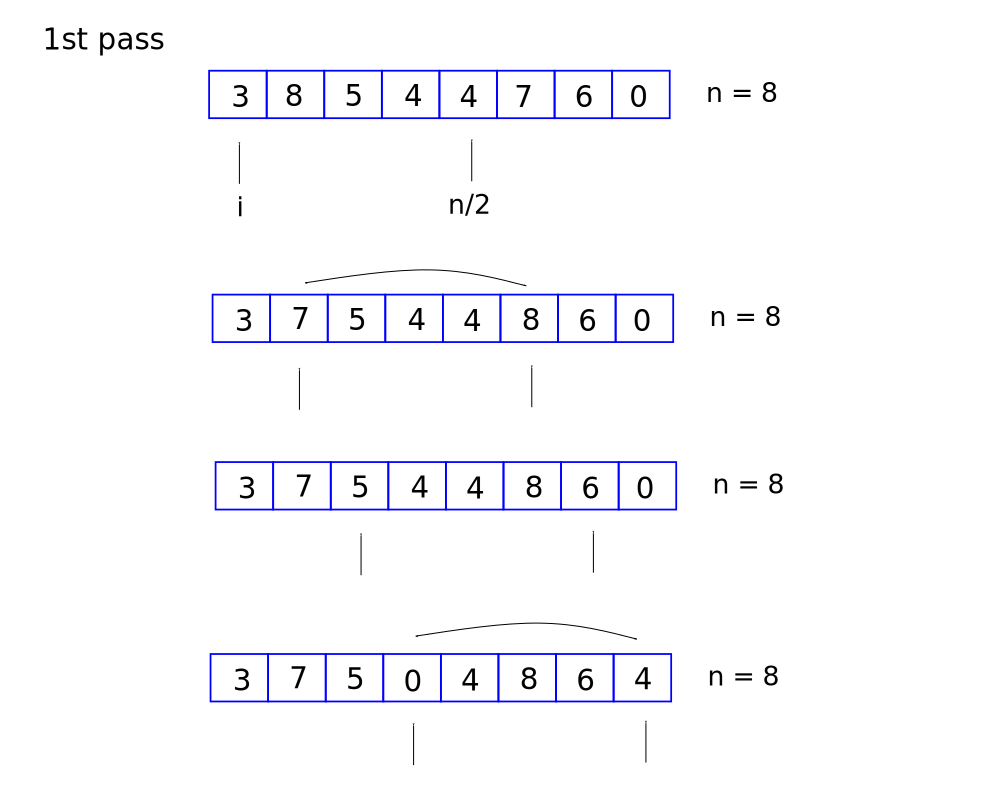

Note that for an odd number of elements, this results in the introduction of a third pointer which facilitates the swapping of three elements, if required. The requirement is clear: if the pair of pointers results in no swapping, then the introduction of the third pointer is not carried out. If however, the first two pointers swapped values then the third pointer is introduced and the value is checked.

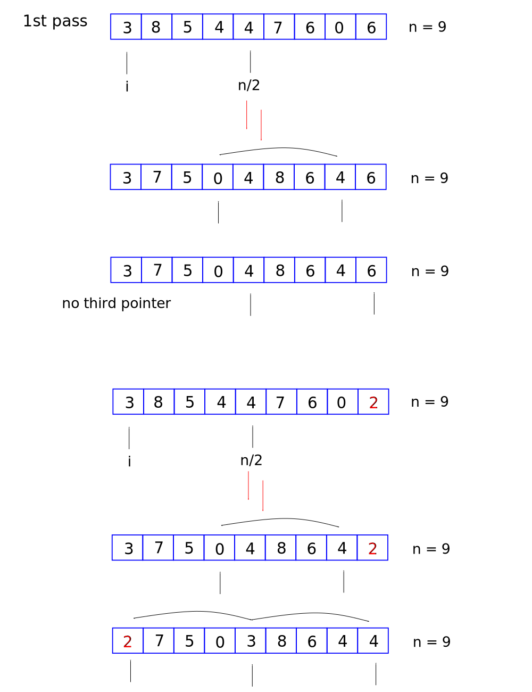

The gap between all three pointers is still the floor value of `9/2`.

Returning to the previous example, the array is then processed again. In the next pass, one sets up a smaller gap, the floor value of `n/4`. Each time a new pass is carried out, the gap is halved. This continues until `n/2*(pass no.) < 1`.

Note that the number of pointers is eventually increased as the pass number increases. Going back to the introduction of the third pointer, this is done on a needs basis. For small gaps, the third pointer is introduced if the first pointers swapped elements. If the second and third pointer also swapped values then a fourth (non-NULL with the same gap) pointer earlier in the list is introduced and compared. If the third and fourth pointer swapped values then a fifth pointer is introduced. If not, then no preceding pointers are introduced. The index `i` is incremented.

In the extreme case where the gap is one, shell sort behaves just like an insertion sort. The aim of shell sort is to reduce the number of elements swapped in the latter passes.

There are maximum of `log[2] n` passes possible. The worst case time complexity is thus O(n log[2] n). Some analyses of shell sort expresses time complexity as O(n^[3/2]). We ignore the number of swap procedures since it is insignificant compared to traversals and passes.

```cpp
void ShellSort(int A[], int n)
{
  int gap, i, j, temp;

  //iterate over each pass by dividing gap by 2 each time
  for(gap = n/2; gap >= 1; gap/= 2)
  {
    //i is the leading pointer; j represents the trailing pointer
    for(i = gap; i < n; i++)
    {
      temp = A[i];
      j = i-gap;
      //check the first pair; if swapped decrement j and repeat until j is out-of-bounds
      while(j >= 0 && A[j] > temp)
      {
        A[j+gap] = A[j];
        j = j - gap;
      }

      //temp stores the leading element and assigned to the appropriate position
      A[j+gap] = temp;
    }
  }
}
```
