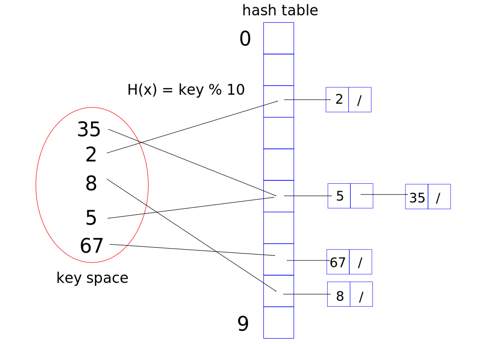
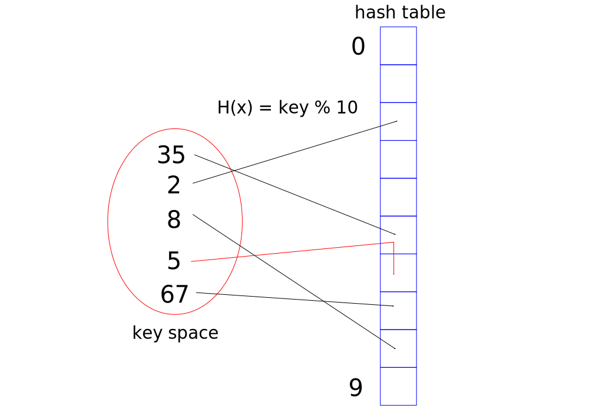
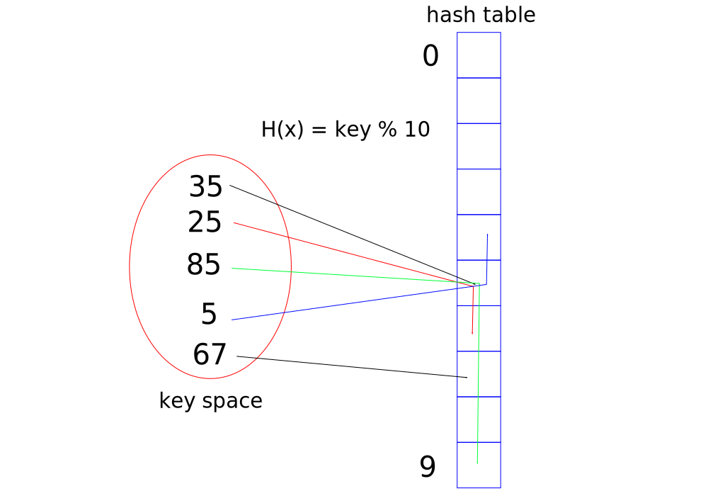
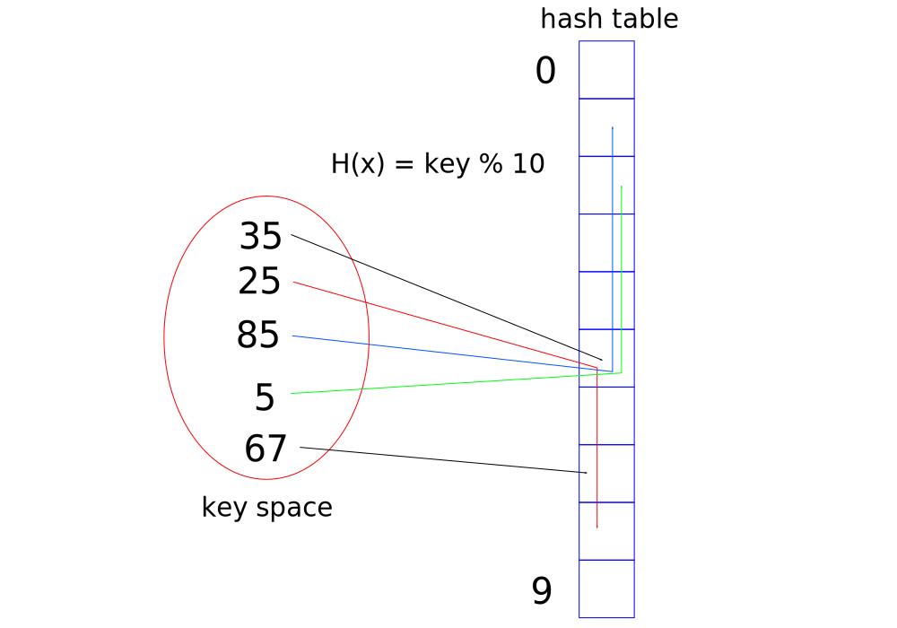

# Hashing techniques

Hashing supports search methods. The simplest example involves the searching of integers. Suppose an array [2, 3, 6, 10, 0, 5] is stored in an array, how would one find the value 3? With hashing one could store all the elements in another array (or other data structure, known as the _hash table_) in which the value of the element (the value is known as the _key_) forms the basis of the index of the element where it is stored. That is:

a set `[2, 3, 6, 10, 0, 5]` is stored in the hash table `B [-1, -1, 2, 3, -1, 5, 6, -1, -1, -1, 10]`

One can find any key (for now, between 0 and 10) by passing B[value]. If the key exists it will be returned, if not then a `-1` flag will be returned. This requires constant O(1). There are a number of limitation with the approach so far.

+ Restricted to values between 0 and 10. A larger hash table would be needed to store large values
+ A lot of memory is redundant, with `-1`'s stored

We address these problems by setting up a mathematical function: a range given by a set and a domain given by the set. We then build mappings or mathematical functions to facilitate hashing.

So far, our function is H(x) = x, where the value maps itself in a one-to-one approach. In this form, H(x) is an 'ideal hashing' mapping. One could reduce the memory required by modifying H(x) as `H(x) = x mod 10` or `H(x) = x % 10`, this restricts the indices to single figures, which in decimal means there will be 0 - 9 or 10 elements in the hash table available. Then:

`[2, 3, 6, 10, 0, 15]` could be stored in an array of ten (not 15) elements, `B [-1, 10, 2, 3, -1, 15, 6, -1, -1, -1]`

The problem now is how to store two keys which are mapped to the same index (try storing key 35 in B, above). This results in a __collision__ between two keys. The hashing function H(x) = x % 10 is thus an example of a many-to-one function. There are two main resolutions to addressing collisions:

+ Open hashing (characteristic of using dynamic memory allocation)
  + Chaining
+ Closed hashing (characteristic of using fixed memory allocation)
  + Open addressing (mapping is not strict if collision occurs)
    1. Linear probing
    2. Quadratic probing
    3. Double hashing

## Open hashing: chaining

Think about implementing an array of linked lists as the hash table. This keeps the hash table to a minimal size and circumvents collisions. The linked lists are populated in an orderly state so as to assist with searching within a linked list. The linked lists resemble chains, hence the method is referred to as chaining.



By sorting the elements in the linked list, one can quickly ascertain if the key is present by comparing magnitudes and stopping the search if the next node stores a key whose magnitude is greater.

The analysis of hashing functions is based on the load factor `lambda = n/(hash table size)`. It represents the number of keys stored per hash table placeholder (how many nodes are linked per hash table element) assuming that all keys are equally distributed in the hash table.** Clearly, the higher the factor, the more consecutive comparisons are needed to reach (find) the latter nodes in a given chain. The load factor is taken as a measure of the maximum number of comparisons needed, the average is taken as half of this value.

The average time required to search for any key which is present is given by `O(1) + lambda/2`. The average time required to search for any key which is not present is given by `O(1) + lambda`.

The deletion of a key presents one extra step, map with O(1), search for the key (consider lambda). Then delete the node (and update pointers).

** The load factor and any analysis regarding load factors are only valid when the appropriate hash function has been selected such that it distributes all keys evenly. For example, a set of integers, all 'ending' with the digit 5 would only be stored in one linked list and thus present a less than efficient algorithm. It is expected that the programmer selects the correct hash function based on the dataset. There is no one universal hash function which accommodates all datasets.

```cpp
//assume here that the methods sortInsert() and search() call established linked list methods
#define SIZE 10

int getHashTableIndex(int key){
    return key % SIZE;
}

void insert(struct Node *H[], int key){
    int hashIndex = getHashTableIndex(key);

    sortInsert(&H[hashIndex], key);
}

//general form of main given below
void main()
{
    struct Node *hashTable[SIZE];
    struct Node *temp;

    int i;
    int key = 12;

    for (i = 0; i < SIZE; i++){
        hashTable[i] = NULL;
    }

    insert(hashTable, 12);
    //...

    temp = search(hashTable[getHashTableIndex(key)], key);

    //this will return an error if not key is not found
    printf("%d ", temp->data);
}
```

Note here that the size of the hash table is not bound by a given value and chosen to best suit the problem at hand.

## Closed hashing: Linear probing

Use the same approach as chaining. Instead of compiling a hash table as an array of linked list, build an array of data types which match the data type of the key. In this example, we will handle integers as keys, and so create an array of integers for the hash table.

When a collision occurs, pass the key to a probing function. The hash function is `H(x) = x % 10`, and another hash function (referred to here as a probing function since it attempts to probe the table one collision) is `h'(x) = [H(x) + f(i)] % 10`, where `f(i) = i, i = 0, 1, 2,...`. The result is to attempt to store the key at the next available element (of the hash table) with higher index.

The first collision occurs when `i = 0`, that is H(x) = h'(x). The probing function gives the same hash table index as the primary hash function. One repeats the computation of h'(x) to find a value of `i` such that h'(x) is empty or vacant. The act of searching for a vacant space is referred to as a 'linear probe', that is, one changes (increases) `i` linearly, probing for a vacant element until one is found. In the example below, `i = 0` results in a collision but `i = 1` is vacant.



Note that the introduction of mod 10 ensures that the probing is cyclic. Each element is probed as `i` increases. When key = 19 collides with another key 9 at index 9, the probing function h'(x) returns 10 (when i = 1) and so the pointer returns to the top of the hash table.

Searching is performed by using the hash function. If the sought key does not match the hash table key then the next element in the hash table is compared. This continues until either:

+ the next element is vacant (recall that the insertion method does not skip vacant elements so neither would search)
+ hash table has been traversed fully? This is considered next...

The loading factor of linearly probed hash tables is always less than one. In other words, the size of the hash table is greater than the number of keys present. Consequently, there will always be a vacant element somewhere in the hash table. Therefore, the searching of a key will always terminate when a vacant element is found and never require the traversal of the entire hash table.

The desired conditions for a loading factor for linearly probed hash tables is `lambda <= 0.5`, the hash table is at most half-filled. This usually helps reduce the number of comparisons needed while balancing this aspect with redundant memory. One issue with linearly probed hash tables is the formation of groups of keys, referred to as 'primary clustering' of keys.

The deletion of keys is not trivial. Once a key is found (using the same search method), the table is re-populated to ensure that all keys are in their appropriate slot. If one was to delete key 35 (above) then it would not be possible to locate key 5 because element 5 is now vacant. The re-populating of the hash table is known as 'rehashing'.

Generally, deletion from linearly probed hash tables is not recommended. A slight modification (not explored in detail here) is to build another array of the same size as the hash table and mark each element with `NULL`, `0` or `1`, to indicate whether the corresponding hash table element is vacant, deleted or present, respectively.

```cpp
//choosing the right SIZE is important if this is to work
#define SIZE 10

int hash(int key)
{
    return key%SIZE;
}

int probe(int H[], int key)
{
    int index = hash(key);
    int i = 0;
    while(H[(index+i)%SIZE] != 0)
        i++;

    return (index+i)%SIZE;
}

void Insert(int H[], int key)
{
    int index = hash(key);
    if(H[index] != 0)
        //find the first vacant element
        index = probe(H,key);

    H[index] = key;
}

int Search(int H[],int key)
{
    int index = hash(key);
    int i = 0;

    //an empty element would be NULL and also terminate the loop
    while(H[(index+i)%SIZE] != key)
        i++;

    return (index+i)%SIZE;
}
```

The average time of a successful search of a key is taken as `1/lambda ln(1/(1-lambda))`. The average time of an unsuccessful search is taken as `1/(1-lambda)`.

## Closed hashing: Quadratic probing

Linear probing tends to build whole blocks of keys which when traversed would not terminate very often on unsuccessful searches. Quadratic probing attempts to break up the blocks along the hash table.

The only difference is a modified probing function:

`h'(x) = [H(x) + f(i)] % 10`, where `f(i) = i^2, i = 0, 1, 2,...`

This effectively cycles through `h'(x) = H(x) % 10`, then `h'(x) = (H(x) + 1) % 10`, then `h'(x) = (H(x) + 4) % 10` and so on. Note that when a key is assigned to `h'(x) = (H(x) + 1) % 10` then `h'(x) = (H(x) + 4) % 10` is potentially zero.



In other words, when `h'(x) = (H(x) + 1) % 10 != NULL` and `h'(x) = (H(x) + 4) % 10 = 0`, then `x` is not present.

When searching for a key, one can call the following with the same quadratic hash function:

```cpp
int Search(int H[], int key){
    int index = hash(key);
    int i = 0;

    //if key found is not the same or is NULL, and the next hashed index is vacant, then cease the search; otherwise check the next hashed index and its successor
    while (H[(index+i*i) % SIZE] != key){
        i++;
        if (H[(index + i*i) % SIZE] == 0){
            return -1;
        }
    }
    return (index + i*i) % SIZE;
}
```

The analysis of quadratic probing is given below, without justification:

+ average successful search taken as `-ln(1 - lambda)/lambda`
+ average unsuccessful search taken as `1/(1 - lambda)`

## Closed hashing: Double hashing

In this case, one uses two hash functions H(x) to map keys to the hash table, `H1(x)` and `H2(x)` and resolve collisions.

+ `H1(x) = x % 10`
+ `H2(x) = R - (x % R)` where `R` is the largest prime number smaller than the hash table length (determined after hash table initialisation)
+ `h'(x) = (H1(x) + i*H2(x)) % 10` where `i = 0, 1, 2,...`

Note that the second hash function never returns zero. The hashing ensures that all elements are utilised.

First attempt to assign the key to the hash table index using `H1(x)`. If there is a collision then deduce `h'(x)` (practically start from `i = 1` for each* key; `h'(x)` with `i = 0` would always result in a collision). If there is a second collision, then repeat with `i = 2`. In a way, `i` signifies the collision no.

See below (n = 9, R = 7). The first hash function for keys ending with 5 are always `H1(x) = 5` and the second is `H2(x) = 7 - (x % 7)`.

Overall, `h'(x) = [5 + i*(7 - (x % 7))] % 10`.



This demonstrates that the mapping of the key is based on the key and is not always consistent. Both linear and quadratic mapping consistently maps keys which collide (e.g. all those ending with the same digit), `h'(x) = [x % 10 + f(i)] % 10`. The grouping of the keys illustrated with quadratic probing is the same.

```cpp
#define SIZE 10
#define PRIME 7

//...

int Hash(int key){
    return key % SIZE;
}
 
int PrimeHash(int key){
    return PRIME - (key % PRIME);
}
 
int DoubleHash(int H[], int key){
    int index = Hash(key);
    int i = 0;
    while (H[(Hash(index) + i * PrimeHash(index)) % SIZE] != 0){
        i++;
    }
    return (index + i * PrimeHash(index)) % SIZE;
}
 
void Insert(int H[], int key){
    int index = Hash(key);
 
    if (H[index] != 0){
        index = DoubleHash(H, key);
    }
    H[index] = key;
}
 
int Search(int H[], int key){
    int index = Hash(key);
    int i = 0;
    while (H[(Hash(index) + i * PrimeHash(index)) % SIZE] != key){
        i++;
        if (H[(Hash(index) + i * PrimeHash(index)) % SIZE] == 0){
            return -1;
        }
    }
    return (Hash(index) + i * PrimeHash(index)) % SIZE;
}
```

## Hashing functions

Some general aims:

+ The keys mapped should be uniformly distributed
+ For closed hashing, the size of the hash table must be double the number of keys present. Furthermore, the size should equal a prime number, to minimise collisions
+ Hash functions must return the same index for a given key

Other hashing functions include midsquare() and folding().

'Midsquare' squares the key and then returns the middle digit, which is then used as the hash table index. One can also take the middle two digits if the square contains an even number of digits.

'Folding' involves breaking up a large value into pairs of digits and then summing each pair. `123456` becomes `12 + 34 + 56`. If this results in too large an index then one can 'fold' the sum.

We have only considered integers as keys so far. For characters, one can convert the character into its ASCII codes and then design a hash function which operates on the ASCII codes. Other languages, for example Java, build hash-codes which identify objects based on various metadata properties such as date stamps, file size etc.
