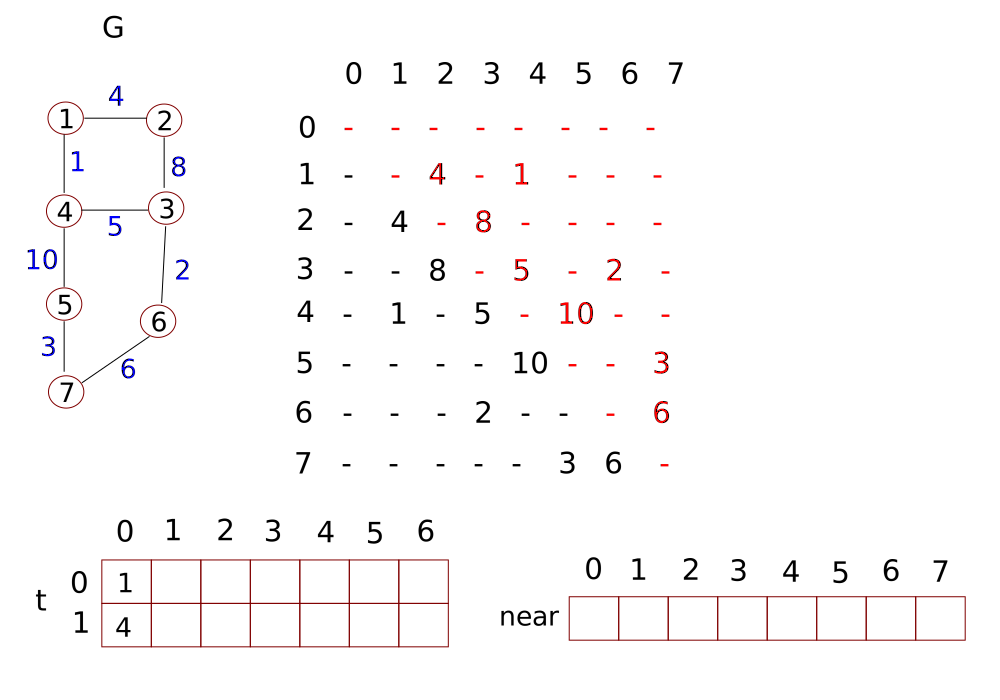
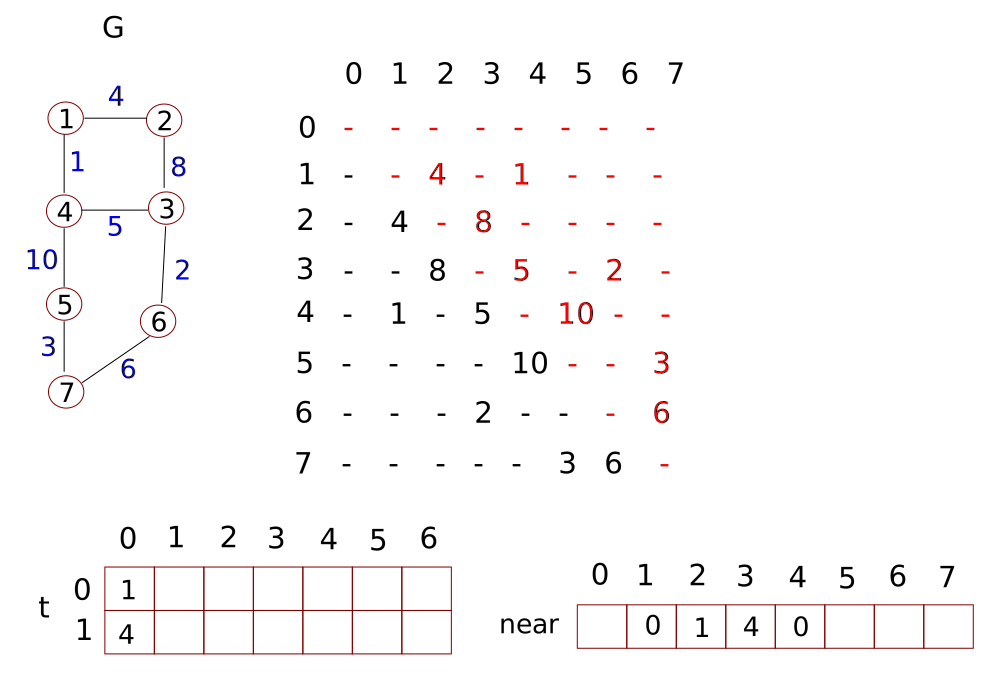

# Graphs

Graphs are made up of vertices and edges, and expressed as `G(V, E)`.


Directed graphs have directed edges (outcoming one vertex and incoming to another). Two edges with opposing direction between the same vertices are parallel edges. Graphs which are not made up of self-loop(s) or parallel edges are known as _simple_ digraphs, in which a digraph is a _directed_ graph. When a graph is simply referred to as a graph then it is assumed to be non-directed. Graphs made up of two or more components are known as non-connected graph.

Vertices, which when removed, result in two or more components are known as _articulation points_ (none of the above graphs contain articulation points).

A _path_ is a set of all edges in between two vertices. Paths are cyclic (or circular) if it traverses to and from the same vertex.

Graphs in which all vertices are connected by at least one path are referred to as _connected graphs_. A graph is termed _strongly connected_ if there is a path between each pair of vertices.

Graphs in which all edges are directed in the same direction then the graph is termed _topological_.

## Representing undirected graphs

### Adjacency matrix


The dimensions of the matrix above matches the vertices in the graph. One could also include a zero-based row and column to represent the zeroth element if desired (thus the matrix would be (n+1) by (n+1)). The values in the zeroth row and column can take any value, they would be ignored at run-time.

The graph vertices correspond to the row (i) and column (j) numbers of the matrix. Start with the row number (the starting vertex) and find the column number (the final vertex), or, vice versa, working from a column number and then to a row number.

The elements in the matrix denote if there is one edge present. For a matrix A, then `A[i][j] = 1` when there is one edge between vertices `i` and `j`, and `A[i][j] = 0` otherwise.

It follows that `A[i][i] = 0` in all cases, except for self-loops (some implementations assign infinity instead of zero). Also see how the matrix is symmetric.

As will be demonstrated, algorithms generally have to process all elements in the matrix to verify that graph structure. Therefore, time complexities are O(n^2).

### Cost adjacency matrix (of Weighted graphs)


### Adjacency list

This representation is essentially an array of linked lists. Each element in the array represents a given vertex and the linked list lists the connected vertices (listed in ascending order). Assume here that vertex "1" is given by the zeroth element, vertex "2" is given by the first element and so on.


Algorithms generally access all vertices `v` and proceed along a path `e` twice (from 1 to 2, and 2 to 1). Hence the time complexity would be `O(v + 2e)` or just `O(v + e)`.

### Cost adjacency list


### Compact list

This representation uses a single-dimensioned array. In this case, we require space for each vertex, two spaces per edge and a spare element to set the zeroth element as `NULL` and enable vertex number to equal the element number.

Elements 1 to n represent the first vertex index connected to vertices n. Element `n+1` is the first out-of-bounds index (in the case below, element 21) and separates the origin vertices from the neighbouring vertices.


The space complexity of compact lists is `O(v + 2e + 1)`, which is effectively O(n).

## Representing directed graphs

### Adjacency matrix

The approach to representing a directed graph follows similarly to an undirected graph, with a matrix. The counting of edges is incremented by considering the direction of the edge. One reads the row number followed by the column number. Note that the matrix need not be symmetric.


Reading from row to column shows one the edges moving out of the vertex given by the row number. Reading from column to row reveals the edges coming into the vertex given by the row number. As a result, the in-degree of a vertex given by the column number is the sum of the elements in the same column. The out-degree of a vertex given by a given row number is the sum of the elements in the same row.

The space complexity of adjacency matrices is `O(n x n)`, or just O(n^2).

### Adjacency list

Like adjacency matrices, adjacency lists consider direction. The number of nodes in each linked list is typically lower for directed graphs compared to undirected graphs.


The out-degree is the sum of nodes present in a given linked list corresponding to the vertex in question. To determine the in-degree of a vertex, one would need to process the entire array and tally the number of times the vertex in question appears in the array of linked lists.

Calculating the in-degree is more time consuming. If the in-degree is an important value to derive then one can build an _inverse adjacency list_ and present the nodes which point to a given vertex.

The space complexity of compact lists is `O(v + e)`, which is effectively O(n). Algorithms discussed here tend to use adjacency lists instead of adjacency matrices.

### Compact list

A compact list for a directed graph is similar to that for an undirected graph. The groups of vertices which are connected to the primary vertices (element 1 to n) list elements pointed to by the primary values. It is also possible to build an analogous 'inverse compact list' where instead the groups of vertices represent vertices which point to the primary vertices.

## Breadth first search BFS

BFS is similar to level-order of a tree. First one re-draws the graph as a tree like structure, where the edges in the graph and tree are equal and match. Process the edges required in any logical order with each vertex (value).

A dotted edge is used to represent edges already present in the graph but are not drawn in the conventional tree structure way. Hiding the dotted edges shows that data structure as a tree.


Then take the level-order traversal of the 'tree' to find the BFS sequence. The results of BFS can vary depending on how the graph was re-drawn.

Additionally, we used vertex `1` as the starting point. This is not a requirement and any other vertex can be used as a starting vertex. Note, dotted lines can cross solid lines if needed. What is important is that in _visiting_ each intermediate child node of the growing tree, one _explores_ each adjacent vertex completely. The order of exploring (visiting all adjacent vertices) vertices can vary and is arbitrary. One can start from an internal vertex if desired.

The sequence lists the vertices visited.

1. After a vertex is visited, add the vertex to a queue.
2. Take a vertex out of the queue and _explore_ it.
3. When a vertex is visited, add it to the queue and the BFS sequence. If the vertex has already been visited before, do not add it to the queue or BFS sequence and instead move to the next vertex.
4. Repeat the steps 1-3 once a vertex has been _completely explored_.

Once the graph has been processed, the queue should be empty, and BFS ends.

The resultant trees produced from a BFS search are known as _BFS spanning trees_. The dotted edges are referred to as _cross edges_. In this BFS example, the cross edges only link vertices in the same or adjacent (tree) level.

The time complexity of BFS is O(n). The _exploration_ of a vertex is not considered when analysing time complexity.

### BFS algorithm

The ADTs needed are a queue for the vertices currently being explored and an array (initially padded with zeros) showing which vertices have already been visited. The graph, in this case, is represented by an adjacency matrix.

```cpp
//initialise queue q and array visited globally

void breadthFirstSearch(int i){
    //u and v are row and column pointers, respectively
    int u, v;

    printf("%d ", i);
    visited[i] = 1;
    enqueue(q, i);

    while(!isEmpty(q)){
        u = dequeue(q);
        for (v = 1; v <= n; v++){
            //process each row of a adjacency matrix, advancing the column pointer each time
            if (A[u][v] == 1 && visited[v] == 0){
                printf("%d ", v);
                visited[v] = 1;
                enqueue(q, v);
            }
        }
    }

}
```

The while loop will run (n-1) times and the inner for loop runs `n` times, so the time complexity is O(n^2), at worst.

## Depth first search DFS

DFS is similar to pre-order traversal of tree structures.

1. Pick _any_ starting vertex, set it as visited.
2. Pick _any_ adjacent vertex, set it as visited.
3. Suspend the exploration of the (new) vertex from step 1. Instead, push it into a stack.
4. If available, pick any (other*) vertex adjacent to the vertex from step 2. Set the vertex as visited.
5. Regarding vertex from step 4:

+ If there are vertices adjacent to the vertex from step 4, suspend the exploration of the vertex from step 4 and push it to the stack.
+ If there are no other vertices adjacent to the vertex from step 4, then pop the vertex from step 3 and continue with other adjacent vertices starting from step 3.

An example of DFS is outlined below. Notice how part of the DFS sequence resembles the stack, the ordering of the values of which directs future visit checks.


The above tree is referred to as a _DFS spanning trees_. The dotted lines are known as _back edges_, termed as such since they are drawn to connect 'backwards' to a vertex (compare these to cross edges).

The time taken to build a DFS spanning tree is O(n), since we visit new vertices and explore then once. The time complexity of DFS, like BFS, depends on the representation used (adjacency matrix, adjacency list or compact list).

DFS and BFS searches emphasise on visiting all vertices and are not concerned with the resultant sequences (which all differ).

In the example below, a (n+1) by (n+1) adjacency matrix represents the graph, along with a stack and array 'visited'.

```cpp
void depthFirstSearch(int u){
    if (visited[u] == 0){
        printf("%d ", u);
        visited[u] = 1;
        for (int v = 0; v <= n; v++){
            //if there is an edge between vertices u and v, and it has not been visited yet
            if (A[u][v] == 1 && visited[v] != 0){
                depthFirstSearch(v);
            }
        }
    }
}
```

## Spanning trees

A spanning tree is a subgraph such that the for a given number of vertices `v`, the number of edges is `v - 1`. Cyclic graphs are not permitted.


When drawn, a spanning tree links all vertices together with the minimum number of edges required.

There are usually numerous spanning trees per graph and is deduced with a binomial coefficient `eC(v-1) - no. of cyclic subgraphs`. For a graph with four vertices, this results in `20 - 4` spanning trees.

Notice that if a graph is non-connected (there are two or more non-connected subgraphs) then it is not possible to find a spanning tree since all vertices will not be connected.

### Minimum cost spanning tree

Edges can be weighted. Spanning trees with weighted edges have an associated cost, which is the sum of the weights. With the same graph with differently weighted edges, the possible spanning trees will have different costs. A widely sought after spanning tree is the one with the least cost, known as the _minimum cost spanning tree_. There are two algorithms in use which can deduce the minimum cost spanning tree (MCST): _Prim's MCST_ and _Kruskal's MCST_.

### Prim's Minimum Cost Spanning Tree

Prim's algorithm is recursive: first pick the edge with the lowest weight. From then on, choose an edge with the lowest that is connected to the vertices present, until all vertices are connected.


The worst case time taken to build a spanning tree is `O((v-1)*e)`, since one builds `v-1` edges, and each time one looks for the minimum edge from all `e` edges. This translates to O(n^2). If one were to use a stack (as per a binary heap or red-black tree) to compute Prim's MCST, then the time taken is reduced to `(v - 1) log e`, where is e is the number of edges, or just O(n log n).

If Prim's algorithm was run on a non-connected graph then it would derive the MCST for one component only and never 'reach' the other component(s).

Writing the algorithm (indeed, any algorithm) first requires knowing which data structures to use to represent the problem. This is then followed by the sequence of steps required.

We represent the graph (non-directional graph) using an adjacency matrix. Since the graph is non-directional, the matrix is symmetric. This means that one only need inspect the upper-triangular matrix or lower-triangular matrix for the weightings. Recall, one reads row followed by column numbers.

The matrix itself is given by an `n*n` matrix where `n = v + 1` (assuming that each vertex is numbered from 1 onwards). Each element in the matrix stores the corresponding edge weight. Elements which do not correspond to an edge are typically set to the maximum value of the primitive data type (maximum `int` type, for example), mathematically, taken as 'infinity'.

The (growing and final) spanning tree `t` will be stored as a `2*(v-1)` array `t`.

Another single dimensioned array labelled as `near` is also declared and then padded with the largest (int) values. The application of `near` is outlined next.

Both arrays `near` and `t` store vertex labels only, not weightings.

1. Find the minimum weighted edge by looking for the lightest edge from the upper- or lower-triangular part of the adjacency matrix. Add the pair of vertices to array `t`



2. Mark the corresponding elements in `t` as zero. This essentially means that 1 and 4 are connected with the lowest weighting.


3. The row index of the adjacency matrix relates to the corresponding index of the array `near`. Starting from the beginning of array `near` and top row of the adjacency matrix, find the weighting between the element of `near` and vertex 1. We ignore both the row = 1 of the adjacency matrix and the vertex (element) 1 in `near`. In this case, the next element is vertex 2 (and row 2), which is closer to vertex 1 than it is to vertex 4 (respectively, 4 compared to 'infinity'). To deduce this computationally, examine the adjacency matrix (not the graph) row 2 (the third row). Mark array `near` at element 2 (for vertex 2) with the vertex that is closer to vertex 2, that is, the value 1. In other words, 2 is closer to 1 than it is to 4.


4. Next, vertex 3 is infinitely far from vertex 1 but only weighted 5 from 4, so mark `near` element 3 with vertex 4. This means 3 is closer to 4 than it is to 1.



5. Using the row from the adjacency matrix, repeat for all other remaining elements 5-7. Mark the element in `near` with the vertex (1 or 4) which has the lower weighting. 5 is closer to 4 than it is to 1. If both vertices are infinitely apart then assign either vertex 1 or 4.


This completes the initialisation of Prim's algorithm.

__Iterative calls__

Then we need to locate the minimum weighted edge. Ignoring the zero-assigned elements, compare the elements in the adjacency matrix designated by the pairs in the `near` array. The (origin) vertex is the index of `near` and the (terminal) vertex is the value of the element at that index.


From the above example, row 2 and column 1 yield the lowest weighing (after considering the edge which joins vertices 1 and 4).

One then adds (2, 1) to column = 1 of array `t`. Pairing (row 0, row 1) of `t` matches the pairing from `near` (index, element). Array `t` holds a record of the edges covered. The edges between vertices (1, 4) and (2, 1) are finalised.

Then update `near` element 2 (represent vertex 2 added to `t`) as a zero. This ensures that vertex 2 pairings are not compared from here onwards.


Note so far that elements marked with 0s in `near` are ignored. At the moment, the array says vertices 3, 5, 6 and 7 are nearer to vertex 4 (the valued stored) than vertex 1. Next one checks if these vertices (not scanned) are nearer to 2 (than to 4) and updates `near` if the weightings are lower.

In this example, there is no change. Moreover, vertex 3 is connected to both vertices 2 and 4, but has a lower weighting with vertex 4. This completes the first iteration.

Find the lowest weighting from the pairings in `near`. Then update array `t`.


Set element 3 to zero. Now compare which vertex is closer to 3 (compared to 4). Update array `near` with the lower weighting whenever possible. So that is


So vertex 6 is closer to 3 than it is to 4. Update as before...


Find out which vertices are closer to 6 (cf. 4) and update...


We finish it here:


Initialising the global variables is given by:

```cpp
#define I = 32767  //highest 16-bit integer

int cost[8][8] =   { {I, I, I, I, I, I, I, I},
                    {I, I, 4, I, 1, I, I, I},
                    {I, 4, I, 8, I, I, I, I},
                    {I, I, 8, I, 5, I, 2, I},
                    {I, 1, I, 5, I, 10, I, I},
                    {I, I, I, I, 10, I, I, 3},
                    {I, I, I, 2, I, I, I, 6},
                    {I, I, I, I, I, 3, 6, I} };

int near[8] = {I, I, I, I, I, I, I, I};

int tree[2][6]
```

Then once proceeds to find the minimum weight of the entire graph, carried in `main()`.

```cpp
//i (row) and j (column) traverse cost[][]
//col (column) will record the element of a given row which has the smallest weight 
int i, j, col, u, v, n = 7, min = I;

for (i = 1; i <= n; i++){
    //process the upper triangular portion of cost[][]
    for (j = i; j <= n; j++){
        if (cost[i][j] < min){
            min = cost[i][j];
            //save the indices for array t[][] (tree[][])
            u = i;
            v = j;
        }
    }
}
```

Then one assigns the first edge to array `tree`, and sets zeros to `near`:

```cpp
tree[0][0] = u;
tree[1][0] = v;
near[0][0] = near[1][0] = 0;
```

One then checks each of the rows in cost[][] to find out which vertex is closest to 1 or 4.

```cpp
for (i = 1; i <=n; i++){
    if (near[i] != 0 && cost[i][u] < cost[i][v]){
        near[i] = u;
    } else {
        near[i] = v;
    }
}
```

This concludes the first stage of establishing the first edge. The remaining steps are the iterative procedures which build up tree[][].

```cpp
//build up the rest of the spanning tree, tree[][], hence finish at n-1
for (i = 1; i < n-1; i++){
    min = I;

    //near[j] stores the element of the jth column of a given row i.e. cost[][j]
    //find the lowest weighted edge from the current near[]: (index, element) or (j, near[j])
    for (j = 1; j <= n; j++){
        if (near[j] != 0 && cost[j][near[j]] < min){
            min = cost[j][near[j]];
            col = j;  //save the current column index where minimum weighting resides
        }
    }

    //update the spanning tree, pull across (index, element) or (k, near[k])
    tree[0][i] = col;
    tree[1][i] = near[col];

    //prevent future comparisons
    near[col] = 0;

    //update near[] with the col that has the lowest weighting
    for (j = 1; j <= n; j++){
        if (near[j] != 0 && cost[j][col] < cost[j][near[j]]){
            near[j] = col;
        }
    }

    print_tree();
}
```

### Kruskal's minimum cost spanning tree

A somewhat simpler algorithm compared to Prim's algorithm, there is no initialisation step. The approach starts by choosing edges with the lowest weight possible and building up the spanning tree. This repeats as long as no cyclic tree if formed. If a cyclic tree is about to be formed then select the next lowest weighted edge.


The time complexity as outlined above is O(n*e) or just O(n^2). This applies regardless of the data type structures used.

Computationally, Kruskal's method can employ minimum (binary) heaps to find the minimum edge. For `e` edges, the time taken to find the weighted edge is `log e` time. Therefore, Kruskal's method becomes O(n log n) time.

Compared to Kruskal's method, Prim's method places less emphasis on finding the minimum cost spanning tree and is more aligned to finding 'a' valid spanning tree. If one were to take a non-connected graph, Prim's method would produce only one of the components, which has the lowest edge of the entire graph. On the other hand, Kruskal's method builds paths separately, and such paths may derive from any component. As a result, Kruskal's method will build MCSTs of all components.

### Disjointed sets - testing for cyclic graphs

Disjointed sets do not have elements in common with each other. The intersection of two disjointed sets is a null set or empty set.

Sets if integers can be stored in arrays. When building the array, the existence of an element is given by the value -1 at the appropriate element. For instance, the value -1 at the element with index 5 means the set contains an element with the value of 5.

When handling tree structures, it is necessary to modify this convention and signify the parent node or vertex. One also needs to be able to identify the child nodes of any given parent. A potential (there are others) revised convention is then applied:

+ Instead of assigning a -1 value to the appropriate element, one assigns the parent node value as its value. A value of 2 at index 17 means an element with the value of 17 is child node to parent, which has the value of 2.
+ The parent node is symbolised by the negative value of the number of members (the _cardinality_ of the set), including itself and all other descendants.
+ A value of -1 is assigned to all other elements which do not represent any member (they are essentially _singletons_)

Overall, an array such as {2, -4, 2, 2} shows that elements 0, 2 and 3 are child nodes each having, respectively, the values 0, 2 and 3. They are child nodes to node 2. There are a total of four members in this set, where the parent node is symbolised with the negative of the _cardinality_ of the set.

When joining two subsets, the root node is assigned to the parent of the largest set. The parent of the smaller set is represented by the value of the new parent (the index of the parent node does not change: this is needed regarding _its_ children). The magnitude of the new parent node is changed to reflect the new cardinality.

+ as two subsets (the parent of each is in __bold__) {__3__, 5, 9} and {__4__, 7, 8, 10} can be stored as [-1, -1, -1, -3, -4, 3, -1, 4, 4, 3, 4]. Note here there are two different positive numbers meaning there are two parent nodes of disjointed sets.
+ the union of {__3__, 5, 9} and {__4__, 7, 8, 10} is given by [-1, -1, -1, 4, -7, 3, -1, 4, 4, 3, 4]

One can check if a cycle is formed by comparing the parent nodes to the top of the tree. In the set, element _5_ [-1, -1, -1, 4, -7, _3_, -1, 4, 4, 3, 4] belongs to __3__ [-1, -1, -1, __4__, -7, _3_, -1, 4, 4, 3, 4] where 3 belongs to 4. Element _10_ [-1, -1, -1, 4, -7, 3, -1, 4, 4, 3, _4_] also belongs to 4. Thus both elements belong to the same set and tree, so joining them would result in a cyclic graph.

#### The union of two sets

One can design a method union() which joins two vertices. Assume the required global variables have been initialised.

```cpp
void union(int u, int v){
    //array s stores all subsets or joined subsets
    //s[x] < -1 for all parent nodes of subsets with at least two elements
    if (s[u] < s[v]){
        //u is the parent to more children
        s[u] += s[v];
        s[v] = u;
    } else {
        s[v] += s[u];
        s[u] = v;
    }
}
```

#### Finding the parent node

Overall, one can deduce the root node by examining the value at consecutive elements until a negative value is returned.

```cpp
int findParent(int u){
    int x = u;

    //loop through all elements until a negative value (root node) is found
    while (s[x] > 0){
        x = s[x];
    }

    return x;
}
```

### Writing Kruskal's algorithm

We start by designing the data structures applied. A `3 x e` array `edges` is used to store all `e` edges. The zeroth row lists lower valued vertex, the first row stores the light valued vertex and the second row stores with weighing.

Two single-dimensioned arrays `set` and `edgesIncluded` are used to store the set built up and a means to identify the index of the edge (from `edges`) has already been considered, respectively.

Finally, an array `t` is used to denote the edges of the built tree.


Find the minimum edge. Then check that the nodes/vertices pair are represented by negative values (trees have only one parent but elements with -1 are their own parent) using `set`.  If so, then proceed with the (weighted) union. If both are their own parent then assign one as the parent arbitrarily (element 4 was chosen in this example). Update the arrays are required.


Find the next minimum edge and see if was already included by examining the `edgesIncluded` array. This time, we include (3, 6) at index 4. `edgesIncluded[4] = 0` so this edge hasn't been included yet. We will assign 6 as the parent node.


Repeat the process.


Repeat again. This time (1, 2) is the next pair, and join singleton {2} to 4 (join to the parent). Update all arrays. Note that adding (1, 2) does not mean 1 is directly connected to 2 in the tree.


Repeat with (3, 4).


Finally, we process (6, 7).


Now that all required edges have been processed, we cease further iterations for this analysis. In practice, a more general method which builds array `edgesIncluded` and `edges` with dimensions that match the number of edges in the original graph (`e` would equal eight in this example). One continues until all edges are considered i.e. all elements with non-zero indices are populated with 1s.

Do not compare the tree built with the original graph. Looking at array `t`, one can see that the larger weighted edges are omitted, and Kruskal's method has given a valid MCST.

In this example, no cyclic graphs (or potential to build cyclic graphs) were encountered. If cyclic graphs are about to form, simply change the tally `edgesIncluded` with a 1 but do not add the pair to `t`.

An example of the main() implementation, using `findParent()` and `union()`, is provided below.

```cpp
//global I = 32767
void main(){
    int i = 0, j, k, n = 7, e = 8, min, u, v;

    while(i < n-1){
        min = I;

        //process edges for locate the next minimum edge
        for (j = 0; j < e; j++){
            if (edgesIncluded[j] == 0 && edges[2][j] < min){
                min = edges[2][j];
                k = j;  //store location of new minimum
                u = edges[0][j];
                v = edges[1][j];
            }
        }

        //perform union if both parent nodes belong to different subsets
        if (findParent(u) != findParent(v)){
            t[0][i] = u;
            t[1][i] = v;
            //union() will determine the root node formed
            union(findParent(u), findParent(v));
            i++
        }

        //flag this edge as done
        edgesIncluded[k] = 1;
    }
}
```

Note that `set` is not implemented here since the goal is to build an MCST.
