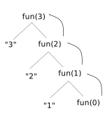
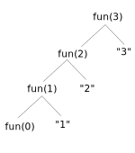

# Time and space complexity

**Time complexity** is a measure of how long it takes for an algorithm to run to completion. **Space complexity** refers to how much memory is required to run. Both are functions of length of the input.

Analysis of the algorithm usually quantifies a worst-case scenario, focusing on the dominant, highest degree term. The time complexity or space complexity is expressed such that they can be compared, independent of hardware resources (CPU speed, operating system _etc_).

The relative measure is symbolised by the big-O notation, and compares how algorithms run as the number of elements (variables) involved changes.

For example, an algorithm of **order** (or **degree**) `O(n)` changes complexity proportionally to the number of elements. If one doubles the number of elements, the algorithm would take twice as long and require twice as much memory to execute.

A nested for loop which compares one element with each element (including itself) has a degree of `O(n^2)`. A for loop which compares one element with all _other_ elements requires `O(n(n-1)/2)` which is essentially `O(n^2)`.

Functions, can be traced using trees. The first statement is represented by a left-hand edge and node, with all subsequent statements placed to the right. Below is a recursive function:

```cpp
void fun(int n)
{
 if(n > 0)
 {
 printf("%d ", n); 
 fun(n - 1);
 }
}
```

The first call is written at the top and all subsequent calls branch from the top.



This recursive function `fun()` has a _calling phase_ (also referred to as an _ascending phase_), the section of the block which precedes recursion. The sequence printed is 3, 2, 1.

Recursive functions with statements post-recursion have a _returning phase_ (also referred to as a _descending phase_), demonstrated next. The sequence is 1, 2, 3.

```cpp
void fun(int n)
{
 if(n > 0)
 { 
 fun(n - 1);
 printf("%d ", n);
 }
}
```



Both recursive examples shown are of the order `O(n)`.

## The stack and recursion

Iterative loops are usually less demanding on the stack, than recursive functions, since fewer stack frames are generated for each function call. Some compilers convert recursive functions into iterative ones.

In many cases, recursive and iterative functions have the same time complexity. Some recursions are termed _excessive_. A reduction in recursive calling can be achieved using _memoisation_, a method involving the storage of recursive output which can be recalled, instead of executing recursive functions again. See later, when Fibonacci by recursion is discussed.
