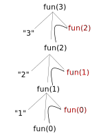

# Types of recursive functions

+ Tail recursion: when the recursive function is the last call of a a block, for example

```C++
void fun(int n)
{
 if(n > 0)
 {
 printf("%d ", n); 
 fun(n - 1);
 }
}
```

Note this example is not a tail recursion because the final call is the `+` operator:

```C++
void fun(int n)
{
 if(n > 0)
 {
 printf("%d ", n); 
 fun(n - 1) + n;
 }
}
```

+ Head recursion: when a recursive function is the first call of a block (following the conditional statement).

Tail and head recursion, with only one recursive call, are termed _linear recursions_. They generally have `O(n)` complexity.

+ Tree recursion: recursion which call themselves more than once (the trace resembles more of a tree than traces for linear recursion).

```cpp
void fun(int n)
{
 if (n > 0)
 {
  printf("%d ", n);
  fun(n - 1);
  fun(n - 1);
 }
}
```



Above, the output is "3, 2, 1, 1, 2, 1, 1". The space complexity is `(n + 1)` which is `O(n)`. A total of 15 calls were made for an element size of 3. It can be shown that the order follows a geometric progression, with worst-case degree of 2^(n+1) - 1, which is effectively O(2^n).

+ Indirect recursion: this amounts to A() calling B() which calls A()... When the base case is met, then the cycle is reversed and eventually the calls cease.

```cpp
void A()
{
 if(...)
 {
 ...
 B();
 ...
 }
}

void B()
{
 if(...)
 {
 ...
 A();
 ...
 }
}
```

+ Nested recursion: when a recursive function's actual parameter is another recursive function.

```cpp
void fun(int n)
{
 if(...)
 {
 ...
 fun(fun(n-1));
 ...
 }
}
```
