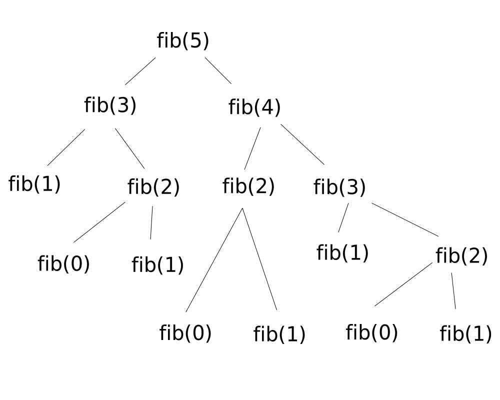
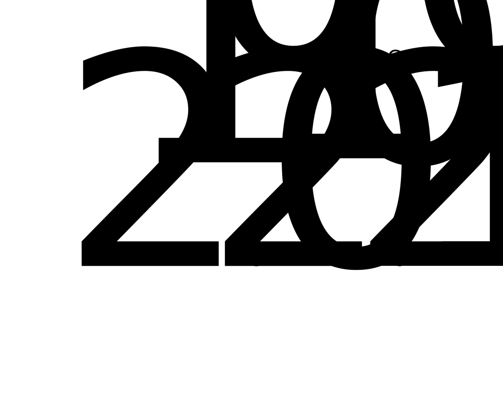
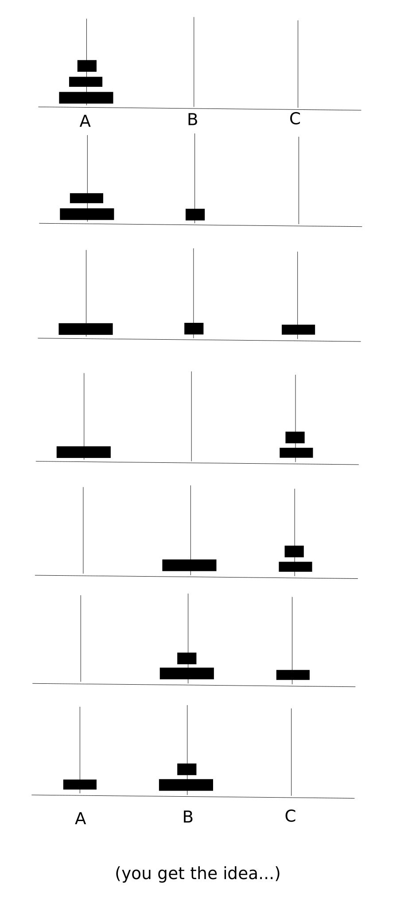

# Examples of recursive functions in action

The Taylor series for `e^x` involves increasing factorials, increasing powers and the sum of all given terms. The recurrence relations are:

```math
sum(n) =    {n = 0               1}
            {n > 0      sum(n-1)+n}
```

```math
factorial(n) =  {n = 0                 1}
                {n > 0  factorial(n-1)*n}
```

```math
power(m, n) = {n = 0                  1}
              {n > 0    power(m, n-1)*m}
```

One can trace from `exp(x) = e^x` as the sum of `exp(x,0) + exp(x,1) + exp(x,2) + ...`

The base case is `exp(x,0) = 1`, and generally, `exp(x,y) = x^y/y! = power(x,y)/factorial(y)`. We first recursively call exp(x,y) until we reach `exp(x,0)` and then sum the ascending terms.

The C++ code is given as:

```cpp
int e(int x, int y){
    static int p = 1, f = 1;
    int r;
    if (y == 0)
        return 1;
    else{
        r = e(x, y - 1);  //head recursion
        p = p*x;
        f = f*y;
        return r + p/f;
    }
}
```

The head recursion is called first until `e(x,0) = 1` is called. Then the first return is:

```math
e(x,1) = r + p/f = e(x,0) + p*x^1/f*1
```

The second return is

```math
e(x,2) = r + p/f = e(x,0) + p*x^1/f*1 + p*x^2/f*2
```

Thus `e(x,y) = e(x,0) + ... + p*x^y/f*y`, where the highest order term is returned last.

Note that p = 1 and f = 1 are static variables are never re-initialised.

The time complexity so far is `O(n^2)` when one considers the number of multiplications for each term. The first two involve no multiplications, the next is `2`, the fourth is `4`, then `6` so `2[1 + 2 + ... + n]` which is `2[n(n+1)/2]`.

The complexity can be reduced significantly by taking out common factors:

```math
exp(x,4) = 1 + x/1(1 + x/2(1 + x/3(1 + x/4)))
```

The factorisation employs *Horner's rule*. The time complexity is now `O(n)`.

The iterative form of the factored form is:

```cpp
int e(int x, int n){
    int s = 1;
    for(n > 0; n--){
        s = 1 + x/n*s;
    }
    return s;
}
```

The more memory demanding recursive form is:

```cpp
int e(int x, int n){
    static int s = 1;
    if (n == 0)
        return s;
    s = 1 + x/n*s;
    return e(x, n-1);   //note how this is tail recursive cf. above
}
```

## Fibonacci series by recursion

```math
fib(n) = {n = 0                 0}
         {n = 1                 1}
         {n > 1 fib(n-2)+fib(n-1)}
```

The iterative code is:

```cpp
fib(int n){
    int t0 = 0, t1 = 1, sum, i;
    if(n <= 1) return n;

    for(i = 2, i <= n; i++){
        sum = t0 + t1;
        t0 = t1;
        t1 = sum;
    }

return sum;
}
```

The recursive form is:

```cpp
int fib(int n){
    if(n <= 1) return n;

    return fib(n-2) + fib(n-1)
}
```



Since some of the `fib()` calls are staggered (as given by the `fib(n-2) + fib(n-1)`), one finds that the call is repeated in places. In other words, the recursive function `fib(5)` calls `fib(1)` five times. The recursive approach is said to be 'excessive'. The time complexity of the above functions are, at worst, `O(2^n)`.

The reduction in calls is achieved by storing the intermediate values. This process is known as **memoization**. An array of negative values (which are not part of the Fibonacci series) can be initialised. For example, for `fib(n)`, the array `A[n]` with `-1` assigned to each element would be initialised. Then an if statement checks if `A[n] == -1`, then the call is made; otherwise, `A[n]` is returned. The time complexity of the Fibonacci series is reduced to `O(n+1)`.

## nCr by recursion

Background: choose the number of ways a sample is derived for which order does not matter (combinations). For example, ABC and ACB are not distinct but equivalent groups. For a permutation, order does matter, and so ABC and ACB are distinct. Hence there are more permutations than combinations.

The formula for deducing the number of combinations of n elements from a (total) set of r elements is:

```math
nCr = n!/r!(n-r)!    for n >= r
```

When `n = r` (when all elements are considered) then there is only one combination. Thus `nCn = 1`. By definition, `0! = 1` and so `0C0 = 1`.

The outer combinations given by Pascal's triangle are all valued at 1. These values can be checked for instead of called, as the following snippet shows:

```cpp
if (n == r || r == 0)
    return 1;
return nCr(n-1, r-1) + nCr(n-1,r);
```



## Tower of Hanoi

This originates from the fundamental problem of moving a tower in pieces from A to C, via B.



The function takes the form `hanoi(n, start, via, end)`, where n = disc number, and the positions are denoted by start, via and end.

The sequence of `hanoi()` functions is dependent on the number of discs. When `n = 1`, we have:

```cpp
hanoi(1, A, B, C){
    printf('Move disc 1 from A to C via B');
}
```

When there are two discs present, we have a recursion for the first, larger disc when `n = 2` and the smaller disc `n = 1`:

```cpp
hanoi(2, A, B, C){
    //this prints "Move disc 1 from A to B via C"
    hanoi(1, A, C, B); 

    printf('Move disc 2 from A to C via B');

    //this prints "Move disc 1 from B to C via A"
    hanoi(1, B, A, C);
}
```

When there are three discs involved, we have:

```cpp
hanoi(3, A, B, C){
    hanoi(2, A, C, B);
    printf('Move disc 3 from A to C via B');
    hanoi(2, B, A, C);
}
```

In general, for `hanoi(n)`, we have:

```cpp
void hanoi(int n, int A, int B, int C){
    if(n > 0){
        hanoi(n-1, A, C, B);
        printf('Move disc %d from A to C via B', n);
        hanoi(n-1, B, A, C);
    }
}
```

Practically, we would give the positions a constant (`int A = 1` etc.). Then the call `hanoi(1, 2, 3, 1)` is equivalent to `hanoi(1, B, C, A)`, moving disc 1 from B to A via C.
