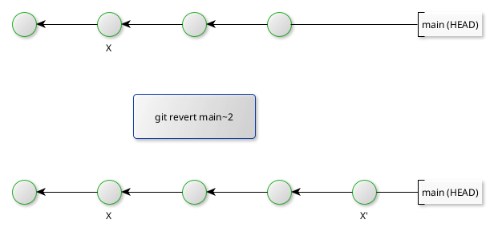
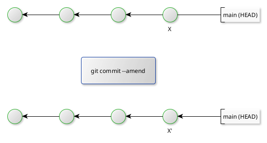
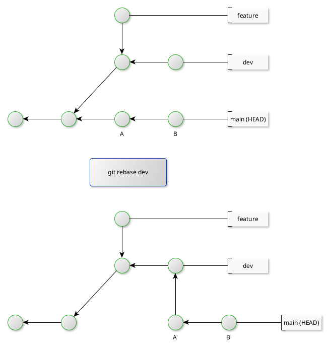

# Altering commits

This is all about altering commit histories, with many often requiring conflict resolution.

## git revert

The command ```git revert``` introduces a new commit at the tip of the branch which reverts the work of the previous commit (either the HEAD or any other commit on the current branch).



## git commit --amend

This amends the last commit (i.e. without introducing a new commit). This can be useful to when making minor modifications (e.g. cosmetic typos).



## git reset

This command is normally executed at a given commit, after which Git will then place the HEAD at the given commit and, depending on the options chosen, update the working directory and index to a state to match the selected commit.

The current state of the project must be staged before running ```git reset```. Hence the working directory and index are synchronised. This is relevant to understanding ```git reset```.

+ ```git reset --soft commitSHA``` - the content of the index and working directory are not updated (not reset), i.e. only the HEAD is repointed to the selected commit. This option tends to be applied when one wants to combine the staged state with the currently selected commit.
+ ```git reset --mixed commitSHA``` - the default option; the state of the index is updated but the working directory (prior to running ```git reset```) is not changed. This tends to be used when altering the sequence of commits, making the trail more logical.
+ ```git reset --hard commitSHA``` - the state of the index and working directory is updated to match the selected commit. This tends to be used when subsequent commits (from the selected commit) should be abandoned.

## git cherry-pick

This command copies a commit from a different branch over to the current branch tip. This can be carried out on one commit or an ordered range, as follows:

```git cherry-pick diffBranch~3 diffBranch~1```

Note that this creates a new commit and new commit SHA but retains much of the commit metadata itself (e.g. timestamps). In general, this option should be used sparingly; developers should consider a ```merge``` or ```rebase``` (covered next) option.

## git rebase

This command alters where a sequence of commits is based. The context assumes one takes all commits _from_ the current branch (up to the mearge base) _to_ the target branch's tip.



Note the original order of the branch to be rebased is preserved.

If a conflict is found, the Git will halt the operation. After the developer has resolved and staged the update (the resolution), run ```git rebase --continue```. Git then commits the resolution and continues the rebase operation.

If however a conflict is found and the developer wants to completely abort the rebase, then run ```git rebase --abort```.

Note that rebasing only works when the branch to be rebased is linear (no subbranches present). In such cases, the developer would need rebase subbanches first before rebasing the main branch.
