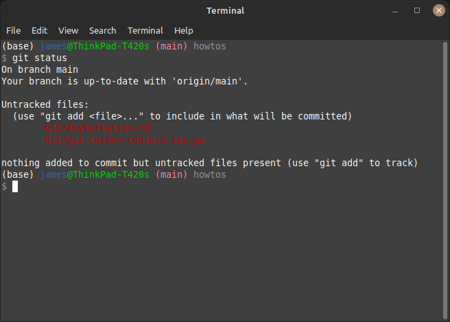

# Installing Git

This briefly outlines how to install Git on Ubuntu based distros and includes ```/home``` [files](./git-custom-console.tar.gz) that (on reboot) customise the console when navigating git projects.

```bash
sudo apt install git-all
```

Then set up the git user's name and email address using:

```bash
git config --global user.name "Joe Bloggs"
git config --global user.email joebloggs@example.com
```

The aforementioned files should be extracted (or the existing text files updated) in order to produce the following format in a console:



Notice how the main branch is highlighted as (main).
