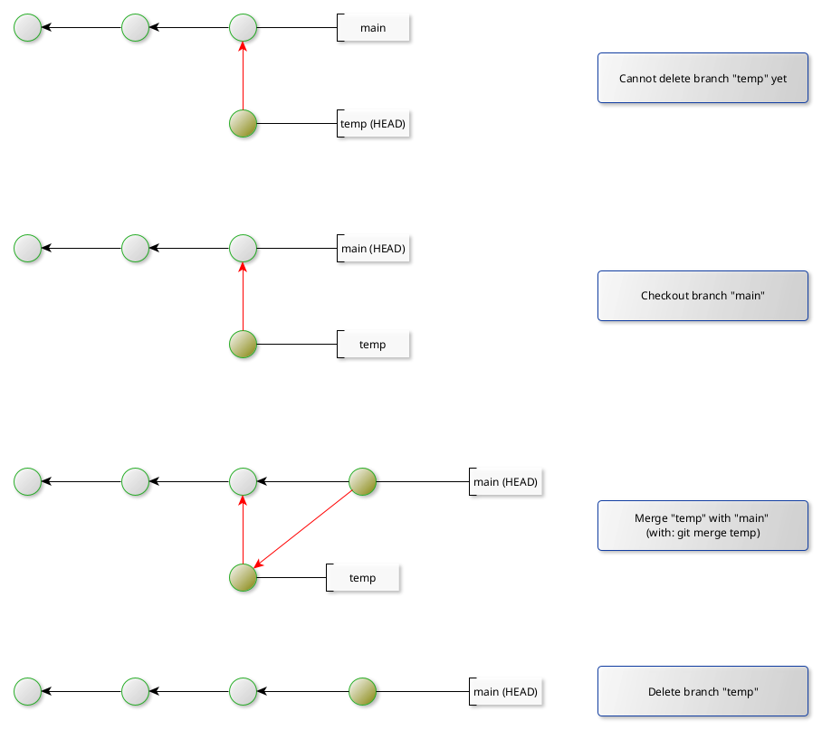

# Source control with Git

Source control is the practice of tracking changes to source code. Git and [Apache Subversion](https://subversion.apache.org/) (or just "SVN") represent the more popular source control management (SCM) tools in use. Older tools such as [CVS](https://savannah.nongnu.org/projects/cvs/) (Concurrent Version Control Systems), are still available though largely superseded.

This outline focuses on the core Git commands, which should be applicable to the range of remote repositories available, for example, GitHub, [GitLab](https://gitlab.com/) and [BitBucket](https://bitbucket.org/), as well as predominantly self-hosting options such as [Gogs](https://gogs.io/) and [Gitea](https://docs.gitea.io/en-us/).

## Basic ideas

Code changes start somewhere and can then ```branch``` off to focus on specific updates, changes or developments, depending on the project. In some cases the work carried out on a given branch may be abandoned, whereas in others they are merged with the ```master``` branch. During a ```merge```, the project files updates from one branch are merged with another. In some cases when merge conflicts arise and therefore these must be handled manually.

Each node along a branch is denoted by a hash, a ```commit hash``` or more casually a ```commit```. The changes to code are performed by first adding all files (with ```git add```) to a list that require uploading to the repo; this step is also known as ```staging```. The developer then commits the changes (with ```git commit```) which builds a new hash. Quite often, this takes place on a local machine and therefore it is necessary to push the commit hash (with ```git push```) to a remote repository (typically known as ```origin``` but more accurately referred to as ```upstream```). 

Any developer with access to a repository can pull the latest branch (with ```git pull```), by default the master branch, to their local repository. A developer can also query for upstream updates (without downloading the updates) by fetching the status (with ``` git fetch```) from the repository.

# Branches

One can initialise a new repository and set the main branch name as follows:

```bash
git init -b mainBranchName
```

One can rename a branch later with:

```bash
git branch -m oldName newName
```

Branches can be named with / to mimix Unix pathnames, and subsequently form a useful way to organise branches. For example

+ bug-fix/ticketX
+ bug-fix/ticketY

One can view a list of commits for multiple branches using a wildcard * as:

```bash
git show-branch 'bug-fix/*'
```

One can create a new branch and then checkout the new branch with:

```bash
git checkout -b newBranchName
```

## The HEAD pointer

The HEAD pointer represents the current reference point along a current branch and by default points to the latest commit. 

There is only one HEAD per repository, as such.

One can "check out" an existing branch and this by default, will set the HEAD pointer to the latest hash along the existing branch. It is possible to detach the HEAD pointer to some preceding commit hash. Git commands generally assume the point of view of the HEAD pointer.

## Stashing and carrying updates to a different branch

A given developer can only have one active branch at a time. Before checking out other branches, developer would need to commit changes. There are cases where this is not desirable (changes may be expected to pass tests before being committed) while also noting that the current changes should not simply be discarded. In these circumstances, Git provides a way to ```stash``` changes (sometimes more than once) and then return to them later. Use ```git stash -m "stash comment"```.

Developers can also merge uncommitted changes from the current branch to a desired branch following a ```git checkout targetBranchName``` command. This is not the same as merge of branches but actually an example of a ```three-way merge```.

## Listing branches

Use the following to view local (temporary) branches:

```bash
git branch 
```

The following will show remote (permanent) branches:

```bash
git branch -r
```

Finally, the following shows both local and remote branches:

```bash
git branch -a
```

As shown above, use ```git show-branch``` to list commits of the current branch.

## Checking out specific commits

One can checkout a specific commit in one of several ways:

+ by hash value (SHA)
+ by tag name
+ by reference to the HEAD pointer, with ^ e.g. ```git checkout HEAD^^^``` to checkout a commit three behind HEAD (this assumes that the path to the third commit is unambiguous)
+ by reference to the tip of the branch (latest commit) with ~ e.g. ```git checkout branchName~4``` to checkout a commit four behind the tip (again, assumes an unambiguous path)

Either way, this ```detaches``` the HEAD pointer from the tip of the branch. This effectively results in a HEAD that is not part of the branch anymore, and so any subsequent commits, while permitted, will not be associated with any branch. Consequently, when one tries to checkout the tip of the branch later, the aforementioned commits are unreachable (they do not belong to any branch).

To make the commits reachable, one must start a new branch when the HEAD is detached, before committing changes. It is also possible to tag a (dangling) commit and then be able to access the commit later via the tag.

Eventually, any commits that are not tagged or part of a branch are disposed via Git's garbage collection.

## Resetting and reverting commits

Git can ```reset``` changes to a given commit. This means Git removes (deletes) all commits between the current one up to the given commit. A somewhat less destructive method is available by instead directing Git to ```revert``` on a branch. Instead of deleting prior commits, this instruction "re-commits" the previous hashes, in the order they appear up to the given commit. 

To compare both methods using a branch with the sequence ```A -> B -> C```, a reset to hash A would result in a branch ```A``` whereas a revert to has A would lead to ```A -> B -> C -> B -> A```.

## Deleting branches

This is typically done locally, when short-lived bug fix or feature branches (not expected to be part of the remote repository) are deleted.

Revisiting the idea of unreachable commits again, Git safeguards users from deleting branches if it means that any commit is left unreachable. Some commits are part of more than one branch, so in such cases it is possible to delete one of the branches. In other cases, Git will be default prevent users from deleting branches.

If a situation arises whereby a commit would become unreachable, then in order to delete the branch, one would need to either:

- checkout a (different) branch that also has the commit (that should not be deleted) and then proceed to delete a different branch that also has the commits
- get the commits over to an existing branch via a merge, before deleting the branch


