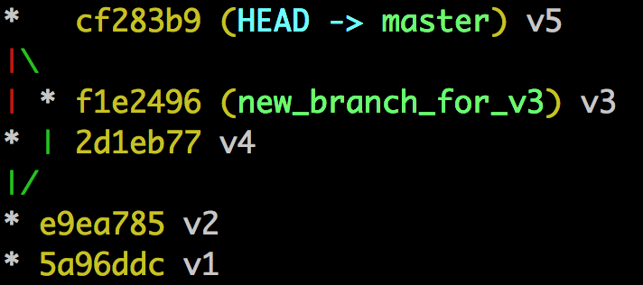
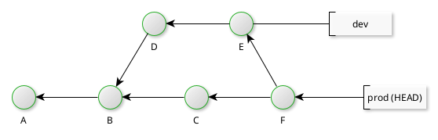
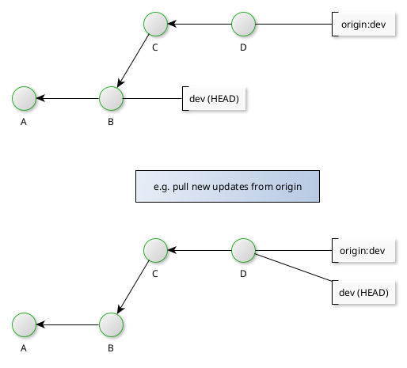

# Merging

Merging is the unification of two or more commit histories of branches. It can only take place within the same repository: branches (whether originating from this repository or some other repository) must be present beforehand before a merge can take place.

To many, a merge is technically only completed when a new commit is persisted. The resultant commit will have as many parent commits as there are branches.

A merge always involves merging a _source_ branch _into_ the current, _target_ branch. 

Git looks for the latest common ancestor of both branches (a common ancestor is also known as a _merge base_) and proceeds to merge all changes according to the commit history up to the current current on the current branch.

```bash
git merge sourceBranchName
```

In general, all developers are advised to perform merges with a clean working directory and index (i.e. where are previous updates have been staged and committed).

## Viewing merges

One can run [```gitk --all```](https://git-scm.com/docs/gitk) to view commit graphs following a merge (there are other viewers), or, in the case of constrained environments (e.g. a command line interface) the command:

```bash
git log --graph --decorate --pretty=oneline --abbrev-commit
```

This will show the commit graph, with the current branch as the primary branch from which all other branches are related to. The current branch is normally set on the left, with the latest commits at the top of the output.



# Merge conflicts

Conflicts occur when the updates on the target and source branches are not identical.

In such cases, Git will not complete the merge or commit anything. Instead it will leave the index and working directory in a dirty state, and mark the conflict within a file (in the working directory) with _three-way_/_merge_/_conflict resolution markers_.

```
<<<<<<<<<HEAD
=============
>>>>>>>>>sourceBranch
```

The developer must then modify the conflicting file, remove the markers and then request a ```git commit```.

### Finding conflicted files

List conflicted files, as referenced to by the index, with:

```bash
git ls-files -u
```

### Inspecting conflicts

Once located, open the file to find the merge markers, before deciding what should be applied.

The following represents a example as a result of the merge of two branches (recall, Git can merge more than two if needed):

```
<<<<<<<<<HEAD
[what is in the target (current) branch]
=============
[what is in the source branch]
>>>>>>>>>sourceBranch
```

When updated and the merge markers removed, stage the update, check for other merge markers with ```git diff --check```, update and stage others where found, before committing the changes.

### Using Git diff

One can print the differences delineated by the merge markers with ```git diff```. Assuming again the merge of two branches, this produces output of the form (not all output is shown for brevity):

```
++ <<<<<<HEAD
 + somethingNotInSource
++ ======
+  somethingNotInTarget
++ >>>>>> sourceBranch
```

The signs indicate what Git was trying to do:
+ ```+``` line addition
+ ```-``` line removal
+ [blank] - no change

The first two characters of each line are two columns, the left-most depicting what Git was trying to do with the current (target) branch, and the next column depicting what Git was trying to do on the other (source) branch.

So the above example shows that Git was trying to:

- Add merge markers to both the source and target branch (denoted by a + in both columns)
- Add a line with content "somethingNotInSource" to the source branch
- And, add a line with content "somethingNotInTarget" to the target branch

In addition, this approach shows the changes attempted against both (all) branches (since there are two columns on the left). 

To view a diff from the perspective of one branch only (useful if one plans to ignore the other branch) then one can use one of two git commands.

```bash
git diff HEAD
git diff --ours
```

This will show one column on the left, as "half" the output of the above, as follows:

```
+ <<<<<<HEAD
  somethingNotInSource
+ ======
+  somethingNotInTarget
+ >>>>>> sourceBranch
```

Conversely, one can ignore the current branch and favour the other branch:

```bash
git diff MERGE_HEAD
git diff --theirs
```

```
+ <<<<<<HEAD
+ somethingNotInSource
+ ======
  somethingNotInTarget
+ >>>>>> sourceBranch
```

The MERGE_HEAD notation will become clear shortly. Note the introduction of the [blank] operation, showing nothing would change if applied.

Finally, developers should note that by updating the conflicting file and removing the markers, Git will _assume_ that this conflict is resolved and not list it again if the command ```git diff``` was re-run. This is helpful particularly if there are lots of conflicts to resolve and developers want to focus on what's conflicted only.

## Git status and Git diff

```git status``` detects differences at the project file level, at both the local and remote repositories.

```git diff``` detects differences within a file for the local repository only.

## Conflict internals

On conflict, Git records the SHA1 of the source commit in the file ```.git/MERGE_HEAD```.

After this and a commit was requested, Git then records the default merge message in the file ```.git/MERGE_MSG```.

Finally, Git tracks three files: (1) the conflicting file (the file that contained the merge markers: this file is referred to as a ```merge base```) and the two original files pre-merge, (2) target and (3) saving the state in the index. The actual merge base is stored in the working directory. 

The numbers stated are actually ```stage numbers```:

0. Any non-conflicted file
1. New/updated project file (in the working directory) as a result of the merge
2. Target file
3. Source file

At this point, Git has what it needs to rollback a merge (discussed later).

### Picking a side

It is possible to apply all changes from one side (source or target) for a given file with either ```ours``` or ```theirs```:

```bash
git checkout --ours filename
```

## Final checks and the diff of a merge

One can run ```git ls-files -s``` (instead of the parameter ```u```) to list all tracked files, conflicted or not.

All files must be assigned a stage number 0 to indicate that it is not conflicted, and therefore that all changes can be committed.

The commit following a merge is denoted by a ```Merge``` field when running ```git log```. A basic form of output, again assuming the merging of two branches, is given below:

```
commit [hashValue] (branchNameList)
Merge: parent1SHA parent2SHA1
Author: ...
Date: ...

  mergeComment
```

Git, if applicable, will also introduce a ```diff``` of the merge, which can be revealed with ```git log```, focusing on the differences between files only, along with the action taken. The two columns again represent, from the left, what _was_ done to the current (target) branch and what _was_ done to the source branch:

```
diff --cc fileName
...
...
fileLineBefore
-  lineInTarget
 - lineInSource
++ lineForBoth
fileLineAfter
```

In the above case, both target and source files had a line removed, and, both had a line added (so effectively the line was replaced in this case).

## Restarting or aborting a merge

To restart an ongoing (e.g. when the developer is still working through conflicts) merge, use ```git checkout -m```.

To abort a merge (e.g. shortly before committing changes), use: ```git merge --abort```.

To discard a committed merge, use ```git reset --hard ORIG_HEAD```.

Git would have saved the original HEAD reference for cases like the above. Note that a hard reset will return the project state to the last clean index and working directory state. Any changes not committed before the merge took place would be lost.

# Merge strategies

Merge strategies describe what Git has done following a merge command. Git tries one strategy, and failing that tries another.

By default, Git attempts a ```degenerate``` merge strategy first, before trying a ```merge-ort``` strategy. Developers can force Git to attempt a specific strategy from the command line.

## Degenerate merges

Some merges (which Git does not return as an error) are not strictly merges (to some) since they do not introduce a new merge commit.

Two simple examples of such ```degenerate``` merges are shown next.

### Already up to date



In this case, the ```prod``` branch is already up to date (the HEAD is ahead or a descendent) with the commits from the ```dev``` branch. Any attempt to merge ```dev``` into ```prod``` will result in an Already up to date (merge) response.

### Fast forwarding

This results from the fast-forwarding of a branch tip, where the HEAD is behind (i.e. is an ancestor to the named commit). Take for example the following where the HEAD of the local ```dev``` branch is an ancestor of the tip of the origin branch.



Common examples of such merges occur when pulling (or indeed fetching) from a remote repository (assuming the developer hasn't made local changes). 

If the developer hasn't made any local changes following commit B; hence, pulling from the (more up to date) remote repository need not involve saving a new commit locally (hence degenerate). Git only needs to move the HEAD to the tip of the branch after pulling from the remote repository.

Fast foward merges are the inverse of Already up to date merges.

## Resolve merges

Resolve merges look for the common ancestor (merge base) and then following sequential processing from the common ancestor, produce a merge commit on the current branch. (The merge commit is strictly not part of the branch merged into the current branch.)

Resolve merges only work on two branches.

## Recursive merges

The recursive merge is similar to the resolve merge strategy but one which can handle more than two branches.

A more effecient rescursive strategy is the ```merge-ort``` strategy.

## Octopus merges

The octopus strategy (as implied) is designed to handle merges of more than two branches where no conflict exists.
