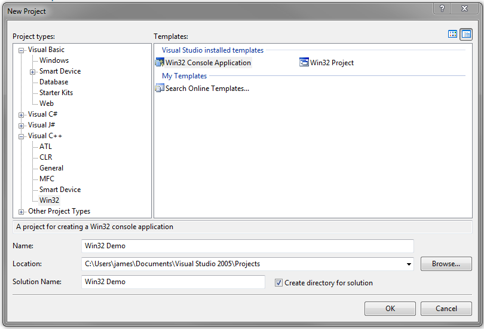
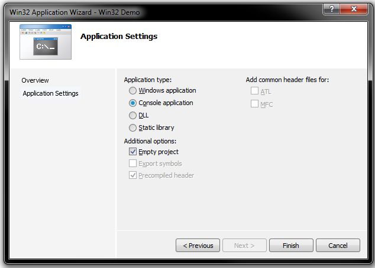
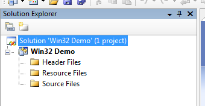
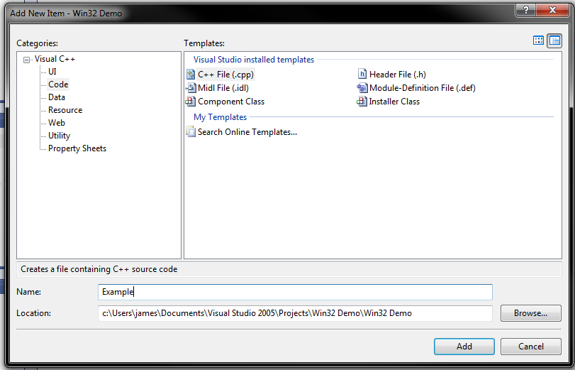
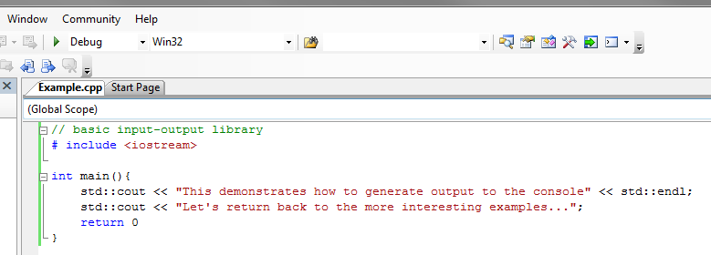
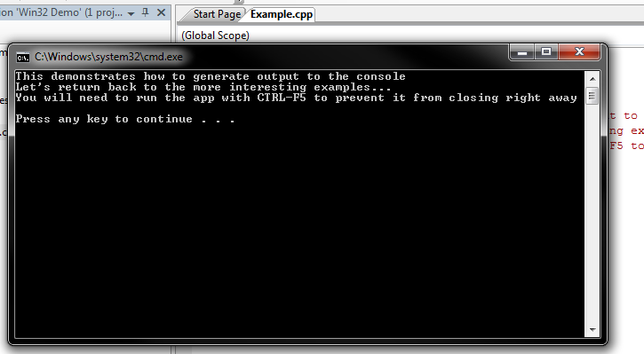
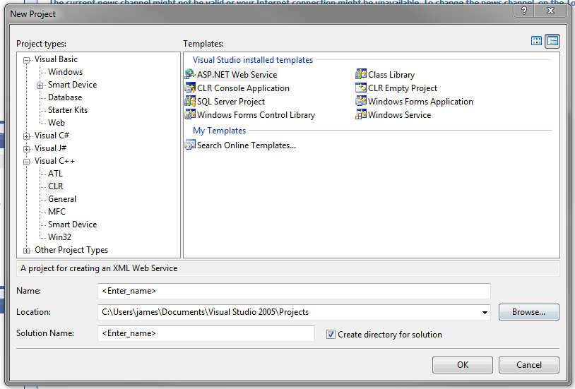

# Microsoft Visual Studio 2005

This article outlines the basics to application development with Visual Studio 2005 (herein referred to as __MVS__).

## New Win32 projects

Start a new project as a Win32 project:

In the above case, the _Solution_ represents the combination of programs and related resources intended to solve a problem. For basic C++ applications,
choose an empty project:

To add project files, right-click on the Solution Explorer as appropriate.

Add a C++ source file:

Generally, one builds a _debug_ version of the application (to allow for debugging and tracing) and, later, a _release_ version of the application that
is more optimal. Clicking the green arrow will build the application, open and (in this case) close the app. To prevent the app from closing right away, enter CTRL+F5 instead.

### Debug build file types

Debug build files are saved to the solution folder's _debug_ subfolder. The file types present are dependent on the project type chosen.

Some examples:

|__File extension__|__Description__|
|-|-|
|.obj|Object files produced by the compiler.|
|.ilk|Incremental linker files. The linker combines object files and modules from other libraries to build the executable. To speed up the process, MVS saves a copy of previous builds (linked) and adds new modules if a change to the source code requires it.|
|.pch|Pre-compiled header files. These files contain represent compiled code that is not subject to modification (e.g. C++ libraries) and, when utilised, speed up build times.|
|.pdb|Program Debug Database files. Contains dubugging info used when running the app in debug mode.|
|.idb|Intermediate Debug files. Stores compiler states when building and speed up rebuilds.|

An exectuable is only generated when compilation and linking have succeeded.

## CLR applications

The above Win32 project is intended for native applications (i.e. written using ISO/ANSI C++, compiled to native machine code, designed to run on the same architecture as the build machine). MVS provides such projects access to the Windows API and MFC (Microsoft Foundation Classes). MFC is an intermediate library that would sit between the application and the operating system.

MVS also provides tools to build _CLR_ (Common Language Runtime) applications, which strictly speaking are Microsoft's implementation of the CLI (Common Language Infrastructure) specification. CLR programs are designed to run on a virtual machine (defined by the CLI). Other languages, including Visual Basic and C# also support CLR development. The CLI defines a standard intermediate language that the virtual machine understands and is therefore what higher-level languages (Visual Basic, C# and C++ to name a few) target.

CLR applications written in C++ are also known as _C++/CLI_ applications. However they are referred to, CLR applications are not native applications. They run on a virtual machine, much like what Java is to the Java Virtual Machine. C++/CLI applications effectively run C++ code in _managed C++_. This means that data and code is managed by the CLR, and includes features not normally available to native applications, including garbage collection.

CLR and MFC projects in C++ can be accessed from the project types, as shown previously.

## .NET applications

The .NET framework is a part of the operating system that makes it easier to build desktop and web applications. It implements the CLI and therefore provides greater collaboration with other programming languages that support it.

Both CLR and .NET applications come with very minor performance penalties due to the added features.
