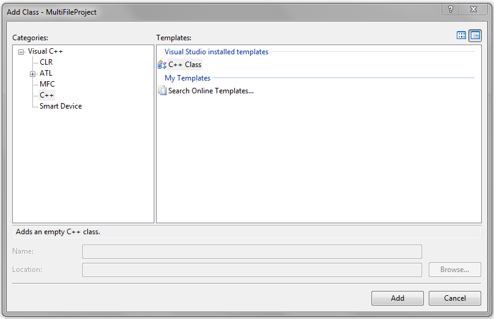
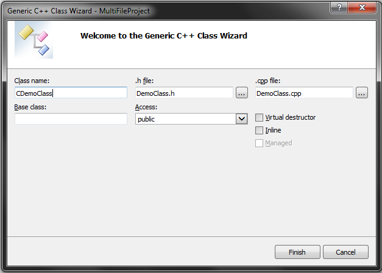
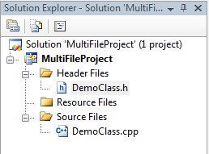
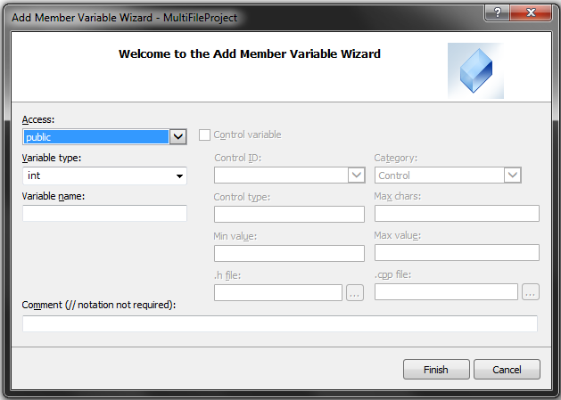
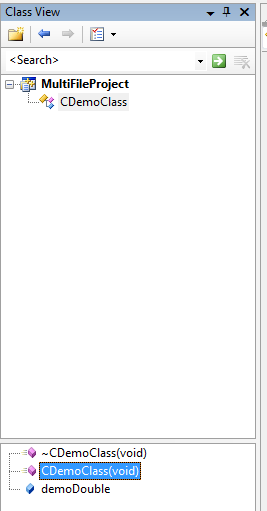
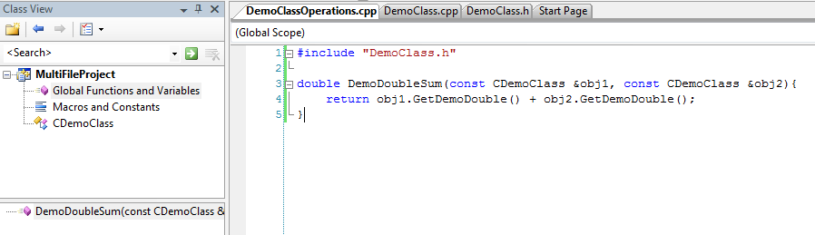
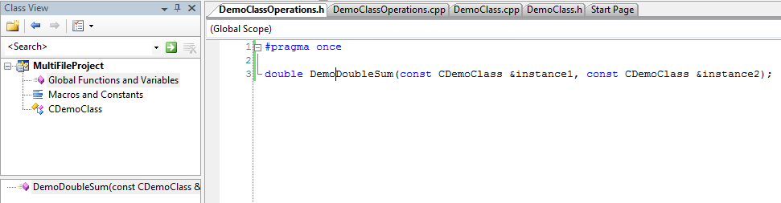
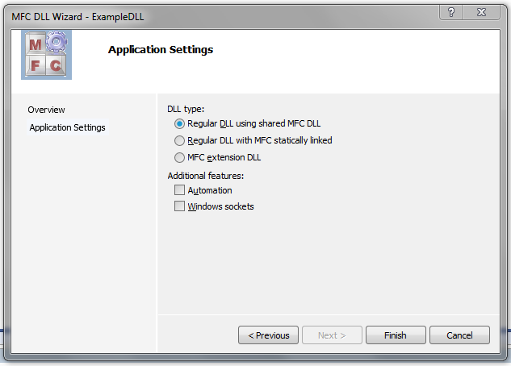

# Microsoft Visual Studio 2005

This article outlines the basics to application development with Visual Studio 2005 (herein referred to as __MVS__).

## New Win32 projects

Start a new project as a Win32 project:


In the above case, the _Solution_ represents the combination of programs and related resources intended to solve a problem. For basic C++ applications,
choose an empty project:


To add project files, right-click on the Solution Explorer as appropriate.


Add a C++ source file:


Generally, one builds a _debug_ version of the application (to allow for debugging and tracing) and, later, a _release_ version of the application that
is more optimal. Clicking the green arrow will build the application, open and (in this case) close the app. To prevent the app from closing right away, enter CTRL+F5 instead.


### Debug build file types

Debug build files are saved to the solution folder's _debug_ subfolder. The file types present are dependent on the project type chosen.

Some examples:

|__File extension__|__Description__|
|-|-|
|.obj|Object files produced by the compiler.|
|.ilk|Incremental linker files. The linker combines object files and modules from other libraries to build the executable. To speed up the process, MVS saves a copy of previous builds (linked) and adds new modules if a change to the source code requires it.|
|.pch|Pre-compiled header files. These files contain represent compiled code that is not subject to modification (e.g. C++ libraries) and, when utilised, speed up build times.|
|.pdb|Program Debug Database files. Contains dubugging info used when running the app in debug mode.|
|.idb|Intermediate Debug files. Stores compiler states when building and speed up rebuilds.|

An exectuable is only generated when compilation and linking have succeeded.

## CLR applications

The above Win32 project is intended for native applications (i.e. written using ISO/ANSI C++, compiled to native machine code, designed to run on the same architecture as the build machine). MVS provides such projects access to the Windows API and MFC (Microsoft Foundation Classes). MFC is an intermediate library that would sit between the application and the operating system.

MVS also provides tools to build _CLR_ (Common Language Runtime) applications, which strictly speaking are Microsoft's implementation of the CLI (Common Language Infrastructure) specification. CLR programs are designed to run on a virtual machine (defined by the CLI). Other languages, including Visual Basic and C# also support CLR development. The CLI defines a standard intermediate language that the virtual machine understands and is therefore what higher-level languages (Visual Basic, C# and C++ to name a few) target.

CLR applications written in C++ are also known as _C++/CLI_ applications. However they are referred to, CLR applications are not native applications. They run on a virtual machine, much like what Java is to the Java Virtual Machine. C++/CLI applications effectively run C++ code in _managed C++_. This means that data and code is managed by the CLR, and includes features not normally available to native applications, including garbage collection.

CLR and MFC projects in C++ can be accessed from the project types, as shown previously.


## .NET applications

The .NET framework is a part of the operating system that makes it easier to build desktop and web applications. It implements the CLI and therefore provides greater collaboration with other programming languages that support it.

Both CLR and .NET applications come with very minor performance penalties due to the added features.

## Multifile projects

This outlines how to build and manage header and source files with MVS. The following project is on GitHub [here](https://github.com/jfspps/VisualStudio2005Learning/tree/main/MultiFileProject).

### Class view

New (for example) Win32 console applications do not have classes by default, as shown by MVS Class viewer. To create 
a class from the viewer, right-click the solution and select ```Add```, then ```Class...```. Select ```C++ Class```:



Enter the details (convention applied here precedes the class name with a C; MVS then autofills the filenames):



From the Solution Explorer, one can then see both header and source files created:



The preprocessor directive ```#pragma once``` is a Microsoft-specific directive, preventing the compiler from including
the current header file more than once in the source code. This is done since multiple header files can include other header files
which also have the same class definitions. This is not allowed and would cause an compile-time error.

An ISO/ANSI C++ equivalent to ```#pragma once``` is as follows:

```cpp
#ifndef CUSTOM_CLASS_DEF
#define CUSTOM_CLASS_DEF
class CDemoClass
{
public:
	CDemoClass(void);
	~CDemoClass(void);
};
#endif
```

The directive ```#ifndef``` can be read as if-not-defined i.e. if "CUSTOM_CLASS_DEF" is not defined elsewhere/previously
then proceed with the following i.e. ```#define```. The directive ```#endif``` closes the if block.

To add data members from the Class view, right-click the class and select ```Add``` then ```Add variable```. The option
to add member functions can also be seen from the same list.



The constructor, destructor, data and function members will be listed in the Class view:



Changes applied (saved) to the header or source files will cause the Class view to update.

To add global functions (i.e. operations on DemoClass objects that do not require access to private members), 
from the Solution Explorer, right-click ```Source Files``` and add a C++ source file. Then from this file, include
the header file:



The global functions will then be listed as shown above.

The corresponding header file for the source file of global functions can be added similarly from the Solution Explorer,
making the global functions available elsewhere in the project.



Right-clicking the function name will provide a dropdown to access the function definition. 

Highlighting an in-built function with the cursor and entering `F1` open the help documentation to the selected function.

## Dynamic link libraries DLLs

DLLs are libraries _linked_ to applications in one of two ways:

- _early binding_ or _load-time dynamic linking_: the DLL is loaded shortly after the application that requires it is loaded
- _late binding_ or _runtime dynamic linking_: the DLL is only loaded when the application (which may have been booted for some time) needs to access it

When a DLL is no longer required by any application, it is deleted from memory.

For the latter (late-binding) an application can ask to load the DLL (if it is not already loaded) prior to invocation with the Windows API
function `LoadLibrary()`, before getting the address of the function in the DLL with `GetProcAddress()`. When the program no longer needs the 
DLL, it can call `FreeLibrary()` to detach itself from the DLL.

### What's available

DLLs not only contain code but also resources e.g. icons, fonts and images. Only specific functions identified by the `exported` keyword are visible to applications. 

DLLs have the equivalent of an application `main()` function known as `DllMain()`. Windows calls this function to initialise the DLL and calls it again to cleanup prior to deletion.

### Types of DLLs

Specifically in regard to [MFC](./3_MFCApplications.md) applications, there are three types of DLLs:

+ _MFC extension DLL_ - a DLL that contains classes derived from (that extend) MFC classes, or, defines functions with pointers to MFC instances. Such DLLs dynamically link to other MFC DLLs and so the working environment must have MFC installed. Programs that utilise MFC extension DLLs cannot be statically linked to MFC.
+ _Regular DLL dynamically linked to MFC_ - an option when a DLL does not extend MFC classes, but rather contains functions that require access to MFC classes and related. Programs that use such DLLs need not be MFC applications. MFC must be installed in the environment, since these types of DLLs do not contain MFC implementation.
+ _Regular DLL statically linked to MFC_ - these DLLs do not extend MFC classes but define functions that require access to MFC classes and related. Rather than referring to MFC through dynamic linking, these DLLs contain a copy of the MFC classes it needs through static linking. A bulkier option but with the advantage that MFC need not be installed. As above, programs that utilise such DLLs need not be MFC applications.

The choices can be instructed through MVS via the New Project wizard:


