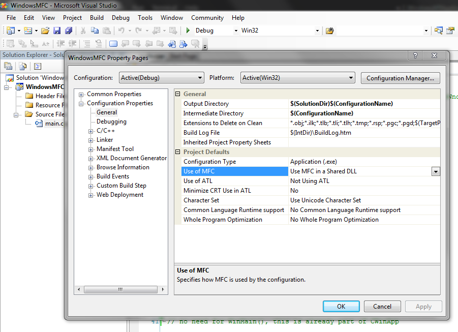
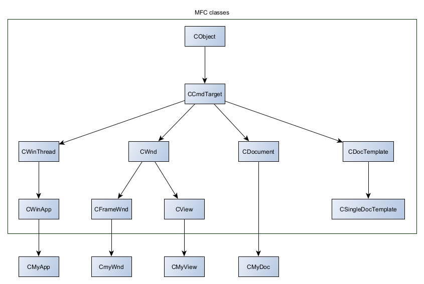
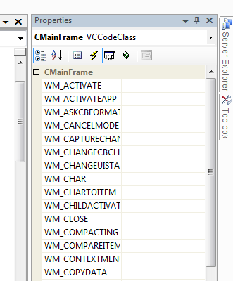

# Microsoft Foundation Classes applications

This article demonstrates the main aspects involved to building Windows applications with MVS using MFC (Microsoft Foundation Classes).

## Setup

Building a demo application similar to that with the Windows API [example](./2_WindowsAPIApplications.md) is much simpler, so much
so that the code is given below. Readers will notice a few areas that overlap from the lower level Windows API approach.

Note that this demo was built as an empty Win32 project, while also enabling _Use MFC in a Shared DLL_ found under the project's
Configuration Properties.



```cpp
// MFC classes
#include <afxwin.h>

// convention for MFC projects to precede class names
// with C and data members with m_

// All MFC applications are based on CWinApp
class CDemoApp: public CWinApp 
{
public:
	// this will be called by WinMain automatically
	virtual BOOL InitInstance();
};

// windows in MFC are referred to as frame windows, defined by CFrameWnd
class CDemoWindow: public CFrameWnd
{
public:
	CDemoWindow(){
		Create(
			0,		// use the CFrameWnd defaults
			L"Demo MFC Application");
	}
};

BOOL CDemoApp::InitInstance(void){
	m_pMainWnd = new CDemoWindow;

	// key point that links the App (CDemoApp) to
	// an MFC frame window (CDemoWindow); m_pMainWnd
	// is freed up automatically by WinMain()
	m_pMainWnd->ShowWindow(m_nCmdShow);
	return TRUE;
}


// have to build a global instance of the app before
// WinMain() runs (it assumes an instance exists)
CDemoApp AnInstance;

// no need for WinMain(), this is already part of CWinApp
```

## MFC documents, views and document templates

### Documents and Views

MFC applications manage documents and views. A _document_ refers to the data the application handles at a given time
and a _view_ refers to the how the document is presented to the user. The window in which the view appears is called
the _frame window_. Each view can only be related to one document (via pointers) whereas each document can be related to 
multiple views (again, via pointers).

Documents are defined as derived classes of `CDocument` whereas views are defined as derived classes of `CView`.

MFC applications can handle one document at a time as _SDI applications_, supported by the _Single Document Interface_ 
of the MFC library. Applications that need to support multiple documents (of varying types if needed) 
at a time are built as _MDI applicaitons_ using the _Multiple Document Interface_.

### Document templates

The connection between a document, a view and frame windows is managed by a _document template_. The document template can be
assigned to multiple documents of the same type. Technically, the document template (an MFC object) creates document and frame window
objects, while the frame window object creates the views. The document template object is subordinate to the _application_.

- Application creates...
  + Document template creates...
    - Document
	- Frame window creates...
	  + View

Technically, SDI applications are implemented as derived classes of `CSingleDocTemplate` while MDI applications are
implemented from `CMultiDocTemplate`. More classes are shown below:



## Communicating with Windows via messages

### Message Maps

As already mentiond, applications communicate with Windows via messages. The association between an application function and a message is managed 
via a _message map_. When a given message occurs, the corresponding member function (referred to as a _message handler_) is called. 

Each MFC application class that can handle Windows messages will have a message map. The start and end of a message map is denoted
by macro:

```cpp
// note the lack of semi-colon: these are not typical member function protoypes/declarations
BEGIN_MESSAGE_MAP()
// message handlers
END_MESSAGE_MAP()
```

It is possible to declare message handlers outside of message maps; such handlers are distinguished from other member functions with `afx_msg` prefix:

```cpp
class SomeClass : public WinApp
{
	public:
		SomeClass();

	// Overrides
	public:
		virtual BOOL InitInstance();

		afx_msg void OnAppAbout();
		// this macro indicates that SomeClass can contain 
		// member functions that are message handlers;
		// note the lack of semi-colon (it's best to declare this last)
		DECLARE_MESSAGE_MAP()
}
```

Below is an example of a message map:

```cpp
// the first parameter identifies the current class for which 
// this message map is defined; the second parameter identifies the 
// base class from which the message handler can find the message handler
// if it can't find it in the current class
BEGIN_MESSAGE_MAP(CSketcherApp, CWinApp)
	ON_COMMAND(ID_APP_ABOUT, &CSketcherApp::OnAppAbout)
	// Standard file based document commands
	ON_COMMAND(ID_FILE_NEW, &CWinApp::OnFileNew)
	ON_COMMAND(ID_FILE_OPEN, &CWinApp::OnFileOpen)
	// Standard print setup command
	ON_COMMAND(ID_FILE_PRINT_SETUP, &CWinApp::OnFilePrintSetup)
END_MESSAGE_MAP()
```

The message handler given above are _command messages_ (we cover message types shortly), which are generated by the user e.g. a menu option selection.

```cpp
// when a command message identified as ID_APP_ABOUT
// is received, the member function (message handler) OnAppAbout is called
ON_COMMAND(ID_APP_ABOUT, &CSketcherApp::OnAppAbout)
```

Messages should not be mapped to more than one message handler; otherwise all latter message handlers
will be ignored (the first macro declaration is the only macro applied).

To list all messages for a given class, in Class View, right-click the class, select Properties
then click the "Messages" button (the following example is based on a typical _CMainFrame_ class):



### Types of messages

1. _Windows messages_: standard Windows messages, prefixed with `WM_` but not `WM_COMMAND`. Examples include the need to repaint the client
area, or when a mouse button has been released
2. _Control notification messages_: messages originating from controls (e.g. list boxes) to the parent windows that created the control, or from child window to parent window; prefixed with `WM_COMMAND`
3. _Command messages_: messages orginating from the user (e.g. from interacting with UI elements) characterised by unqiue identifiers; also prefixed with `WM_COMMAND`

Command messages are processed in a predefined order, where it moves from one (MFC application) class to another, before finally resorting to the main frame window class (the parent window class) and finally the application class.
