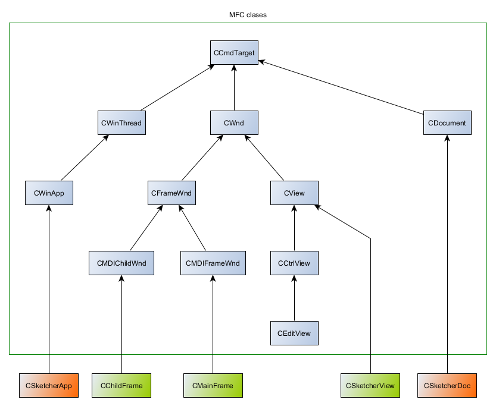
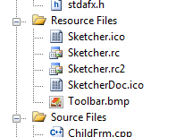
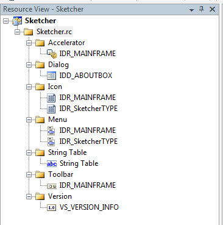
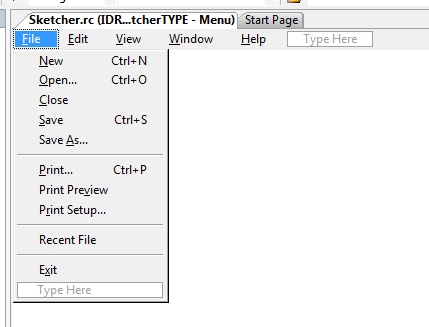

# Microsoft Foundation Classes applications

This article demonstrates the main aspects involved to building Windows applications with MVS using MFC (Microsoft Foundation Classes). Many
 of the ideas are demonstrated through the accompanying [Sketcher Demo](https://github.com/jfspps/VisualStudio2005Learning/tree/main/Sketcher).

## Setup

Building a demo application similar to that with the Windows API [example](./2_WindowsAPIApplications.md) is much simpler, so much
so that the code is given below. Readers will notice a few areas that overlap from the lower level Windows API approach.

Note that this demo was built as an empty Win32 project, while also enabling _Use MFC in a Shared DLL_ found under the project's
Configuration Properties.


```cpp
// MFC classes
#include <afxwin.h>

// convention for MFC projects to precede class names
// with C and data members with m_

// All MFC applications are based on CWinApp
class CDemoApp: public CWinApp 
{
public:
	// this will be called by WinMain automatically
	virtual BOOL InitInstance();
};

// windows in MFC are referred to as frame windows, defined by CFrameWnd
class CDemoWindow: public CFrameWnd
{
public:
	CDemoWindow(){
		Create(
			0,		// use the CFrameWnd defaults
			L"Demo MFC Application");
	}
};

BOOL CDemoApp::InitInstance(void){
	m_pMainWnd = new CDemoWindow;

	// key point that links the App (CDemoApp) to
	// an MFC frame window (CDemoWindow); m_pMainWnd
	// is freed up automatically by WinMain()
	m_pMainWnd->ShowWindow(m_nCmdShow);
	return TRUE;
}


// have to build a global instance of the app before
// WinMain() runs (it assumes an instance exists)
CDemoApp AnInstance;

// no need for WinMain(), this is already part of CWinApp
```

## MFC documents, views and document templates

### Documents and Views

MFC applications manage documents and views. A _document_ refers to the data the application handles at a given time
and a _view_ refers to the how the document is presented to the user. The window in which the view appears is called
the _frame window_. Each view can only be related to one document (via pointers) whereas each document can be related to 
multiple views (again, via pointers).

Documents are defined as derived classes of `CDocument` whereas views are defined as derived classes of `CView`.

MFC applications can handle one document at a time as _SDI applications_, supported by the _Single Document Interface_ 
of the MFC library. Applications that need to support multiple documents (of varying types if needed) 
at a time are built as _MDI applicaitons_ using the _Multiple Document Interface_.

### Document templates

The connection between a document, a view and frame windows is managed by a _document template_. The document template can be
assigned to multiple documents of the same type. Technically, the document template (an MFC object) creates document and frame window
objects, while the frame window object creates the views. The document template object is subordinate to the _application_.

- Application creates...
  + Document template creates...
    - Document
	- Frame window creates...
	  + View

Technically, SDI applications are implemented as derived classes of `CSingleDocTemplate` while MDI applications are
implemented from `CMultiDocTemplate`. More classes are shown below:


## Communicating with Windows via messages

### Message Maps

As already mentiond, applications communicate with Windows via messages. The association between an application function and a message is managed 
via a _message map_. When a given message occurs, the corresponding member function (referred to as a _message handler_) is called. 

Each MFC application class that can handle Windows messages will have a message map. The start and end of a message map is denoted
by macro:

```cpp
// note the lack of semi-colon: these are not typical member function protoypes/declarations
BEGIN_MESSAGE_MAP()
// message handlers
END_MESSAGE_MAP()
```

It is possible to declare message handlers outside of message maps; such handlers are distinguished from other member functions with `afx_msg` prefix:

```cpp
class SomeClass : public WinApp
{
	public:
		SomeClass();

	// Overrides
	public:
		virtual BOOL InitInstance();

		afx_msg void OnAppAbout();
		// this macro indicates that SomeClass can contain 
		// member functions that are message handlers;
		// note the lack of semi-colon (it's best to declare this last)
		DECLARE_MESSAGE_MAP()
}
```

Below is an example of a message map:

```cpp
// the first parameter identifies the current class for which 
// this message map is defined; the second parameter identifies the 
// base class from which the message handler can find the message handler
// if it can't find it in the current class
BEGIN_MESSAGE_MAP(CSketcherApp, CWinApp)
	ON_COMMAND(ID_APP_ABOUT, &CSketcherApp::OnAppAbout)
	// Standard file based document commands
	ON_COMMAND(ID_FILE_NEW, &CWinApp::OnFileNew)
	ON_COMMAND(ID_FILE_OPEN, &CWinApp::OnFileOpen)
	// Standard print setup command
	ON_COMMAND(ID_FILE_PRINT_SETUP, &CWinApp::OnFilePrintSetup)
END_MESSAGE_MAP()
```

The message handler given above are _command messages_ (message types are covered shortly), which are generated by the user e.g. a menu option selection.

```cpp
// when a command message identified as ID_APP_ABOUT
// is received, the member function (message handler) OnAppAbout is called
ON_COMMAND(ID_APP_ABOUT, &CSketcherApp::OnAppAbout)
```

Messages should not be mapped to more than one message handler; otherwise all latter message handlers
will be ignored (the first macro declaration is the only macro applied).

To list all messages for a given class, in Class View, right-click the class, select Properties
then click the "Messages" button (the following example is based on a typical _CMainFrame_ class):


### Types of messages

1. _Windows messages_: standard Windows messages, prefixed with `WM_` but not `WM_COMMAND` (!). Examples include the need to repaint the client
area, or when a mouse button has been released. Always handled by objects derived from `CWnd` (see below).
2. _Control notification messages_: messages originating from controls (e.g. list boxes) to the parent windows that created the control, or from child window to parent window; prefixed with `WM_COMMAND`. Always handled by objects derived from `CWnd` (see below).
3. _Command messages_: messages orginating from the user (e.g. from interacting with UI elements) characterised by unqiue identifiers; also prefixed with `WM_COMMAND`.

Much of the functionality of an MFC application involves writing message handlers for all three above types.

### MFC classes so far

MFC applications generated by the MFC Application wizard construct classes derived from `CCmdTarget`, which as shown is an indirect parent to `CWinApp`. The latter class is the parent class to the above `CSketcherApp` class, which in [this example](https://github.com/jfspps/VisualStudio2005Learning/tree/main/Sketcher) represents the main application class of the MDI application.



A summary of the Sketcher app (demo) classes:

+ `CSketcherApp` (from `CWinApp`) - the main application class
+ `CMainFrame` (from `CMDIFrameWnd`) - defines the parent frame window
+ `CSketcherView` (from `CView`) - defines a view
+ `CSketcherDoc` (from `CDocument`) - defines a document
+ `CChildFrame` (from `CMDIChildWnd`) - defines a child frame window (reside within the parent frame window)

Command messages are processed in a predefined order, where it moves from one (MFC application) class to another until a message handler is found (defined), before finally resorting to the main frame window class (the parent window class) and finally the application class. 

For MDI applications, the sequence would be:

1. The active View object
2. The Document object associated with the active view
3. The Document Template object for the active document
4. The (child) Frame window for the active view
5. The main Frame window object
6. The Application object

### Resources

Resources files (extension `.rc`) define the look of application components e.g. menus, toolbars and dialogs. The code to the events are handled separately via event handlers.



Double clicking an rc file opens the Resource View:



In this example, resources prefixed with "IDR_" identify resources that define a complete menu.

Double clicking IDR_SketcherTYPE opens an Editor:



## Graphic Device Interface (GDI)

Drawing in a window is always relative to the top-left corner of the window. Windows can draw on screen when it knows the position of the
window and the position relative to the top-left corner reference point.

The output is handled without regard to the hardware available via the Windows _Graphical Device Interface_ (GDI). The GDI supports display screens, printers and plotters.

To render something, Windows requires a _device context_, a Windows data structure that translates GDI function calls into physical device actions. The device context handles different _mapping modes_ (coordinate systems), drawing attributes (drawing colour, background colour, line thickness and so on) as well as providing access to hardware information, via GDI functions.

### Mapping modes

Mappings modes are denoted by convention with the `MM-` prefix. For example `MM_TEXT` (the default mapping mode) defines a __pixel__ position from left to right as having increasing positive x values, and a position from top to bottom as having increasing positive y values. So in relation to the top-left corner of a window, all points in the window have positive x- and y-values.

When drawing on a monitor with a higher-resolution, a coordinate (10,20) (that is, 10 pixels to the right, 20 pixels down) will appear closer to the top-left corner, than on a monitor with a lower resolution. The coordinates are (after Windows 98) always given as 32-bit signed integers. It is possible to move the origin (0,0) from the top-left corner, and so have pixels with negative coordinates.

Another mapping mode, `MM_LOENGLISH` is more familiar to geometric coordinate systems: an increasing x value places the point by multiples of 0.01 inch (MM_TEXT uses pixels as a metric) further to the right and n increasing postive y value places the point further up the coordindate system. 

Choosing pixels or lengths as a unit of measure results in different output. Pixel unit values are dependent on the resolution and whereas unit length in inches is not dependent on the resolution.

### MFC and drawing with CDC objects

Drawing with MFC applications is mostly defined by child classes to `CView`, and the function of interest whenever the client area needs to be redrawn is `OnDraw()`. In relation to the above demo, the `OnDraw()` function is set out by the application wizard:

```cpp
// CSketcherView drawing

void CSketcherView::OnDraw(CDC* /*pDC*/)
{
	CSketcherDoc* pDoc = GetDocument();
	ASSERT_VALID(pDoc);
	if (!pDoc)
		return;

	// TODO: add draw code for native data here
}
```

The commented out pointer parameter (needs reinstating prior to use) can be read as "pointter-to-Device-Context". The function `GetDocument()` retrieves and casts the current View object data member, and sets up the pointer to the document defined by the programmer i.e. `CSketcherDoc`. This is how MFC documents are related to one or more MFC views.

Key to drawing in MFC applications is the `CDC` class (an MFC class for Device Contexts), and its derivatives. Instances of CDC classes contain a device context and member functions (well over 100) needed to draw on devices. The particular derived class of CDC which is used to handle client areas is `CClientDC`. 

Demonstrating how to chang coordinates for a moment, one modifies `OnDraw()`. `OnDraw()` is called each time the client needs to be redaw, typically when the window or child frame is moved, minimised or maximised:

```cpp
// CSketcherView drawing

void CSketcherView::OnDraw(CDC* *pDC)
{
	CSketcherDoc* pDoc = GetDocument();
	ASSERT_VALID(pDoc);
	if (!pDoc)
		return;

	// uses CDC member functions
	pDC->MoveTo(50, 50);

	// alternatively, with older Windows API POINT structure:
	pDC->MoveTo(pointInstance);
}
```

The function `MoveTo()` returns the original coordinates, in the event they are needed (they would be lost otherwise).

### Drawing lines

Instead of just moving from one point to another with `MoveTo()`, applications can draw lines with `LineTo()`.

```cpp
// uses CDC member functions
pDC->LineTo(50, 50);

// alternatively, with older Windows API POINT structure:
pDC->LineTo(pointInstance);
```

The function `LineTo()` returns TRUE is drawn and FALSE if not.

### Drawing rectangles

When used in combination, the program can change coordinates to some point inside the client area and then draw shapes e.g. as a rectangle

```cpp
pDC->MoveTo(50, 50);
pDC->LineTo(50, 200); 	// draw a line 150 pixels down (in MM_TEXT)
pDC->LineTo(150, 200);  // draw another line 100 pixels to the left (in MM_TEXT)
pDC->LineTo(150, 50);  	// draw another line 150 pixels up (in MM_TEXT)
pDC->LineTo(50, 50);	// draw another line 100 pixels to the right (in MM_TEXT)
```

### Drawing ellipses, circles and arcs

One can use the CDC method `Ellipse()` to draw (closed) ellipses or circles. This requires an additional _brush_ object, which in part defines the colour of the edge and fill of the ellipse.

Perhaps a more flexible alternative is the CDC `Arc()` function as this allows one to draw ellipse or circle segments (i.e. an arc), additionally without the need to define a brush. There are two overloaded definitions:

```cpp
// (x1, y1) and (x2, y2) define the upper-left and lower-right corners of 
// the bounded rectangle that encloses the arc; a square would yield 
// a circluar arc;
// (x3, y3) and (x4, y4) define the start and end points of the arc; 
// setting these equal will yield a closed arc
BOOL Arc(int x1, int y1, int x2, int y2, int x3, int y3, int x4, int x4);

// LPRECT accepts a pointer to a CRect instance (the enclosing rectangle);
// the last two params set the start and end points as pointers to CPoint
BOOL Arc(LPRECT lpRect, POINT StartPt, POINT EndPt);
```

Both methods return TRUE of the arc was drawn, or FALSE otherwise. As a sidenote, `CRect` is an MFC class that corresponds to the Windows API structure `RECT`. Likewise, `CPoint` is an MFC class that corresponds to `POINT`.

The following would generate a circular arc:

```cpp
void SketcherView::OnDraw(CDC* pDC){
	// ...

	CRect* pRect = new CRect(250,50,300,100);
	CPoint Start(275,100);
	CPoint End(250,75);
	pDC->Arc(pRect, Start, End);

	// don't forget
	delete pRect;
}
```

### Enclosing and Bounding rectangles

In order to identify the vicinity of an element (a shape), the concept of
 _enclosing rectangles_ is devised. For the Sketcher project, an enclosing 
 rectangle defines the rectangle the element occupies assuming the pen width 
 is 1 pixel. Naturally, the pen width will not always be 1 pixel and in such 
 cases the enclosing rectangle will need to accommodate the shape pen 
 width - this is what the _bounding rectangle_ is for. The bounding rectangle
 is a pen width larger (on all sides) than the enclosing rectangle. 

Both enclosing and bounding rectangles are managed by the MFC class `CRect`.
The act of inflating the enclosing rectangle is handled by `CRect::InflateRect()`.
This method assumes the mapping mode `MM_TEXT` is in place. Calling `CRect::NormalizeRect()`
before inflating it ensures that the rectangle is normalised, i.e. the the left 
coord of the rectangle is _less_ than the right coord, and the top coord is _less_
than the bottom coord.

### Defining Brushes and Pens

One can define a _pen_ (which defines colour and width) by instantiating `CPen`. The unit of width is mapping mode dependent.

```cpp
CPen aPen;

// returns TRUE if the pen initialised successfully or FALSE if not;
// a thickness of 0 always yields a pen one pixel wide regardless of mapping mode (i.e. unit)
aPen.CreatePen(PS_SOLID, 2, RGB(255,0,0));
```

There are numerous pen styles expresed (as symbolic constants e.g. `PS_DASH`, `PS_DOT`) available.

To use a pen, call the CDC function `SelectObject()`. This function returns a pointer to the original pen (for the same reasons as `MoveTo()` does). 
Actually, `SelectObject()` returns a pointer to a `CGdiObject` instance, represented by a class that is parent to pens and brushes.

Building on the ellipse example:

```cpp
void SketcherView::OnDraw(CDC* pDC){
	// ...

	CPen aPen;
	aPen.CreatePen(PS_SOLID, 2, RGB(255,0,0));

	CPen* pOldPen = pDC->SelectObject(&aPen);

	CRect* pRect = new CRect(250,50,300,100);
	CPoint Start(275,100);
	CPoint End(250,75);
	pDC->Arc(pRect, Start, End);

	// don't forget
	delete pRect;

	// restore the original pen
	pDC->SelectObject(pOldPen);
}
```

Brushes are managed in a similar way and come with a range of brush styles (expressed by symbolic constants e.g. `NULL_BRUSH` (no fill), `GRAY_BRUSH`, `HOLLOW_BRUSH`). The following uses `SelectStockObject()` instead of `SelectObject()` to get a predefined stock brush:

```cpp
void SketcherView::OnDraw(CDC* pDC){
	// ...

	CBrush aBrush;

	// options include CreateSolidBrush() and CreateHatchBrush()
	aBrush.CreateHatchBrush(HS_DIAGCROSS, RGB(255,0,0));

	// SelectStockObject returns a pointer to the 
	// predefined stock object relaced; need to cast the pointer
	// to ensure the correct derived instance 
	// (brush derived from CGdiObject) is returned
	CBrush* oldBrush = (CBrush*) pDC->SelectStockObject(NULL_BRUSH);

	// draw as needed

	// restore the original brush
	pDC->SelectObject(pOldBrush);
}
```

What follows next is how to track mouse pointer events so that users can click and drag to draw shapes on screen ("rubber-banding" graphical design).

### Mouse messaging

As with the above drawing functions, mouse messages are generally defined within the View object of the application.

Examining the message list for the View object (so `CSketcherView` in this case) will reveal all Windows Messages IDs, prefixed with `WM_`.
The mouse messages to look at are:

+ WM_LBUTTONDOWN
+ WM_LBUTTONUP
+ WM_MOUSEMOVE

Note that the above events are treated independently, and need not occur in a sensible order (i.e. button down before before button up). It would be 
necessary to evaluate the state or position of the pointer to ensure the behaviour is handled accordingly or ignored completely.

```cpp
// nFlags contains numerous status flags indicating whether keys are down etc.
void CSketcherView::OnMouseMove(UINT nFlags, CPoint point)
{
	// TODO: Add your message handler code here and/or call default below

	CView::OnMouseMove(nFlags, point);
}
```

The `OnMouseMove()` function has a UINT parameter, corresponding to a 32-bit Unsigned integer. The value can be passed as a symbolic constant:

+ MK_CONTROL - CTRL key being pressed
+ MK_LBUTTON - left mouse button being pressed
+ MK_SHIFT - SHIFT key being pressed

One can check (evaluate) what is being pressed with a bitwise AND operator:

```cpp
// within the left mouse button message handler...

if (nFlags & MK_CONTROL){
	// code fired when nFlags has the same bit sequence as MK_CONTROL i.e. nFlags = MK_CONTROL
}
```

The bitwise AND evaulation achieves multiple outcomes. If both bit sequences for `nFLags` and `MK_CONTROL` are non-zero and identical then the evaluation  returns TRUE. If `nFlags` is 0, then this will always fail (`MK_CONTROL` is never 0). Likewise if a different action was fired (a different key was pressed) then the bit sequences would differ and this evaluation would also fail.

In the case of the Sketcher Demo, the `OnMouseMove()` function is involved with drawing successive temporary shapes (aka elements) as the 
mouse cursor moves. The other message handlers (`WM_LBUTTONDOWN` and `WM_LBUTTONUP`) are responsible for initialising the starting and ending points 
(coordinates) within a View object.

In order to mark a view (of a MDI application) where mouse capture should persist, one can call `SetCapture()`. This ensures that all subsequent
mouse messages go to the given view. It's clearly necessary to release this mode at some point, so this can be done with `ReleaseCapture()`.

```cpp
void CSketcherView::OnLButtonDown(UINT nFlags, CPoint point)
{
	// record something
	SetCapture();

	// do other stuff...
}
```

The mouse button released, then release mouse message handling:

```cpp
void CSketcherView::OnLButtonUp(UINT nFlags, CPoint point)
{
	// is it us?
	if (this == GetCapture())
		ReleaseCaptuire();

	// now other views can receive mouse messages...
}
```

## MFC Collections

MFC supports template-based type-safe collection classes of objects and pointers to objects.

Collections of objects are (not exclusively) handled by:

+ CArray (ordered group, zero-based integer index)
+ CList (doubly linked list group)
+ CMap (key-value mapping)

All collections are derived from `CObject` and therefore inherit its features. Objects must first be copied (via a copy constructor) before being placed into the collection.

Similarly, collections of pointers to objects are handled by:

+ CTypedPtrArray
+ CTypedPtrList
+ CTypedPtrMap

### CArray

`CArray` automatically grows as the number of elements increases. The first argument indicates the Object type, the second indicates the type when accessing the array member functions (where applicable) and is usually a reference. In the array, the element is passed by (and assigned) a reference.

```cpp
// a non-constant array (elements can be updated)
CArray<CPoint, CPoint&> somePointArray;

// while not necessary, it speeds up operations for 
// potentially large arrays to set the array size;
// the first argument is the new size, the second
// indicates how many elements are readied the next
// time the array needs to increase in size
somePointArray.SetSetSize(100, 20);

// add an object aPoint; aPoint is passed by reference
somePointArray.Add(aPoint);

// get an element by index
bPoint = somePointArray.GetAt(24);
// could also apply the overloaded operator to CArray
bPoint = somePointArrays[24];

// non-constant arrays only; pass a copy of the object;
// both statements are equivalent
somePointArray.SetAt(18, newPointObject);
somePointArray[18] = newPointObject;
```

when calling `SetSize()`, a helper function `ConstructElements()` is called which sets the new element content to zero. This, and many other
helper functions will need to be overridden if the their default action is not suitable.

### CList

As a doubly-linked list, the setup and parameter list for new `CList` instances is the same as `CArray`:

```cpp
// a non-constant array (elements can be updated)
CList<CPoint, CPoint&> bList;

// new elements are added explicitly, at the head or tail
POSITION positionOfInserted = bList.AddTail(cPoint);
POSITION positionOfInserted2 = bList.AddHead(dPoint);

// one can retrieve the element at the next position
// knowing the previous position;

// this returns NULL if there is no element; the value
// of positionOfInserted passed is incremented (updated)
// if ePoint is not NULL; therefore, this can be run repeatedly
CPoint ePoint = bList.GetAt(positionOfInserted);

// inserting elements before or after specific elements
// requires a known POSITION
POSITION positionOfThisPoint = bList.InsertBefore(positionOfInserted, thisPoint);
POSITION positionOfAnotherPoint = bList.InsertAfter(positionOfInserted, anotherPoint);

// updating an element; returns nothing
bList.SetAt(positionOfThisPoint, thisPointInstead);

// retrieving an element, with a valid POSITION
CPoint found = bList.GetAt(positionOfThisPoint);
```

As with `CArray`, it may necessary to override helper functions e.g. `ConstructElements()` or `DestructElements()` 
if the default behaviour is not suitable.

To __iterate__ through the `CList`, loop through checking the `POSITION` returned until null:

```cpp
CPoint somePoint(0, 0);

POSITION aPosition = bList.GetHeadPosition();

while (aPosition){
	// aPostion is updated as long as somePoint is not NULL
	somePoint = bList.GetNext(aPosition);
}


// similarly, start some place down the list and 
// iterate back

POSITION bPosition = bList.GetTailPosition();

while (aPosition){
	somePoint = bList.GetPrev(bPosition);
}
```

One can __retrieve__ a element by an index, particularly if the length of the list is known:

```cpp
int size = bList.GetCount();

// get the second element in CList
if (size >= 2){
	POSITION secondPosition = bList.FindIndex(1);
	CPoint secondPoint = bList.GetAt(secondPosition);
}
```

To __search__ `CList`, one can call `Find()`. Under the default helper function `CompareElements()`, this only
work if the heap address of the element is known ahead of time. The helper function compares
the address and returns the `POSITION` if matched.

To find an element without knowing the heap address, one would need to override `CompareElements()`.

To __remove__ elements (these methods also free memory automatically):

```cpp
if (!bList.IsEmpty){
	bList.RemoveHead();

	// or bList.RemoveTail();
}


// to remove elements by POSITION (nothing returned)
bList.removeAt(validPosition);

// remove everything
bList.RemoveAll();
```

### CMap

The `CMap` element is characterised by a key and value, both of which need not be of the same type. Maps are not ordered.

The key is converted to an unsigned integer value (of type UINT) via _hashing_, to produce a _hash value_ that is an offset to some _base address_. 
The memory allocation is sequential from the base value by increments of the constant length of the value data type (in bytes). The location of an element (entry) is initially* given by `BASE + (HASH VALUE UINT * LENGTH)`.

Each possible value to `BASE + (HASH VALUE int * LENGTH)` is collectively referred to as a _hash table_. 

Hash values are not always unique,* in which case elements are tied to the element that already resides at that location, as a linked list. See [Hashing](https://jfspps.github.io/howtos/DataStructuresAndAlgorithmsinC++/27_Hashing/#hashing-techniques) to visualise this. Clearly having fewer hash values in the table hinders search functions, since such functions have to evaluate multiple elements for a given hash value.

Carrying on with the MFC `CPoint` example:

```cpp
// the first two arguments represent the key, the last two represent the value
CMap<LONG, LONG&, CPoint, CPoint&> pointMap;

// setting values; both are equivalent
pointMap.SetAt(keyA) = cPointA;
pointMap[keyB] = cPointB;

// retrieving values
bool found = pointMap.LookUp(someKey, someValue);
```

### CTypedPtrList

This stores pointers to objects. The declaration of the constructor is as follows:

```cpp
CTypedPtrList<BaseClass, Type*> listName;
```

The first argument specifies the MFC base class of the element pointer, either `CObList` or `CPtrList`. The former supports pointers of objects derived from `CObject` while the latter supports `void *` pointers. Generally, the base class chosen is `CObList`. The second argument represents the element pointer type required, and is usually the class the best matches elements in the list (choosing `CObList*` would be too general and encompass all child classes).

The member functions to `CTypedPtrList` are similar to the `CList` class, only that they operate exclusively on pointers rather than objects.

### Logical and Client Coordinates

Using `CDC` methods e.g. `LineTo()` assumes that arguments (coordinates) are passed as _logical coordinates_. These coordinates assume an origin and unit (dimension) that is initialised when the view is static. The origin is placed at the top left of the canvas. If the user scrolls the view to some other area of the document, then the origin also moves.

Mouse events don't know about MFC documents, they are only based on the views, and are passed according to _client coordinates_. The client coordinates also have origin component, however, their unit is always in pixels and their origin is always fixed to the top-left of the view, even if scrolling is applied. (All this doesn't matter if there is no scrolling. The logical and client origins would be equal and would never change.)

The client coordinates is based on the client window, not the document. The logical coordinates are based on the document.

The mapping mode applied affects __both__ logical and client coordinate systems: for the former it affects the origin and unit, for the latter the origin only. Some mapping modes apply different units/dimensions, and also apply different axes (increasing or decreasing x or y).

To handle this, one will need to

+ convert the client coordinates from the mouse pointer to logical coordinates within the document before creating elements (shapes)
+ invalidating rectangular areas of the client area (to get the area to redraw) requires converting the logical coordinates back to client coordinates

The first point can be handled with `CDC`'s `DPtoLP()` method. The latter can be handled with `CDC`'s `LPtoDP()` method.