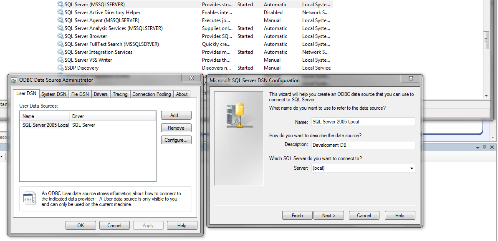
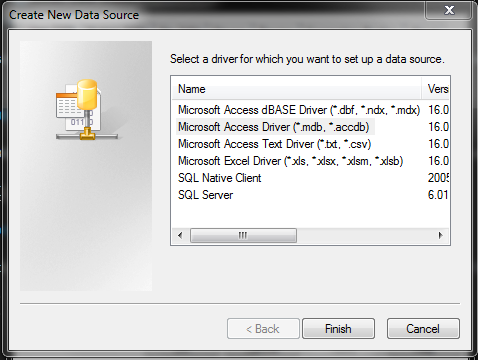
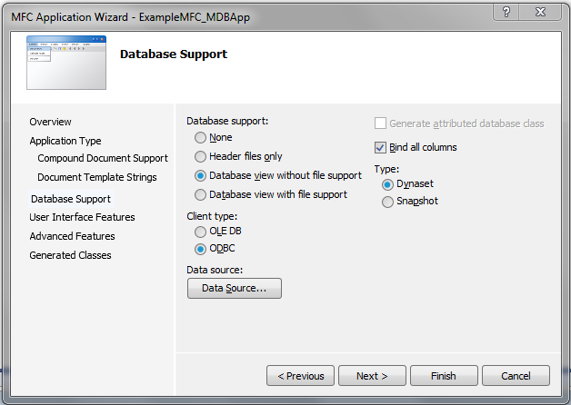
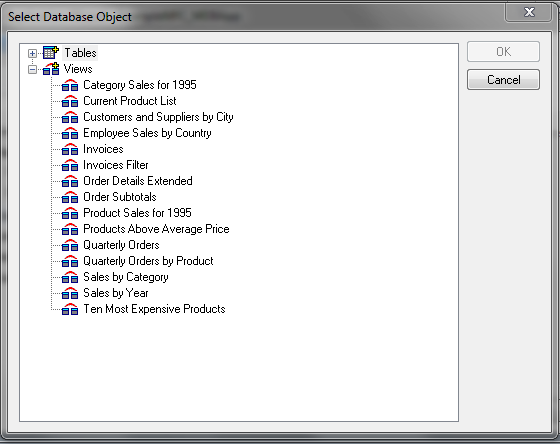
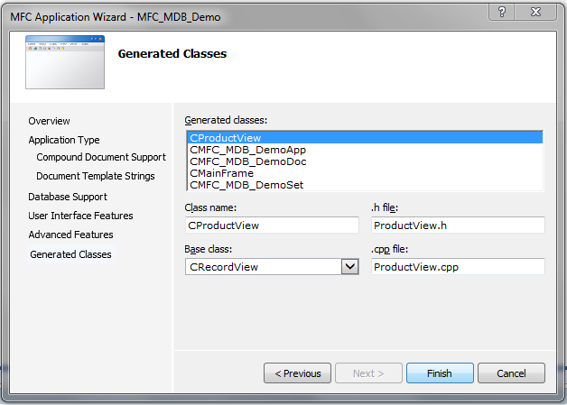

# MFC Database applications

This article demonstrates the main aspects involved to building Windows database applications with MVS using MFC (Microsoft Foundation Classes).

Note: to ensure access to all of Microsoft SQL Server 2005's functionality, it may be necessary to uninstall SQL Server 2005 installed with MVS 2005, and then install SQL Server 2005 (e.g. Developer edition) from scratch.

## SQL Server 2005

Given the time at which SQL Sever 2005 was applied for MVS 2005, there are a few differences compared to more modern implementations of SQL. All SQL queries discussed here return `recordsets`.

```sql
SELECT * FROM tableName;

SELECT colA, colB FROM tableName;

-- the following are equivalent and required for column names with whitespace; 
-- the latter preferred with C++ strings
SELECT "column A", "column B" FROM tableName;
SELECT [column A], [column B] FROM tableName;
```

The `WHERE` keyword is applied as follows:

```sql
SELECT * FROM tableName WHERE [Column C] = 1 AND [Column D] > 0.5;
```

There is no `JOIN` keyword with this level of SQL but join queries with specific fields can be performed as follows:

```sql
SELECT * FROM tableOne, tableTwo WHERE tableOne.[column A ID] = tableTwo.[column Z ID];
```

One can sort records by ordering:

```sql
SELECT * FROM tableOne WHERE colA.status = 'someString'
```

## Database support

MVS 2005 supports

+ __OLE DB__ - an Object-Linking and Embedding database accessed via COM (ActiveX); can be hosted locally or remotely and is generally more optimal without the MFC overhead
+ __ODBC__ - an Open DataBase Connectivity implementation; a standard function orientated interface that support a number of database vendors inc. SQL Server 2005 through __ODBC drivers__

MFC supports ODBC primarily through the following classes:

+ CDatabase - represents database connections
+ CRecordset - represents the object returned from `SELECT` queries, supporting navigation through the set
+ CRecordView - represents the object (typically a dialog box) that displays the current information from the recordset instance
+ CFieldExchange - provides functions that exchange data between the database and recordset object; tends to be used only if custom data types for fields are involved
+ CDBException - handles exceptions that occur from ODBC operations

## Registering an ODBC database

Before accessing an ODBC database, one must register such a database from Windows. From the Control Panel or Administrative Tools is the _Data source (ODBC)_ option. 

### SQL Server 2005

With SQL Server 2005 already installed, one can set up a local database as shown:



### Microsoft Access

This requires a Microsoft Access Driver (*.mdb) file. If Microsoft Access is not already installed then download the Microsoft Access Database runtimes (2016 supports Windows 7).

Open the _Data source (ODBC)_ option from the Windows Control Panel, then locate the MDB file to register the database.



## Starting a new MVS project

Create a new MFC application via the wizard, choosing the SDI interface. Eventually when prompted, select _Database view without file support_ and select _ODBC_ as the client type:



Click _Datasource_ and set up a new data source (*.dsn). When prompted from the _ODBC Microsoft Access Setup_ dialog, select the MDB file (again) by clicking _Select_ (see the [repo](https://github.com/jfspps/VisualStudio2005Learning) for a copy of the Northwind.mdb file).

Then pick one or more database tables or views (hold CTRL and click):



The previous wizard dialog box gives the option of database support type:

+ __Dyanset__ - recordset is saved to memory and updated whenever _moving_ (i.e. not automatic if not) from one record to another. This ensures changes to the data (from the current user or other users) is made known.
+ __Snapshot__ - recordset is saved to memory. Updates applied to the database by other users are not known since the update does not refresh the recordset in memory.

We select snapshot for the demo. Update the generated class names if desired (we chose the Product table from the MDB file so updated the record view class as shown):


