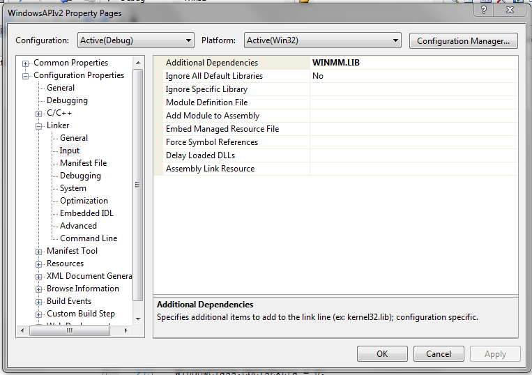

# Microsoft Windows API C++ applications Part 2

This article continues from [Part 1](2_WindowsAPIApplications.md), focusing on GDI without reference to the MFC.

## Resources

### Icons

Resource scripts are actually text files that resemble C code. Taking the icon section of the script:

```cpp
/////////////////////////////////////////////////////////////////////////////
//
// Icon
//

// Icon with lowest ID value placed first to ensure application icon
// remains consistent on all systems.
IDR_MAINFRAME           ICON                    "res\\Sketcher.ico"
IDR_SketcherTYPE        ICON                    "res\\SketcherDoc.ico"
```

The layout shows the symbolic constant (referred to by icon related functions in code), 
the type of resource (e.g. ICON, CURSOR, WAVE) and then the file location. The symbolic constant can be given in the resource
script or located in a header file that would be declared at the top of the .rc script.

In the Sketcher demo, the header file is "resource.h", which declares the above icons as:

```cpp
#define IDR_MAINFRAME                   128
#define IDR_SketcherTYPE                129 // the numbers are arbitrary
```

The MVS resource compiler handles all resources and bundles them as part of the EXE file.

### Menus

Menu and menu options are also defined in MVS as resources. 

The following is demonstrated by [this project](https://github.com/jfspps/VisualStudio2005Learning/tree/main/WindowsAPIv2). 
In the resource script (`resource.rc`), one can define:

```cpp
MainMenu MENU DISCARDABLE
{
	POPUP "&File"
	{
		MENUITEM "&Open", MENU_FILE_ID_OPEN
		MENUITEM "&Close", MENU_FILE_ID_CLOSE
		MENUITEM "&Save", MENU_FILE_ID_SAVE
		MENUITEM "E&xit", MENU_FILE_ID_EXIT
	}

	POPUP "Help"
	{
		MENUITEM "&About", MENU_HELP_ABOUT
	}
}
```

Then via a declared header file (`resource.h`), state:

```cpp
#define MENU_FILE_ID_OPEN 1000
#define MENU_FILE_ID_CLOSE 1001
#define MENU_FILE_ID_SAVE 1002
#define MENU_FILE_ID_EXIT 1003

#define MENU_HELP_ABOUT 2000
```

Then initialise and set the menu in the body of the application (with a plain Win32 demo):

```cpp
#include <windows.h>
#include "resource.h"

LRESULT WINAPI WindowProc(HWND hWnd,
						  UINT message,
						  WPARAM wParam,
						  LPARAM lParam);

int WINAPI WinMain(HINSTANCE hInstance, HINSTANCE hPrevInstance,
				   LPSTR lpCmdLine, int nCmdShow){

   WNDCLASSEX WindowClass;

   static LPCTSTR szAppName = L"winDemo";
   HWND hWnd;
   MSG msg;

   WindowClass.cbSize = sizeof(WNDCLASSEX);
   WindowClass.style = CS_HREDRAW | CS_VREDRAW;
   WindowClass.lpfnWndProc = WindowProc;

   WindowClass.cbClsExtra = 0;
   WindowClass.cbWndExtra = 0;

   WindowClass.hInstance = hInstance;

   WindowClass.hIcon = LoadIcon(0, IDI_APPLICATION);
   WindowClass.hCursor = LoadCursor(0, IDC_ARROW);

   WindowClass.hbrBackground = static_cast<HBRUSH>(GetStockObject(GRAY_BRUSH));

   // refer to the resource by name (could also define as a symbolic constant)
   WindowClass.lpszMenuName = L"MainMenu"; 

   WindowClass.lpszClassName = szAppName;
   WindowClass.hIconSm = 0;

   RegisterClassEx(&WindowClass);

   // not stricly necessary to set the window for SDI applications
   // but here is how to load the menu
   hWnd = CreateWindow(
	   szAppName,
	   L"Example window title",
	   WS_OVERLAPPEDWINDOW,
	   CW_USEDEFAULT,
	   CW_USEDEFAULT,
	   CW_USEDEFAULT,
	   CW_USEDEFAULT,
	   0,
	   LoadMenu(hInstance, L"MainMenu"),
	   hInstance,
	   0);

   ShowWindow(hWnd, nCmdShow);
   UpdateWindow(hWnd);

   while (GetMessage(&msg, 0, 0, 0) == TRUE){
	   TranslateMessage(&msg);
	   DispatchMessage(&msg);
   }

   return static_cast<int>(msg.wParam);
}

LRESULT WINAPI WindowProc(HWND hWnd,
						  UINT message,
						  WPARAM wParam,
						  LPARAM lParam){
  HDC hDC;
  PAINTSTRUCT PaintSt;
  RECT aRECT;

  switch(message){
	  case WM_PAINT:
		  hDC = BeginPaint(hWnd, &PaintSt);

		  GetClientRect(hWnd, &aRECT);

		  SetBkMode(hDC, TRANSPARENT);

		  DrawText(
			  hDC,
			  L"Some text that appears in the client area",
			  -1,
			  &aRECT,
			  DT_SINGLELINE | DT_CENTER | DT_VCENTER);

		  EndPaint(hWnd, &PaintSt);
		  return 0;

	  case WM_DESTROY:
		  PostQuitMessage(0);
		  return 0;

	  default:
		  return DefWindowProc(hWnd, message, wParam, lParam);
  }
}
```

We define the event handler fired when a user clicks a menu option next.

### Linking LIB files

For this demo, we will be playing wave files. This will require importing the `mmsystem.h` header file __and__
including the Windows Multimedia Extension library `WINMM.LIB`. 

Lib files can be included as a linker dependency through the project properties. 
Simply type in the name of the library (it is located Platform SDK lib folder, normally
`C:\Program Files (x86)\Microsoft Visual Studio 8\VC\PlatformSDK\Lib`; there is an AMD64 version too)



### Menu option messages: introducing audio

Menu option selection is a result of user interaction and therefore classed as a [command message](3_MFCApplications.md#types-of-messages), `WM_COMMAND`. Under this, each menu option is assigned a sound
to play (except for Exit):

```cpp
case WM_COMMAND:
		  {
			  switch (LOWORD(wParam))
			  {
			  case MENU_FILE_ID_OPEN:
				  {
					  PlaySound(MAKEINTRESOURCE(SOUND_ID_ENERGIZE),
						hinstance_app,
						SND_RESOURCE | SND_ASYNC);
				  } break;
			  case MENU_FILE_ID_CLOSE:
				  {
					  PlaySound(MAKEINTRESOURCE(SOUND_ID_BEAM),
						hinstance_app,
						SND_RESOURCE | SND_ASYNC);
				  } break;
			  case MENU_FILE_ID_SAVE:
				  {
					  PlaySound(MAKEINTRESOURCE(SOUND_ID_TELEPORT),
						hinstance_app,
						SND_RESOURCE | SND_ASYNC);
				  } break;
			  case MENU_FILE_ID_EXIT:
				  {
					  PostQuitMessage(0);
				  } break;
			  case MENU_HELP_ABOUT:
				  {
					  MessageBox(
						  hWnd, 
						  L"Menu Sound Demo", 
						  L"About Sound Menu", 
						  MB_OK | MB_ICONEXCLAMATION);
				  } break;
			  default: break;
			  }
		  } break;
```
