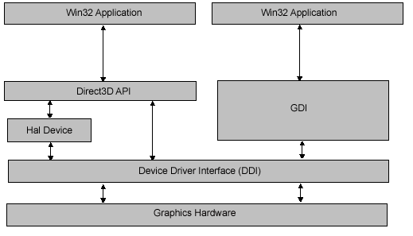
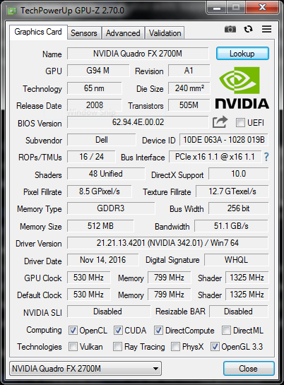
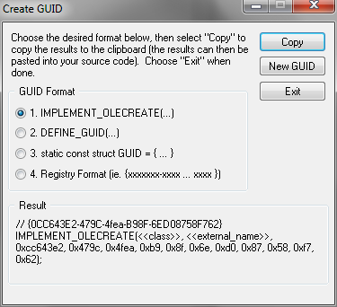

# DirectX 9.0c

This article introduces the concepts behind DirectX 9.0c, set in relation to the GDI and Win32 APIs.

## Components

DirectX 9 is mainly composed of:

+ DirectX Graphics (Direct3D and additional graphics functionality provided by D3DX [Windows Vista or higher only])
+ DirectInput (all keyboard, mouse and user controller functionality)
+ DirectSound (audio production and capture)



As shown, Win32 applications call upon DirectX libraries, which in turn access the hardware via standard interfaces. Hardware vendors produce drivers that conform to the Component Object Model (COM) interfaces so that application developers need not update software too often when hardware is upgraded or replaced.

What is not shown above is an additional layer known as the _Hardware emulation layer_ (HEL) that performs functions in software mode if the underlying hardware does not support said functions. This sits on top of the _Harware abstraction layer_ (HAL).

A major alternative to Direct3D was OpenGL (now at time of writing superseded by Vulkan). OpenGL drivers are released along with DirectX drivers from hardware vendors. OpenGL v2.0 (to v2.1) was released in 2004, at roughly the same time as DirectX 9.0c (integrated with Windows XP SP2).

For completeness, roughly speaking Direct3D 10 (Windows Vista or later) was released at around the same time as OpenGL v3.x. Similarly, Direct3D 11 (Windows 7 or later; added to Vista SP2 shortly after initial release) was released at the same time as OpenGL v4.x.

Full details about what version of DirectX and OpenGL (amongst other APIs) can be extracted with e.g. GPU-Z:



### Deprecated: DirectDraw (last available with DirectX 7)

Up to and including DirectX 7.0, all 2-dimensional acceleration was provided by _DirectDraw_. This API is generally much faster then the GDI (or older MCI, Media Control Interface, which DirectX replaces). From DirectX 8 onwards, all 2-dimensional drawing was merged with Direct3D.

More recent dedicated APIs that replace DirectDraw include Direct2D (launched ca. 2012, Windows 7 or above).

### Deprecated: DirectMusic (last available with DirectX 8)

DirectXSound does not support MIDI and wavetable synthesiser music. Such features were provided by DirectMusic, which was built on top of DirectSound. Since Windows Vista, DirectMusic is not available to 64-bit applications and was deprecated and replaced by Windows Audio Session API (WASAPI).

Alternative to DirectSound include OpenAL.

### Deprecated: DirectPlay (last available with DirectX 8)

DirectPlay is a networking API, providing features such as "sessions" (games in progress) and "lobbies" (where players congregate and play).

### Deprecated: Direct3D retained mode Direct3DRM

A more high-level object and frame based 3D system. Requires programmers to modify each frame scene, without much need to interface with the DirectX API, and quite slow.

The concepts of _retained mode_ and (below) _immediate mode_ are not unique to the DirectX graphics APIs but applied to other graphical APIs.

### Deprecated: Direct3D immediate mode Direct3DIM

A more low-level part of the API (retained mode was built on top of immediate mode) and quite difficult to use in its eariler iterations. Eventually (since Direct3D 5) adopted a more accessible OpenGL like approach to function calls with the rendering engine rather than direct arrays (i.e. buffers).

Following the release of DirectX 9.0c, the distinction between retained mode and immediate mode was dropped, and retained mode abandoned. In short, all Direct3D calls with DirectX 9.0c are assumed in immediate mode.

### Deprecated: DirectShow (last available with DirectX 8)

This component handles video streaming in applications, supporting a numer of formats including Advanced Streaming Format (ASF), Motion Pictures Exports Group (MPEG), Audio-Video Interleaved (AVI), MPEG Audio Layer-3 (MP3) and WAV files. This was removed from the DirectX 9 and moved to the Windows SDK.

DirectShow was eventually superseded by Media Foundation (MF) in Windows Vista or newer.

## The Component Object Model (COM)

DirectX, OLE and ActiveX technologies makes use of the conventions set out by the Component Object Model (COM). COM objects come in the form of DLLs and therefore applications that depend on the logic do not need to be recompiled or rebooted. Despite the name, COM objects are not instances or OOP objects but are instead classes.

### COM objects and interfaces

COM objects are concrete C++ classes that inherit and implement one or more abstract classes (through multiple inheritance), which themselves are collections of [pure virtual functions](../DataStructuresAndAlgorithmsinC++/3_Classes_in_C++.md#abstract-classes-and-pure-virtual-functions). The abstract classes are also referred to as _interfaces_ and are simply collections of function prototypes.

All COM interfaces (prefixed with an "I") are derived from a base class interface `IUnknown`. A single COM object (prefixed with a "C") can have one or more interfaces.

`IUnknown` is a C++ structure:

```cpp
struct IUnknown {
    // retrieves other interfaces (and via the pointer, their functions)
    virtual HRESULT __stdcall QueryInterface(const IID &iid, (void **)ip) = 0;

    // increments interfaces references count
    virtual ULONG __stdcall AddRef() = 0;

    // decrements interfaces references count
    virtual ULONG __stdcall Release() = 0;
}
```

Note (or recall) that the `__stdcall` pushes parameters to the stack from right to left. All methods are
`virtual` to support polymorphism ([late-binding](../DataStructuresAndAlgorithmsinC++/3_Classes_in_C++.md#virtual-functions)).

### COM interface functions

The function `QueryInterface()` is used to assign pointers to functions (pointers to functions are discussed later in this section) from other interfaces. Each interface has its own 128-bit interface ID (`iid`), consequently of which there are 2<sup>128</sup> possible values. These are basically globally unique identifiers (GUIDs). To generate the UUIDs within MVS 2005, click _Tools_ and then click _Generate GUID_:



The COM object acts as a backbone connected to all other related interfaces. Running `QueryInterface()` from one of the connected interfances should get you access to other connected interfaces.

COM keeps track of the number or count of COM interfaces connected. The aforementioned `AddRef()` and `Release()` functions are called whenever new interfaces are attached (created) or removed. When the count reaches zero, the COM object is destroyed.

There is also a parent-child relationship between COM objects. Creating a COM object from another COM object sets this relationship up. Furthermore, `AddRef()` on both COM objects is automatically called (the interface count becoming non-zero on initialisation). Calling `Release()` on the parent COM object would automatically call `Release()` on the child object, and potentially destroy (release) both. Generally, it's more logical to call `Release()` on the child object first.

Below is an example of a COM object definition with reference to three interfaces:

```cpp
struct IGraphics : IUnknown{
    virtual int InitGraphics(int mode) = 0;
    virtual int SetPixel(int x, int y, int c) = 0;
    // other methods...
}

struct ISound : IUnknown{
    virtual int InitSound(int driver) = 0;
    virtual int PlaySound(int note, int volume) = 0;
    // other methods...
}

struct IInput : IUnknown{
    virtual int InitInput(int device) = 0;
    virtual int ReadStick(int stick) = 0;
    // other methods...
}

// a COM object
class CDemoClass : public IGraphics, ISound, IInput {
    public:

    // retrieves other interfaces 
    // (and via the pointer, their functions)
    virtual HRESULT __stdcall 
        QueryInterface(const IID &iid, (void **)ip){
            // implementation required
        }

    // increments interfaces references count
    virtual ULONG __stdcall AddRef(){
        // implementation required
    }

    // decrements interfaces references count
    virtual ULONG __stdcall Release(){
        // implementation required
    }

    // now implement the interfaces
    virtual int InitGraphics(int mode){
        // do stuff...
    }

    virtual int SetPixel(int x, int y, int c){
        // do stuff...
    }

    virtual int InitSound(int driver){
        // do stuff...
    }

    virtual int PlaySound(int note, int volume){
        // do stuff...
    }

    virtual int InitInput(int device){
        // do stuff...
    }

    virtual int ReadStick(int stick){
        // do stuff...
    }

    private:
    // local stuff
}
```

When upgrading the above object, it is important to retain the original interface implementations. This is so that other applications that call on this COM object (as a DLL) can continue to work without needing to update the calling application.

The next section looks at implementing the interfaces.

## A minimal COM application

The following sets out more about COM object implementation.

```cpp
#include <stdio.h>
#include <malloc.h>
#include <iostream.h>

// contains important constants for COM objects
#include <objbase.h>

// pregenerated GUIDs; using curly braces for initialisation

// {B9B8ACE1-CE14-11d0-AE58-444553540000}
const IID IID_IX = 
{ 0xb9b8ace1, 0xce14, 0x11d0, { 0xae, 0x58, 0x44, 0x45, 
                                0x53, 0x54, 0x0, 0x0 } };

// {B9B8ACE2-CE14-11d0-AE58-444553540000}
const IID IID_IY = 
{ 0xb9b8ace2, 0xce14, 0x11d0, { 0xae, 0x58, 0x44, 0x45, 
                                0x53, 0x54, 0x0, 0x0 } };

// {B9B8ACE3-CE14-11d0-AE58-444553540000}
const IID IID_IZ = 
{ 0xb9b8ace3, 0xce14, 0x11d0, { 0xae, 0x58, 0x44, 0x45, 
                                0x53, 0x54, 0x0, 0x0 } };

// the interfaces
interface IX: IUnknown{
    virtual void __stdcall fx(void)=0;
}; 

interface IY: IUnknown{
    virtual void __stdcall fy(void)=0;
}; 


// define the COM object
class CCOM_OBJECT :	public IX, public IY
{
    public:

    CCOM_OBJECT() : ref_count(0) {}
    ~CCOM_OBJECT() {}

    private:

    virtual HRESULT __stdcall 
        QueryInterface(const IID &iid, void **iface);

    virtual ULONG __stdcall AddRef();
    virtual ULONG __stdcall Release();

    virtual	void __stdcall fx(void) {
        cout << "Function fx has been called." << endl; 
    }

    virtual void __stdcall fy(void){
        cout << "Function fy has been called." << endl; 
    }

    int ref_count;
};

HRESULT __stdcall 
    CCOM_OBJECT::QueryInterface(const IID &iid, void **iface){

    // this function basically casts the this pointer or the IUnknown
    // pointer into the interface requested, notice the comparison with
    // the GUIDs generated and defined at the begininng of the program

    // requesting the IUnknown base interface
    if (iid == IID_IUnknown){
        cout << "Requesting IUnknown interface" << endl;
        *iface = (IX*)this;
    }
        
    if (iid == IID_IX){
        cout << "Requesting IX interface" << endl;
        *iface = (IX*)this;
    } else if (iid == IID_IY){
        cout << "Requesting IY interface" << endl;
        *iface = (IY*)this;
    } else { 
        cout << "Requesting unknown interaface!" << endl;
        *iface = NULL;
        return(E_NOINTERFACE);
    }

    // if everything went well cast pointer to IUnknown 
    // and call addref()
    ((IUnknown *)(*iface))->AddRef();

    return(S_OK);
}

ULONG __stdcall CCOM_OBJECT::AddRef(){
    // increments reference count
    cout << "Adding a reference" << endl;
    return(++ref_count);
}

ULONG __stdcall CCOM_OBJECT::Release()
{
    // decrements reference count
    cout << "Deleting a reference" << endl;
    if (--ref_count == 0){
        delete this;
        return(0);
    }
    else
        return(ref_count);
}

IUnknown *CoCreateInstance(void){
    // this is a very basic implementation of CoCreateInstance()
    // it creates an instance of the COM object, in this case
    // I decided to start with a pointer to IX -- IY would have
    // done just as well

    IUnknown *comm_obj = (IX *)new(CCOM_OBJECT);

    cout << "Creating Comm object" << endl;

    // update reference count
    comm_obj->AddRef();

    return(comm_obj);
}

void main(void) {

    // create the main COM object
    IUnknown *punknown = CoCreateInstance();

    // create two NULL pointers to the 
    // IX and IY interfaces
    IX *pix=NULL;
    IY *piy=NULL;

    // from the original COM object query for interface IX
    punknown->QueryInterface(IID_IX, (void **)&pix);

    // try some of the methods of IX
    pix->fx();

    // release the interface
    pix->Release();

    // now query for the IY interface
    punknown->QueryInterface(IID_IY, (void **)&piy);

    // try some of the methods
    piy->fy();

    // release the interface
    piy->Release();

    // release the COM object itself
    punknown->Release();
}
```

## DirectX libraries are COM objects as DLLs

To compile a DirectX application, one normally needs to import the following libraries 
(usually found in e.g. `C:\Program Files (x86)\Microsoft DirectX 9.0 SDK (February 2005)\Lib\x86`) and 
representative header files for:

+ ddraw.lib
+ dsound.lib
+ dinput.lib
+ dinput8.lib
+ dsetup.lib
+ dplayx.lib
+ d3d8.lib (for Direct3D 8)
+ d3d9.lib (for Direct3D 9)

As mentioned, DirectX 9.0c Direct3D assumes immediate mode; retained mode is no longer available.

The above libraries are wrappers that make calls to DirectX COM objects as DLLs. It should be apparent now that
if Microsoft updates DirectX in line with COM conventions, then a DirectX application should continue to
run without issue.

## DirectX and COM

In outline only for now, a typical DirectDraw application proceeds as follows:

1. Instantiate a DirectX COM object with `DirectDrawCreate()` and give its own GUID. This is overall similar to what `CoCreateInstance()` above does.
2. Create NULL pointers (for the DirectDraw interfaces) e.g. of type `LPDIRECTDRAW7`
3. Assign the NULL pointer(s) to the DirectDraw interface with `QueryInterface()` and thereby get access to DirectDraw's virtual functions.
4. Call DirectDraw functions required using the interface pointer
5. Release the interface before the program terminates (this therefore releases the GUID)

## COM VTABLES

As shown, interface functions are virtual functions, so that the definition invoked is not fixed at compile time but determined at runtime. This is known as late-binding.

A COM interface is a list of virtual functions, known as a _virtual function table_ or `VTABLE`. The VTABLE lists the address to all virtual functions for a given interface: _the interface pointer is thus a VTABLE pointer._

## Function pointers in C++

Pointers to functions allow applications to e.g. move around the VTABLE and find the required function, as long as the protoype matches. This allows e.g. DirectX to be able to assign a function pointer properly, and then call the assigned function e.g. to draw a pixel based on the hardware installed. 

The following would be considered part of DirectX API logic, not any DirectX application logic:

```cpp
// function pointer declaration
int (* SetPixel)(int x, int y, int colour);

int SetPixel_AMD(int x, int y, int colour){
    // code for AMD
}

int SetPixel_NVidia(int x, int y, int colour){
    // code for NVidia
}
```
It then assigns the function pointer when the system boots:

```cpp
// this would be called by DirectX when the machine boots
// and is set only once; the programmer doesn't do anything
SetPixel = SetPixel_AMD;
```

Once assigned by the system, any DirectX application that calls `SetPixel()` (what the game programmer would normally do) is actually calling `SetPixel_AMD()`.
