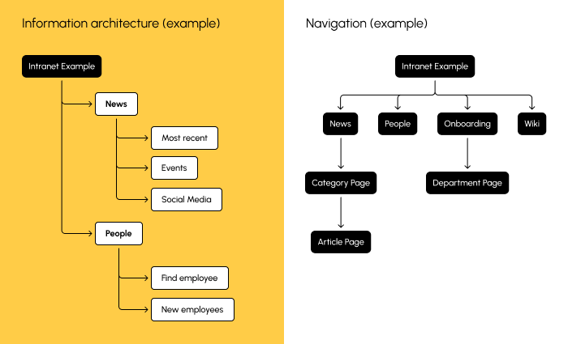

# Design Principles

Software design starts at the very beginning of the development process and continues on in an iterative fashion. It is essentially about the design of the full solution so that it meets the need of end-users and focuses on addressing the end-users' problems while providing an experience that end-users fundamentally understand and relate to.

The main concepts to start of with are __personas__ and __user stories__. A persona is representation of a person with a specific background, attitude and expectation. Not all end-users will be classed under a given persona and quite often the software will be required to cater to the needs of multiple personas. A user story defines a story that is linked to a given persona, describing what the persona wants to do and some explanation about the decisions they make and some justification why.

The field of Software Design cannot be adequately summarised in this article. Nevertheless, I highlight a few key areas, in no particular order:

+ Information architecture -  the logical way of organising the information stored by the software, and is aimed at helping designers plan how a user can access specific information
+ Animation design - the design of transitionary points which occur when the interface changes significantly; this area is important as a form of feedback to the user letting them know that the instruction was received
+ User experience design - the design of the interface (usually as wireframes) in a way which is intuitive and easy to navigate for end-users, and in many circles is arguably more important than user interface design, next
+ User interface design - the graphical design of the interface, making use of colour and light to provide a visually appealing front-end

## A design process

There are all sorts of approaches to software design so the following summary is not meant to cover everything.

### Personas and user stories

+ Think about the user types and what they want to achieve in using the software. Focus initially on the most important or most common user types.
+ Write out the key user stories for each persona.

A Department Head may want to get access to a list of ongoing jobs that his or her team is working on. The user story could be phrased as:

> As a Department Head, I want to be able to view a list of ongoing tasks so that I can get up to date on the status of the project

Phrasing it like this unifies business and technical minded team members so that all know what problem must be solved.

### Information architecture

Here we break down the information that is saved by the software. The phrasing is still high-level and presented in a way which end-users can understand. To some, an information architecture diagram resembles a sitemap.

||
|:--:|
|[Information Architecture Diagram](https://uxdesign.cc/information-architecture-how-to-make-it-worth-your-time-money-6ae71c0f8674)|

The architecture should be designed such that it takes into consideration of the aforementioned personas and user stories.

### Mockups, wireframes and prototypes

Designers will usually resort to pen and paper to start building basic outlines (or wireframes) of the user interface. This is sometimes pinned to wall to get the overall broad picture in view.

There are prototyping tools that allow designers to quickly build mock-ups and wireframes of the interface, using their reference sketches. Here are a few (free) examples:

+ [PenPot](https://penpot.app/)
+ [Quant-UX](https://www.quant-ux.com/)
+ [Diagrams.net](https://app.diagrams.net/)
+ [MyDraft](https://mydraft.cc/)

### Usability Testing

At this stage, we turn the prototypes or high-spec demos to a number of end-users and try out the interface. During this analysis, notes should be taken explaining what background and experience of the tester, revealing any bias they might have, as well as comments on what was accepted and what confused the tester.

As one can expect, the larger the test group size, the problems will be found and can be fixed before any go-live. Interestingly, the Nielsen Norman group found that the optimal number of testers is [five](https://www.nngroup.com/articles/why-you-only-need-to-test-with-5-users/).
