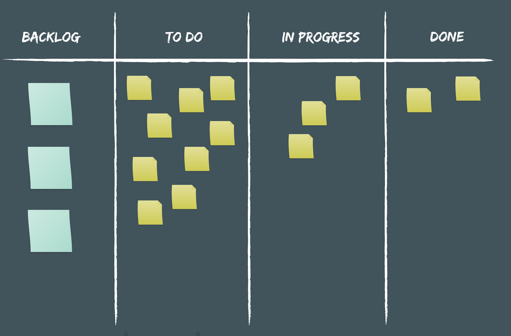
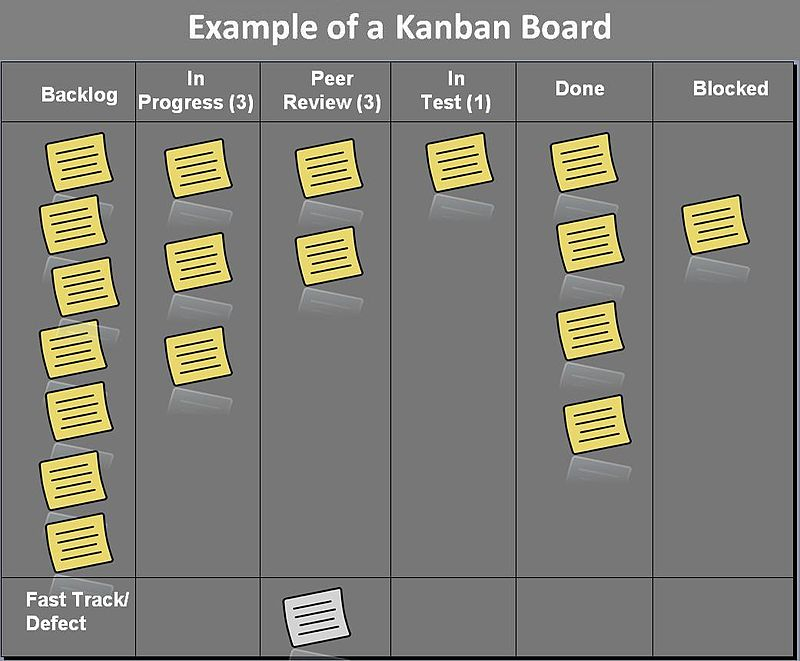

# Software Development Methodolgies

Software development is based on a model or set of principles which define the various roles and project stages involved. In this short brief, we explore the main ideas behind Software Development methodogies.

It is first important to note that all models are usually never followed strictly in any business, and that some aspects of two or more models will be followed. Overall, the business needs will dictate which aspects are followed.

The [Agile Manifesto](https://agilemanifesto.org/) lists the principles behind Agile development.

## From waterfall to agile

In the earlier days of software development, projects were built according to a _waterfall model_. The model is characterised by a sequence of steps that usually do not proceed until the previous one is complete (i.e. approved and documented):

1. Requirements gathering
2. Analysis
3. Design
4. Writing code
5. Testing code
6. Maintenance

The main drawack with this approach is that it does not accommodate change. Sometimes the customer will not know from the beginning what they need and they may also change their mind as the project is worked on.

Along comes the _agile model_, which is broadly more effective than waterfall models, particularly for larger projects and teams.

Agile methods attempt to provide the customer with opportunities to change things at any stage. It also attempts to deliver testable parts or components of the full solution so that it helps developers identify issues and provide fixes.

A key human part about an agile team is the need to bring together technical and non-technical roles at all stages of the project. This so called _cross functional team_ allows each member to contribute to all stages of the project.

Some of the roles are summarised below:

+ Product manager - technical orientated leader of the project, who generally identifies business opportunities for the product and provides overall management of the product
+ Business analysts - individuals who work closely with the customers and the product manager to draw up user (or business) requirements for large projects
+ UX and UI designers - individuals who specialise in understanding how users respond to an interface and thereby design one which enables users to use the product as easily and efficiently as possible
+ Backend developers - individuals who work on aspects of the product that are not seen by the end-user but nonentheless drive the business logic, through microservices and nearly always some sort of database
+ Frontend developers - individuals who implement the UX and UI designs, usually with the aid of a framework or templating engine, which communicates with the backend microservices
+ DevOps - developer operations, individuals who focus on looking after the continuous integration of new software features and the continuous delivery of said features for testing or deployment to the company's datacentre or a hosted platform-as-a-service
+ Quality Assurance - individuals who perform manual and automated [testing](SoftwareTesting.md), working with all members of team to monitor user targets are met in a timely manner

The two main classes or frameworks of agile are __scrum__ and __kanban__.

## Agile - Scrum

Srum assumes a fairly strict set of rules and principles for agile. The scrum is the team, analogous to a rugby scrum in which players with different roles take part. Consequently, a scrum involves a cross-functional team. The other key parts of scrum include:

+ Timed iterations, known as _sprints_
+ A product _roadmap_ and _backlog_
+ Daily standup meetings
+ Task estimates and _velocity_ calculations
+ Sprint planning meetings and retrospective _Burndown analyses_

The lead member is known as the _scrum master_.

The basic steps involved:

1. Agreement of a high-level roadmap, between the team and the customer.
2. Breakdown of the roadmap into manageable tasks. These tasks are then placed onto a _backlog_ of tasks.
   + The _product backlog_ is a list of prioritised items covering features and bugs identified for the entire project that have not been implemented or addressed
   + The _spring backlog_ is a list of features that are planned for the current iteration or sprint. They are normally phrased as _user stories_, i.e. the "who-what-why" requirement, for example "As a ... I would like to ... because it ..."

### Sprints and meetings

Each sprint normally lasts around two to three weeks (varies according to the business or its needs) and is preceded by a sprint planning meeting. Here, the team decides which tasks should be part of the next sprint. 

In addition to the sprint planning meeting, each day (typically), the team meets for a _standup_ meeting where each member attends a short meeting (standing up to keep it short!) outlining what they have done, any problems encountered and what they will do for the day. This keeps the team updated.

Each spring normally ends with a retrospective meeting, where the team analyses how well the sprint went. The resultant _action points_ are normally assigned to one or more team members, sometimes with a deadline, and be made known to the whole team. The next retrospective meeting normally involves an evaluation of the progress made on previous action points.

There are times when the team meets for _backlog grooming and refinement_ meetings. The former is mostly about identifying what items should be present on the backlog. The latter is about taking the time to analyse and possibly redfine or clarify existing backlog tasks.

### Task estimates

Task estimates are normally framed in units of time or complexity. The former simply indicates how long the team expects a task to be completed, where the latter indicates how many _story points_ (units of measure that define the effort needed to implement a task) are expected for a task. A task estimate of "time of" two days, or, "effort of" four user stories implies which type of estimate was applied.

Developers will quite often prefer to think of estimates in terms of complexity, whereas product managers usually want to know how long a task will take to implement. Either way, they correlate: more complex problems need more story points and more time to complete. The number of story points a team can complete in a given sprint is referred to as the _velocity_ of the team.

Each task estimate (time, shown below, or complexity) can be mapped to a _burndown chart_(By I8abug - Own work, CC BY-SA 3.0, https://commons.wikimedia.org/w/index.php?curid=15511814):

The team's velocity is related to the gradient of the chart and is used to plan subsequent sprints, making sure that the number of estimates does not exceed the existing team's capability.

### Sprint boards

The backlogs are presented on a _scrum board_ or _sprint board_. The product backlog is normally presented on the left and the sprint board is presented to the right.

It typically lists the product backlog, with estimates, where known and the current sprint board, which lists the currrent tasks and the team's velocity, according to:

+ To Do - needs working on but not assigned yet
+ In Progress - assigned work
+ Done - the definition of "done" can vary considerably here and would have to be agreed by the team; it normally represents a task that would be taken off the backlog at the next sprint planning meeting

## Agile - Kanban

Kanban has its roots in the automotive industry and is considered the less rule-bound model of agile, at least compared to scrum. There is no concept of a sprint and as such, kanban focuses more on tasks as defining points.

There are concepts from Scrum that do carry across to Kanban and are mentioned next.

### Planning and cycle times

Much of the planning for Kanban teams is just as applicable from Scrum teams.

The team gathers to decide which tasks should be moved from the backlog to the "To Do" column of a Kanban board (By Dr ian mitchell - Own work, CC BY-SA 2.5, https://commons.wikimedia.org/w/index.php?curid=20245783).  The product backlog is normally presented on the left and the kanban board is presented to the right.

The main restriction imposed on a Kanban approach is the number of tasks assigned to a particular column. When a task can be advanced to the next stage (from "To Do" to "Testing" or similar), it shows where the team as a whole is with respect the overall project development. If there are too few tasks in the "To Do" column, considering the number of team members available, the product manager can call a meeting and adjust the kanban board. If a task is stuck in a column for a period longer than the general cycle time, then the team can pitch in to help where needed.

Kanban uses the concept of _cycle time_ instead of _velocity_ when establishing team metrics. Cycle time is the time needed to move a task from the "ToDo" column to the "Done" column. Teams aspire to reduce cycle times, and this is normally achieved by defining self-contained (decoupled), simplified tasks.

Some teams also define _lead times_ which establish the time between task conception and task completion. This tends to be more useful or helpful for product managers. Knowing the task's cycle time and lead time allows the team to optimise project plans whenever they deem it appropriate.

## Issue trackers

Software development teams can manage their project with issue tracking software that span the spectrum of agile development. There are lots of solutions available! The following is not intended to be representative or exhaustive:

+ [Jira](https://www.atlassian.com/software/jira)
+ [Redmine](https://www.redmine.org/)
+ [Trac](https://trac.edgewall.org/)
+ [Mantis](https://www.mantisbt.org/)
+ [BugZilla](https://www.bugzilla.org/)
+ [Youtrack](https://www.jetbrains.com/youtrack/)

Teams also adopt elements from scrum and kanban, known unsurprisingly as [_scrumban_](https://en.wikipedia.org/wiki/Scrumban). The above project management tools provide more details about all above development models and frame it according to the services they provide.
