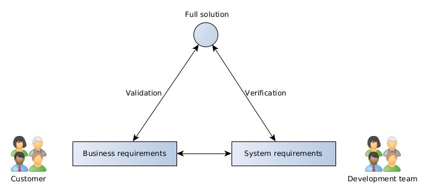

# Software Testing

## Verification and validation

_Verification_ in software testing is about determining if the software and its accompanying files/media/documentation were built according to the given requirements.

Building software to a specification (rather blindly) does not always guarantee that the solution will provide what the customer needs. If the software was built to specification but does not provide what the customer needs, then this might be an indication that the business and/or system requirements need reviewing.

_Validation_ in software testing is about determining if the software meets the needs of the customer. Validation depends on the how closely the business and system requirements describe what the customer actually wants.



Unfortunately, it is not always possible to define when one performs verification and when one performs validation. Loosely stated, verification testing tends to occur during the initial stages of development of a deliverable and validation usually occurs towards the latter stages of development.

_Alpha testing_ is performed by the project team members. Contrast to _beta-testing_, which is normally performed by end-users.

## Predeployment automated testing

In a nutshell, _unit testing_ is about verifying the behaviour of individual methods in code whereas _integration testing_ looks at a broader picture and verifies the interaction between two or more methods (sometimes from different classes). For programmers, such tests are typically run automatically, immediately after the code is compiled, as an _automated test_. The tests are run automatically to ensure that they are performed frequently as the codebase grows, and more importantly, to promptly warn the developer if changes to the code have broken the existing functionality (this is specifically known as a _regression test_, explored later). 

During the development phase, it is quite possible to identify specific problems which may be raised as (for example) Git issues. When the problem is resolved, this will normally either pass a failing test, or a new test is devised to demonstrate that the problem no longer  exists. This latter, targeted form of testing is referred to as _sanity testing_.

Most forms of automated testing and sanity testing is framed from the point of view of the developer, who has knowledge of the underlying implementation. These are further grouped or classified as _white-box testing_.

## Postdeployment manual testing

_Manual testing_ is precisely that, tests performed manually on a given system. In many cases, this is about running through a checklist on a deployed solution. 

The tests are framed from the point of view of a typical end-user who does not know about the underlying implementation and is therefore known as _black-box testing_. We categorise black-box testing into two type: functional and non-functional testing.

### Functional testing

_Functional tests_ are just that, they assess a specific function or feature of the software and are usually based on objective criteria.

#### Smoke testing

Here, the test checks if the current build is stable overall e.g. did the application crash or malfunction at any time during use.

#### UI testing

This test checks the user interface and can involve any number of questions. Some areas to cover include:
+ a visual inspection of the graphical assets and UI controls
+ how the UI elements are rendered and behave, particularly at different screen sizes and on different devices
+ what happens when graphical assets cannot be rendered
+ are form fields validated
+ what does the browser's BACK and FORWARD buttons do in the middle of a transaction; 
+ what happens when users try to refresh the page with F5 etc

The test can be performed manually by going through a checklist or, if appropriate, with the aid of tools that assume the role of end-users browsing and interacting with the user interface, such as [Selenium](https://www.selenium.dev/).

#### Acceptance testing

This test is very end-user centric by design. It asks whether the software allows the user to achieve their goals set out in the business requirements (i.e. validation testing) or not. This would be part of alpha and, more importantly, beta testing, and is normally performed after all other forms of testing have passed. Typical steps to conduct (user) acceptance testing include:

+ Composition of user stories, a description of a feature of the software as a “who-what-why” format from an end-user perspective e.g. “As a ... I want to … so that I can …”. 
+ Construction of the acceptance test case, a list of the procedural steps needed (from a user’s perspective only) to perform what was described in the user story.  The steps are often translated and initially declared as simple, readable methods, using Java (below), or via more dedicated tools, such as the language Gherkin utilised by a tool such as [Cucumber](https://cucumber.io/).

Take for example, a customer who is using our software to buy expensive strawberries and cream:

```java
public void myTestCase() throws Exception
    {
        shopping.selectDessert(“Expensive strawberries and cream”);
        shopping.addToBasket(“1 portion”);
        shopping.confirmPaymentDetails(“Debit card details goes here”);
        shopping.assertPurchaseComplete(“Expensive strawberries and cream”);
    }
}
```

The code within the curly braces attempts to write the steps in a readable form and in a way that does not define how the software should work. The methods ```selectDessert()``` and so on, ultimately link to other methods that the software needs to perform the end-user tasks.

### Non-functional tests

_Non-functional tests_ (also known as _cross-functional tests_) are about how well the software functions under a range of circumstances and do not correspond to a specific component, function or feature. The results are normally expressed by a range of values and can be subjective in places. 

#### Load testing

This monitors how the front-end runs under different loads; this is clearly host specific and should be analysed after the software is deployed to simulate more realistic conditions; the results from this testing may reveal how the front-end should be provisioned within the datacentre.

#### Performance testing

This monitors how quickly the front-end responds to the end-user interaction, were there any memory leaks, do the graphical assets take too long to load and under what conditions?

Both load and performance testing can be performed manually, or with the aid of dedicated tools such as [Jmeter](https://jmeter.apache.org/) and [Gatling](https://gatling.io/), to name a few. 

#### Security testing

Security testing opens up quite a lot of possibilities here and not all are applicable (note that these tests are arguably directed to the back-end more than the front-end). In the end, all applications are at risk if the software is to be made available to customers. Testers can help mitigate the issues by a number of means (listed in no particular order):
+ establish if user input is validated (i.e. conforms to the expected type and/or size) and sanitised (the removal of harmful, potentially method-invoking, characters) before it reaches the front-end code and also before it reaches the Camunda workflow engine. This is probably the most important concern to get right since malicious users would otherwise force their untrusted data to mix with trusted data, a process known as an injection attack.
+ check file upload and download filters (manage file types and sizes permitted)
+ confirm that the preloaded user accounts are only authorised to access specific resources
+ confirm all black-listed clients' IP address is denied/white-listed clients are permitted

Other aspects include observing include:
+ how front-end managed sessions and potentially personal information are handled
+ how brute-force attacks (“repeated guesses or requests”) are detected and whether a limited number of login attempts or other requests are enforced
+ if debug level messages should be disabled at release (these often reveal information for developers to aid troubleshooting but in normal circumstances should be disabled at launch)

A good checklist of security issues which web application developers should address is recommended by the [Open Web Application Security Project (OWASP)](https://owasp.org/), in particular, the current top 10 (reviewed yearly) [most common](https://owasp.org/www-project-top-ten/) security issues. The [Common Weakness Enumeration (CWE) project](https://cwe.mitre.org) discusses security flaws for more general software development and includes a top 25 list, that is [reviewed every two years](https://cwe.mitre.org/top25/index.html).

